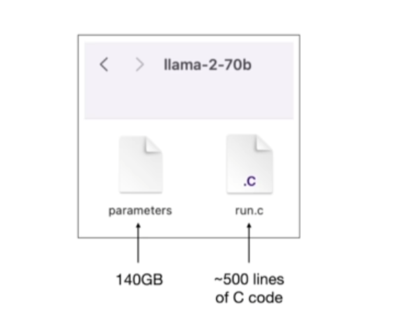
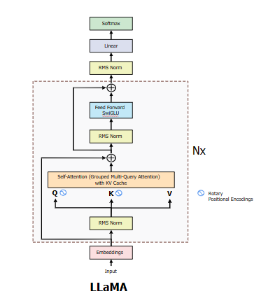

# 第0课：LLM推理入门

## AIOS: 从零构建 LLM 的"操作系统"

**GitHub 仓库**: [https://github.com/wyann22/aios](https://github.com/wyann22/aios)

📚 所有课件、代码和资源都会在此仓库持续更新

---

你是否想过 ChatGPT 是如何生成回复的？70亿参数的模型如何在 GPU 上运行？为什么推理优化如此重要？

本课程将带你亲手从零构建一个 LLM 推理框架。学完之后，你不仅会*使用* LLM，更会深刻理解它们的底层运作原理。

### 本课程适合谁？

| 角色 | 收获 |
|------|------|
| **软件工程师** | 理解 AI/ML 系统架构 |
| **AI infra从业者** | 深入理解大模型推理 |
| **学生** | 可实践、可落地的项目，找工作 |

### 你将收获什么

完成本课程后，你将能够：
- 理解大模型架构
- 从零加载和运行 Llama/Qwen 等模型
- 实现可运行的 LLM 推理引擎
- 掌握 KV-cache、TP/PP、AI编译等优化技术

---

## Part 1: LLM 本质也是软件

在深入实现之前，让我们先理解 LLM 与传统软件的根本区别。这个对比将为你提供贯穿整个课程所需的思维框架。

### 软件的本质

```
┌─────────────────────────────────────────────────┐
│  传统软件                                        │
│  ┌────┐      ┌──────────┐      ┌────┐          │
│  │输入│ ───► │ 代码逻辑  │ ───► │输出│          │
│  └────┘      └──────────┘      └────┘          │
└─────────────────────────────────────────────────┘

┌─────────────────────────────────────────────────┐
│  LLM                                            │
│  ┌────────┐   ┌──────────┐   ┌──────────┐      │
│  │Token输入│ ─► │神经网络层│ ─► │ 概率分布 │      │
│  └────────┘   └──────────┘   └──────────┘      │
└─────────────────────────────────────────────────┘
```

**所有软件都遵循：输入 → 处理 → 输出**

| | 传统软件 | LLM |
|--|---------|-----|
| **输入** | 结构化数据（JSON、SQL） | Token序列（自然语言→数字） |
| **处理** | 执行代码逻辑 | 矩阵运算穿过神经网络层 |
| **输出** | 结构化数据 | 概率分布 → 下一个token |

---

## Part 2: LLM vs 传统软件

LLM也是运行在计算机上的软件，跟传统软件有何不同？



> "魔法"都在权重里

### Llama3: 典型的 LLM 架构



> 💡 访问 [Hugging Face](https://hf-mirror.com/meta-llama/Meta-Llama-3-8B) 查看完整模型卡片

### 传统软件范式

传统软件遵循程序员定义的显式规则：

```
┌─────────────────────────────────────────────────────────────┐
│                      传统软件                                │
├─────────────────────────────────────────────────────────────┤
│                                                             │
│   输入 ──► 规则（代码） ──► 输出                             │
│                                                             │
│   示例：拼写检查器                                           │
│                                                             │
│   "helo" ──► 字典查找 ──► "hello"                           │
│              + 编辑距离                                      │
│              + 预定义规则                                    │
│                                                             │
│   特点：                                                    │
│   ✓ 确定性（相同输入 = 相同输出）                            │
│   ✓ 可解释（可以追踪代码路径）                               │
│   ✓ 资源使用可预测                                          │
│   ✓ 易于调试和测试                                          │
│                                                             │
└─────────────────────────────────────────────────────────────┘
```

在传统软件中：
- **行为是显式的**：每个可能的动作都由程序员编码
- **逻辑是可见的**：你可以精确追踪决策的原因
- **测试是直接的**：定义输入，验证输出
- **内存是结构化的**：数据符合预定义的模式

### LLM 范式

LLM 从数据中学习模式，而非遵循显式规则：

```
┌─────────────────────────────────────────────────────────────┐
│                    基于 LLM 的软件                           │
├─────────────────────────────────────────────────────────────┤
│                                                             │
│   输入 ──► 学习到的权重 ──► 概率分布 ──► 输出                 │
│            （参数）                                          │
│                                                             │
│   示例：词义消歧                                             │
│                                                             │
│   "I deposited money at the bank" ──► LLM ──► bank = 银行 ✓ │
│   "The river bank was steep"      ──► LLM ──► bank = 河岸 ✓ │
│                                                             │
│   特点：                                                    │
│   ✗ 非确定性（温度、采样）                                   │
│   ✗ 黑盒（权重编码模式）                                     │
│   ✓ 能泛化到未见过的输入                                     │
│   ✓ 自然处理歧义                                            │
│                                                             │
└─────────────────────────────────────────────────────────────┘
```

在基于 LLM 的软件中：
- **行为是学习的**：模式从训练数据中涌现
- **逻辑是隐式的**：编码在数十亿个权重值中
- **测试是概率性的**：相同输入可能产生不同输出
- **内存是分布式的**：知识分散在参数中

### 并排对比

```
┌────────────────────┬─────────────────────┬─────────────────────┐
│       方面         │     传统软件        │        LLM          │
├────────────────────┼─────────────────────┼─────────────────────┤
│ 决策方式           │ if-else、规则       │ 矩阵乘法            │
│                    │                     │ + 学习到的权重      │
├────────────────────┼─────────────────────┼─────────────────────┤
│ 知识存储           │ 数据库、文件        │ 模型参数            │
│                    │                     │ （权重/偏置）       │
├────────────────────┼─────────────────────┼─────────────────────┤
│ 处理新情况         │ 添加新代码/规则     │ 已经能泛化          │
│                    │                     │ （如果在训练中见过）│
├────────────────────┼─────────────────────┼─────────────────────┤
│ 执行流程           │ 控制流（循环、      │ 前向传播            │
│                    │ 分支、调用）        │ 穿过各层            │
├────────────────────┼─────────────────────┼─────────────────────┤
│ 调试               │ 断点、日志          │ 注意力分析、        │
│                    │                     │ 探针、消融          │
├────────────────────┼─────────────────────┼─────────────────────┤
│ 资源使用           │ CPU密集型           │ GPU/内存密集型      │
│                    │ 通常O(n)            │ 注意力O(n²)         │
├────────────────────┼─────────────────────┼─────────────────────┤
│ 修改方式           │ 编辑源代码          │ 微调、提示词        │
│                    │                     │ 或重新训练          │
├────────────────────┼─────────────────────┼─────────────────────┤
│ 失败模式           │ 崩溃、错误          │ 幻觉、               │
│                    │                     │ 错误答案            │
└────────────────────┴─────────────────────┴─────────────────────┘
```

### 具体示例：情感分析

让我们看看同一个任务如何用不同方式实现：

#### 传统方法
```python
# 基于规则的情感分析
def analyze_sentiment(text):
    positive_words = {"好", "棒", "优秀", "开心", "喜欢"}
    negative_words = {"差", "糟糕", "难受", "伤心", "讨厌"}

    score = 0
    for word in positive_words:
        if word in text:
            score += 1
    for word in negative_words:
        if word in text:
            score -= 1

    if score > 0:
        return "positive"
    elif score < 0:
        return "negative"
    return "neutral"

# 局限性："这部电影还不错" → 可能误判
```

**局限性**：
- 无法处理否定（"不错" = 正面）
- 无法理解上下文（"这游戏太杀了！" = 正面）
- 需要手动维护词典
- 对新词、俚语或领域特定语言失效

#### LLM 方法
```python
# 基于LLM的情感分析（简化版）
def analyze_sentiment(text, model, tokenizer):
    prompt = f"分析以下文本的情感：'{text}'\n\n情感："

    tokens = tokenizer.encode(prompt)
    logits = model.forward(tokens)  # 神经网络前向传播

    # 模型输出下一个token的概率分布
    # "正面"、"负面"、"中性"具有最高概率
    return decode_sentiment(logits)

# 能处理："这部电影还不错" → 正面
# 能处理："这游戏太杀了！"（游戏语境）→ 正面
```

**优势**：
- 理解上下文和细微差别
- 自然处理否定
- 能泛化到新表达
- 无需手动维护规则

### 理解"黑盒"

当人们说 LLM 是"黑盒"时，他们指的是：

```
┌─────────────────────────────────────────────────────────────┐
│                    LLM 内部                                  │
├─────────────────────────────────────────────────────────────┤
│                                                             │
│  传统程序：                                                  │
│  ┌─────────────────────────────────────────────────────┐   │
│  │ if word in dictionary:                              │   │
│  │     return correct_spelling(word)  ← 你可以读懂     │   │
│  │ else:                                     这个！    │   │
│  │     return find_closest_match(word)                 │   │
│  └─────────────────────────────────────────────────────┘   │
│                                                             │
│  LLM：                                                      │
│  ┌─────────────────────────────────────────────────────┐   │
│  │ weights = [                                         │   │
│  │   0.0234, -0.1567, 0.8921, 0.0012, -0.4521, ...    │   │
│  │   （还有70亿个数字）                                 │   │
│  │ ]                                                   │   │
│  │                                                     │   │
│  │ output = input @ weights[layer1]                    │   │
│  │ output = activation(output)    ← 这个数字           │   │
│  │ output = output @ weights[layer2]   是什么意思？    │   │
│  │ ... （还有32层）                                    │   │
│  └─────────────────────────────────────────────────────┘   │
│                                                             │
│  "知识"分布在数十亿个数字中，而非可读的代码。                  │
│                                                             │
└─────────────────────────────────────────────────────────────┘
```

这就是为什么理解 LLM 内部原理很重要——也是本课程存在的意义。

---

## 通用软件模型：输入 → 处理 → 输出

尽管有诸多不同，但理解这一点至关重要：**LLM 本质上仍然是软件**。和任何程序一样，它接收输入、处理它、产生输出。区别在于输入/输出的*内容*以及处理的*方式*。

```
┌─────────────────────────────────────────────────────────────┐
│               通用软件模型                                    │
├─────────────────────────────────────────────────────────────┤
│                                                             │
│   所有软件都遵循：输入 ──► 处理 ──► 输出                      │
│                                                             │
│   传统软件：                                                 │
│   ┌─────────────────────────────────────────────────────┐  │
│   │  输入：结构化数据（JSON、SQL查询、HTTP）              │  │
│   │  处理：执行代码逻辑（if/else、循环）                  │  │
│   │  输出：结构化数据（JSON、HTML、数据库）               │  │
│   └─────────────────────────────────────────────────────┘  │
│                                                             │
│   LLM软件：                                                 │
│   ┌─────────────────────────────────────────────────────┐  │
│   │  输入：Token序列（自然语言 → 数字）                   │  │
│   │  处理：穿过神经网络层的矩阵运算                       │  │
│   │  输出：概率分布 → 下一个token                        │  │
│   └─────────────────────────────────────────────────────┘  │
│                                                             │
└─────────────────────────────────────────────────────────────┘
```

### 输入/输出对比

```
┌────────────────────┬──────────────────────┬──────────────────────┐
│       方面         │      传统软件        │         LLM          │
├────────────────────┼──────────────────────┼──────────────────────┤
│ 输入格式           │ 结构化：             │ 序列化：             │
│                    │ - API参数            │ - Token ID           │
│                    │ - 数据库查询         │ - Embeddings         │
│                    │ - 表单数据           │ - 注意力掩码         │
├────────────────────┼──────────────────────┼──────────────────────┤
│ 输入大小           │ 可变，通常较小       │ 固定上下文窗口       │
│                    │ （KB级别）           │ （4K-128K tokens）   │
├────────────────────┼──────────────────────┼──────────────────────┤
│ 输出格式           │ 结构化：             │ 概率分布：           │
│                    │ - JSON/XML           │ - 词表上的logits     │
│                    │ - 渲染的HTML         │ - 采样的token ID     │
│                    │ - 二进制数据         │ - 然后解码为文本     │
├────────────────────┼──────────────────────┼──────────────────────┤
│ 输出生成           │ 一次性完整响应       │ 自回归：             │
│                    │                      │ 逐个token生成        │
├────────────────────┼──────────────────────┼──────────────────────┤
│ 确定性             │ 相同输入 =           │ 相同输入 ≠           │
│                    │ 相同输出             │ 相同输出             │
│                    │                      │ （除非temp=0）       │
├────────────────────┼──────────────────────┼──────────────────────┤
│ 处理模型           │ 请求-响应            │ 流式生成             │
│                    │ （单次传递）         │ （迭代解码）         │
└────────────────────┴──────────────────────┴──────────────────────┘
```

### 关键相似点

两者在硬件层面都是**确定性系统**：
- 传统软件：CPU顺序执行指令
- LLM：GPU并行执行矩阵乘法

LLM 中的"随机性"来自**采样策略**（温度、top-p），而非计算本身。当 temperature=0 时，LLM 是完全确定的。

---

## Part 3: 计算和内存：根本性差异

LLM 与传统软件最深刻的区别在于它们的**资源消耗模式**。这种差异从根本上决定了它们运行的硬件。

### 传统软件：计算轻量、逻辑密集

```
┌─────────────────────────────────────────────────────────────┐
│              传统软件资源特征                                 │
├─────────────────────────────────────────────────────────────┤
│                                                             │
│  典型 Web 服务器请求：                                       │
│  ┌────────────────────────────────────────────────────┐    │
│  │  1. 解析HTTP请求          ~1,000 CPU周期           │    │
│  │  2. 数据库查询            ~10,000 周期             │    │
│  │  3. 业务逻辑              ~5,000 周期              │    │
│  │  4. 渲染响应              ~2,000 周期              │    │
│  │  ─────────────────────────────────────────────     │    │
│  │  总计：每请求 ~20,000 CPU周期                       │    │
│  │  在3 GHz下：~7微秒                                  │    │
│  └────────────────────────────────────────────────────┘    │
│                                                             │
│  内存访问模式：                                              │
│  • 随机访问，缓存友好                                        │
│  • 工作集：MB级别                                           │
│  • 带宽：10-50 GB/s 足够                                    │
│                                                             │
│  瓶颈：I/O（磁盘、网络），而非计算                            │
│                                                             │
└─────────────────────────────────────────────────────────────┘
```

### LLM 推理：计算密集、带宽饥渴

```
┌─────────────────────────────────────────────────────────────┐
│               LLM 推理资源特征                               │
├─────────────────────────────────────────────────────────────┤
│                                                             │
│  单个Token生成（Llama 7B）：                                 │
│  ┌────────────────────────────────────────────────────┐    │
│  │  每层（共32层）：                                   │    │
│  │  • 注意力QKV：   4096 × 4096 × 3 = 5000万次运算    │    │
│  │  • 注意力输出：  4096 × 4096     = 1700万次运算    │    │
│  │  • FFN上投影：   4096 × 11008    = 4500万次运算    │    │
│  │  • FFN下投影：   11008 × 4096    = 4500万次运算    │    │
│  │  ─────────────────────────────────────────────     │    │
│  │  每层：~1.6亿次运算                                 │    │
│  │  所有层：32 × 1.6亿 = 50亿次运算                    │    │
│  │                                                    │    │
│  │  总计：每token ~14 TFLOPS                          │    │
│  │  以100 tokens/秒计：持续1.4 PFLOPS                  │    │
│  └────────────────────────────────────────────────────┘    │
│                                                             │
│  内存访问模式：                                              │
│  • 顺序访问，大规模读取                                      │
│  • 工作集：14+ GB（模型权重）                                │
│  • 带宽需求：1-3 TB/s                                       │
│                                                             │
│  瓶颈：内存带宽 和 计算                                      │
│                                                             │
└─────────────────────────────────────────────────────────────┘
```

### 量化对比

```
┌────────────────────┬──────────────────────┬──────────────────────┐
│       指标         │      传统软件        │     LLM 推理         │
├────────────────────┼──────────────────────┼──────────────────────┤
│ 每请求计算量       │ 数千                 │ 数十亿               │
│                    │ CPU周期              │ FLOPs                │
├────────────────────┼──────────────────────┼──────────────────────┤
│ 内存占用           │ MB级别               │ GB到TB级别           │
│                    │ （应用+数据）        │ （模型权重）         │
├────────────────────┼──────────────────────┼──────────────────────┤
│ 内存带宽需求       │ 10-50 GB/s           │ 1-3 TB/s             │
│                    │                      │                      │
├────────────────────┼──────────────────────┼──────────────────────┤
│ 计算模式           │ 不规则、多分支       │ 规则、密集           │
│                    │ （控制流）           │ （矩阵乘法）         │
├────────────────────┼──────────────────────┼──────────────────────┤
│ 并行性             │ 任务级               │ 数据级（SIMD）       │
│                    │ （线程、进程）       │ （数千核心）         │
├────────────────────┼──────────────────────┼──────────────────────┤
│ 延迟容忍度         │ 微秒级               │ 毫秒级               │
│                    │                      │                      │
├────────────────────┼──────────────────────┼──────────────────────┤
│ 功耗               │ 50-200W（服务器）    │ 300-700W（每GPU）    │
│                    │                      │                      │
└────────────────────┴──────────────────────┴──────────────────────┘
```

### 为何这很重要

资源需求的差异导致完全不同的优化策略：

| 传统软件 | LLM 推理 |
|----------|----------|
| 缓存优化 | KV-cache复用 |
| 查询优化 | 批处理策略 |
| 连接池 | 持续批处理 |
| CDN / 负载均衡 | 张量并行 |
| 异步I/O | 投机解码 |

---

## Part 4: 硬件平台：CPU vs GPU

资源特征的差异解释了为什么 LLM 需要专用硬件。

### CPU：为传统软件优化

```
┌─────────────────────────────────────────────────────────────┐
│                    CPU 架构                                  │
├─────────────────────────────────────────────────────────────┤
│                                                             │
│  ┌─────────────────────────────────────────────────────┐   │
│  │  Core 0    Core 1    Core 2    ...    Core N       │   │
│  │  ┌─────┐  ┌─────┐   ┌─────┐         ┌─────┐       │   │
│  │  │ ALU │  │ ALU │   │ ALU │         │ ALU │       │   │
│  │  │ FPU │  │ FPU │   │ FPU │         │ FPU │       │   │
│  │  │ L1$ │  │ L1$ │   │ L1$ │         │ L1$ │       │   │
│  │  │ L2$ │  │ L2$ │   │ L2$ │         │ L2$ │       │   │
│  │  └─────┘  └─────┘   └─────┘         └─────┘       │   │
│  │           共享 L3 缓存 (30-100 MB)                  │   │
│  └─────────────────────────────────────────────────────┘   │
│                                                             │
│  特点：                                                     │
│  • 少量强大核心（8-64个）                                   │
│  • 大缓存（优化局部性）                                     │
│  • 分支预测（处理控制流）                                   │
│  • 乱序执行（隐藏延迟）                                     │
│  • 内存带宽：50-200 GB/s                                    │
│                                                             │
│  适合：不规则工作负载、低延迟、多分支代码                    │
│                                                             │
└─────────────────────────────────────────────────────────────┘
```

### GPU：为并行计算优化

```
┌─────────────────────────────────────────────────────────────┐
│                    GPU 架构                                  │
├─────────────────────────────────────────────────────────────┤
│                                                             │
│  ┌─────────────────────────────────────────────────────┐   │
│  │  SM 0      SM 1      SM 2    ...    SM N           │   │
│  │  ┌─────┐  ┌─────┐   ┌─────┐       ┌─────┐         │   │
│  │  │█████│  │█████│   │█████│       │█████│         │   │
│  │  │█████│  │█████│   │█████│       │█████│  每个   │   │
│  │  │█████│  │█████│   │█████│       │█████│  block  │   │
│  │  │█████│  │█████│   │█████│       │█████│  = 128  │   │
│  │  └─────┘  └─────┘   └─────┘       └─────┘  核心   │   │
│  │                                                    │   │
│  │  总计：10,000+ 简单核心                            │   │
│  └─────────────────────────────────────────────────────┘   │
│  │                   HBM 内存                         │   │
│  │             (80 GB @ 3 TB/s 带宽)                  │   │
│  └─────────────────────────────────────────────────────┘   │
│                                                             │
│  特点：                                                     │
│  • 数千个简单核心（10,000+）                                │
│  • 小缓存（优化吞吐量）                                     │
│  • SIMD执行（相同指令，大量数据）                           │
│  • 高内存带宽：1-3 TB/s                                     │
│  • Tensor核心用于矩阵运算                                   │
│                                                             │
│  适合：规则工作负载、大规模并行、GEMM                        │
│                                                             │
└─────────────────────────────────────────────────────────────┘
```

### 硬件对比

```
┌────────────────────┬──────────────────────┬──────────────────────┐
│       特性         │        CPU           │      GPU/NPU         │
├────────────────────┼──────────────────────┼──────────────────────┤
│ 核心数量           │ 8-64 核心            │ 10,000+ 核心         │
├────────────────────┼──────────────────────┼──────────────────────┤
│ 核心复杂度         │ 高（乱序执行、分支   │ 低（简单ALU）        │
│                    │ 预测、推测执行）     │                      │
├────────────────────┼──────────────────────┼──────────────────────┤
│ 时钟频率           │ 3-5 GHz              │ 1-2 GHz              │
├────────────────────┼──────────────────────┼──────────────────────┤
│ 内存带宽           │ 50-200 GB/s          │ 1-3 TB/s             │
├────────────────────┼──────────────────────┼──────────────────────┤
│ 内存容量           │ 128GB-2TB (DDR)      │ 24-80GB (HBM)        │
├────────────────────┼──────────────────────┼──────────────────────┤
│ 峰值算力 (FP16)    │ 1-5 TFLOPS           │ 300-1000 TFLOPS      │
├────────────────────┼──────────────────────┼──────────────────────┤
│ 功耗               │ 100-300W             │ 300-700W             │
├────────────────────┼──────────────────────┼──────────────────────┤
│ 编程模型           │ 顺序线程             │ CUDA/OpenCL内核      │
├────────────────────┼──────────────────────┼──────────────────────┤
│ 最适合             │ 延迟敏感、           │ 吞吐导向、           │
│                    │ 多分支代码           │ 并行工作负载         │
└────────────────────┴──────────────────────┴──────────────────────┘
```

---

## Part 5: 推理引擎 = LLM 的"操作系统"

这是本课程的核心洞见：

```
┌─────────────────────────────────────────────────────────────┐
│                  软件栈类比                                   │
├─────────────────────────────────────────────────────────────┤
│                                                             │
│   传统计算                          AI计算                   │
│                                                             │
│   ┌─────────────────┐              ┌─────────────────┐      │
│   │    应用程序     │              │    LLM 模型     │      │
│   │ (Chrome, Word)  │              │ (Llama, Qwen)   │      │
│   └────────┬────────┘              └────────┬────────┘      │
│            │                                │               │
│            ▼                                ▼               │
│   ┌─────────────────┐              ┌─────────────────┐      │
│   │    操作系统     │              │   推理引擎      │      │
│   │ (Linux, Windows)│              │ (vLLM, TGI,     │      │
│   │                 │              │  TensorRT-LLM)  │      │
│   │ • 进程管理      │              │ • 内存管理      │      │
│   │ • 内存管理      │              │ • KV缓存管理    │      │
│   │ • I/O调度       │              │ • 批处理调度    │      │
│   │ • 设备驱动      │              │ • 算子优化      │      │
│   └────────┬────────┘              └────────┬────────┘      │
│            │                                │               │
│            ▼                                ▼               │
│   ┌─────────────────┐              ┌─────────────────┐      │
│   │      CPU        │              │    GPU / NPU    │      │
│   │     硬件        │              │      硬件       │      │
│   └─────────────────┘              └─────────────────┘      │
│                                                             │
│   操作系统是软件和硬件之间的桥梁。                            │
│   推理引擎是LLM和GPU之间的桥梁。                              │
│                                                             │
└─────────────────────────────────────────────────────────────┘
```

### 为什么我们需要这个"操作系统"层

正如操作系统为应用程序抽象硬件复杂性：

| 操作系统角色 | 推理引擎角色 |
|-------------|-------------|
| 内存分配 | GPU内存管理 |
| 进程调度 | 请求批处理与调度 |
| 虚拟内存 | KV缓存分页（PagedAttention） |
| 设备驱动 | CUDA算子优化 |
| 文件系统缓存 | 前缀缓存 |
| 多进程隔离 | 多租户服务 |

### 没有推理引擎的情况

```python
# 朴素方法：直接模型执行
model = load_model("llama-7b")  # 14GB GPU内存

for request in requests:
    output = model.generate(request)  # 一次一个
    # GPU利用率：10-20%
    # 吞吐量：10 tokens/秒
    # 内存：KV缓存浪费
```

### 使用推理引擎的情况

```python
# 优化方法：推理引擎管理一切
engine = InferenceEngine(
    model="llama-7b",
    tensor_parallel=2,           # 跨GPU分割
    max_batch_size=64,           # 批处理请求
    kv_cache_policy="paged",     # 高效内存
)

# 引擎处理：
# - 持续批处理（动态添加/移除请求）
# - KV缓存管理（PagedAttention）
# - 内存优化（量化、卸载）
# - 并行性（跨设备的TP、PP）
#
# GPU利用率：80%+
# 吞吐量：1000+ tokens/秒
# 内存：高效共享
```

---

## Part 6: 课程目标

### 从零构建 LLM 的"操作系统"

| Layer | 内容 |
|-------|------|
| **Layer 1** | 模型加载与执行：加载权重、前向传播、分词与生成 |
| **Layer 2** | 内存管理：KV缓存、PagedAttention |
| **Layer 3** | 调度与批处理：持续批处理、请求调度、抢占策略 |
| **Layer 4** | 并行与优化：TP、PP、投机解码等 |

**最终目标**：构建你自己的 "AIOS" — AI操作系统

### 为什么从零构建？

1. **深度理解**：使用 vLLM 很容易；理解*为什么*它能工作让你不可替代
2. **调试能力**：当生产环境出问题时，你需要理解每一层
3. **创新能力**：下一个突破可能来自你
4. **职业发展**：理解内部原理的AI infra工程师需求旺盛

---

## 为什么 LLM 推理很重要

### 训练 vs 推理

```
┌─────────────────────────────────────────────────────────────┐
│                   训练 vs 推理                               │
├─────────────────────────────────────────────────────────────┤
│                                                             │
│  训练（学习）                                                │
│  ┌──────────────────────────────────────────────────────┐  │
│  │  数据 ──► 模型 ──► 预测 ──► 损失 ──► 更新            │  │
│  │           │                              │            │  │
│  │           └────────────────◄─────────────┘            │  │
│  │                      反向传播                          │  │
│  │                                                       │  │
│  │  • 需要海量算力（数千GPU）                              │  │
│  │  • 耗时数月                                            │  │
│  │  • 成本：数百万到上亿美元                               │  │
│  │  • 由AI实验室完成一次                                   │  │
│  └──────────────────────────────────────────────────────┘  │
│                                                             │
│  推理（使用）                                                │
│  ┌──────────────────────────────────────────────────────┐  │
│  │  输入 ──► 训练好的模型 ──► 输出                        │  │
│  │                                                       │  │
│  │  • 在你的硬件上运行                                     │  │
│  │  • 每次响应毫秒到秒级                                   │  │
│  │  • 成本：电费 + 硬件                                    │  │
│  │  • 每天发生数十亿次                                     │  │
│  └──────────────────────────────────────────────────────┘  │
│                                                             │
│  本课程专注于推理                                            │
│                                                             │
└─────────────────────────────────────────────────────────────┘
```

### 为什么专注于推理？

1. **实际影响**：每个 ChatGPT 回复、每个 Copilot 建议、每个AI功能都在运行推理
2. **硬件可及性**：你可以在单个GPU上运行推理；训练需要集群
3. **优化很重要**：推理加速10倍 = 生产成本降低10倍
4. **需求增长**：AI研究员和推理工程师之间的缺口在扩大

### 推理的挑战

```
┌─────────────────────────────────────────────────────────────┐
│                    推理挑战                                  │
├─────────────────────────────────────────────────────────────┤
│                                                             │
│  1. 内存                                                    │
│     ┌────────────────────────────────────────────────┐     │
│     │  Llama 2 7B = 70亿参数                          │     │
│     │  × 2字节 (float16) = 仅权重就14 GB              │     │
│     │  + 激活值 + KV缓存 = 20-40 GB                   │     │
│     └────────────────────────────────────────────────┘     │
│                                                             │
│  2. 计算                                                    │
│     ┌────────────────────────────────────────────────┐     │
│     │  每个token：数十亿次乘加运算                      │     │
│     │  注意力：随序列长度O(n²)                         │     │
│     │  自回归：一次生成一个token                        │     │
│     └────────────────────────────────────────────────┘     │
│                                                             │
│  3. 延迟                                                    │
│     ┌────────────────────────────────────────────────┐     │
│     │  用户期望实时响应                                │     │
│     │  首token时间对用户体验至关重要                    │     │
│     │  吞吐量与延迟的权衡                              │     │
│     └────────────────────────────────────────────────┘     │
│                                                             │
└─────────────────────────────────────────────────────────────┘
```

---

### 学习路径

```
第0课：入门介绍 ← 你在这里！
    ↓
第1课：LLM基础（Transformer、注意力机制）
    ↓
第2课：使用PyTorch运行Llama/Qwen
    ↓
[未来] KV缓存 → 批处理 → 量化 → 高级优化
```

---

## 前置要求

**必需**：
- Python 编程（类、函数、数据结构）
- 基础线性代数（矩阵乘法、向量）

**有帮助但非必需**：
- PyTorch 基础
- 神经网络基础

**环境**：
- Python 3.8+ / PyTorch 2.0+
- CUDA GPU（16GB+ 显存）多卡环境

---

## 欢迎加入

---

## 资源获取

**GitHub 仓库**: [https://github.com/wyann22/aios](https://github.com/wyann22/aios)

所有内容包括：
- 📖 课程讲义和幻灯片
- 💻 完整代码实现
- 📝 练习题和解答
- 🔗 参考资料链接

**下一课**：[第1课 - LLM基础](../lesson-1-llm-basics/README.md)
