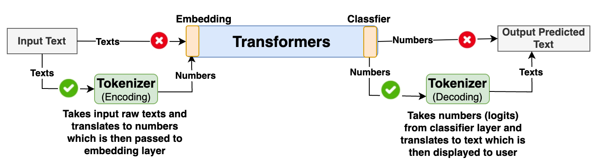
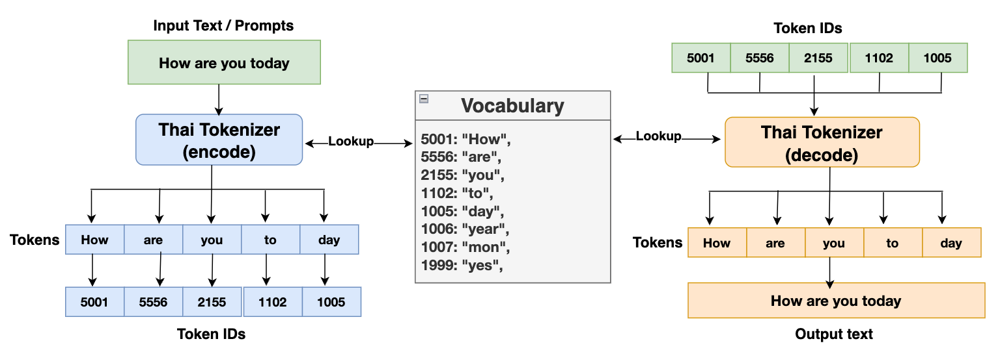
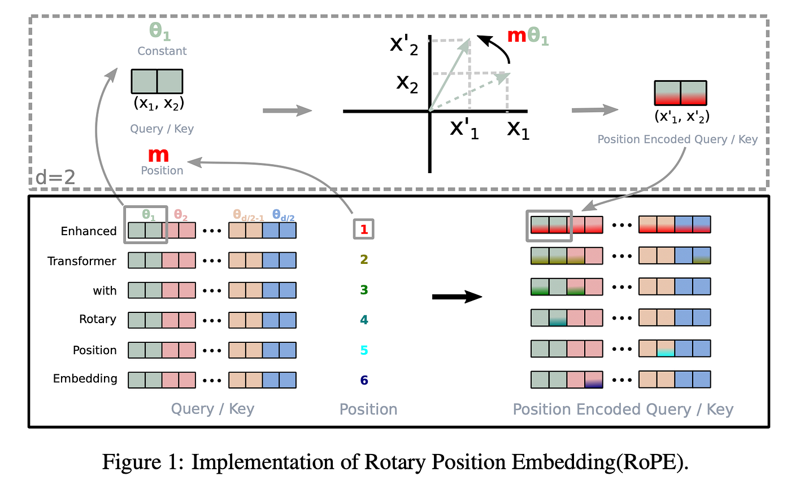

# Lesson 1：LLM 基础（Tokenizer、Decoder-only Transformer、Attention、参数量）

> **📌 课程定位说明**
>
> 本课程主要侧重于 **AI Infra（基础设施/系统）** 角度，而非算法研究。因此在算法原理上不会讲得特别深入，对于 AI Infra 工程师来说，只需了解实现原理即可，不必深究数学推导细节。

- **Tokenizer**：文本 → token ID（数字）
- **Decoder-only Transformer**：token ID → 词表上的 logits
- **生成（Generation）**：不断产生下一个 token ID，再 decode 回文本



---

## 核心概念

### 1) Tokenization：text → tokens → IDs

LLM 不是直接“读文字”，它读的是 **token ID**（整数序列）。

典型流程：

```
Text ──► (Tokenizer) ──► Tokens（字符串片段） ──► Token IDs（整数）
```

为什么 tokenizer 很重要：

- **上下文长度**按 token 数计算，而不是字符数
- **速度/吞吐**常常按“每生成 1 个 token 的成本”衡量
- token 的切分边界会影响模型表达（人名、代码、不同语言等）


你可以把 tokenizer 理解成一个“**可逆的字典压缩器**”：



- **Vocabulary（词表）**：一个固定字典，列出允许出现的“片段”（token）
- **Encode**：把文本拆成这些片段，并把每个片段映射成数字（token ID）
- **Decode**：把 token ID 再映射回片段，并拼回文本（因此它需要尽量可逆、稳定）

为什么不直接按“字符”或“词”？

- **字符级**：序列会变很长（token 数更多），注意力计算更贵，生成更慢
- **词级**：词表会爆炸（新词、拼写变化、人名、代码标识符），还会频繁遇到 OOV（词表外）问题

实际工程里常用的折中是 **子词/片段（subword pieces）**：

- 常见片段变成一个 token（更短的序列）
- 罕见词可以由多个片段组合（避免完全 OOV）
- 词表规模可控（常见是几万到十几万）

此外还有一类非常重要：**特殊 token（special tokens）**，比如：

- `<bos>` / `<eos>`：句子开始/结束
- `<pad>`：batch 对齐用的填充
- 以及聊天模型模板（role、分隔符等）

你后面会反复遇到一句话：**上下文长度、KV cache 大小、吞吐（tokens/s）基本都按 token 数来算**。

---

### 2) Embedding：token ID → 向量

Tokenizer 输出的是整数序列（token IDs），但神经网络需要的是**连续向量**。Embedding 层就是这个桥梁。

```
Token IDs: [1024, 5678, 42]
    │
    ▼
┌─────────────────────────────────┐
│  Embedding 查表                  │
│  (vocab_size × hidden_size)     │
└─────────────────────────────────┘
    │
    ▼
Hidden States: [[0.1, -0.2, ...], [0.3, 0.5, ...], [0.2, 0.1, ...]]
               形状: (seq_len, hidden_size)
```

**核心实现**：

```python
class Embedding(nn.Module):
    def __init__(self, vocab_size: int, hidden_size: int):
        super().__init__()
        # 创建一个可学习的查找表
        self.weight = nn.Parameter(torch.randn(vocab_size, hidden_size))

    def forward(self, token_ids: torch.Tensor) -> torch.Tensor:
        # token_ids: (batch_size, seq_len)
        # 返回: (batch_size, seq_len, hidden_size)
        return self.weight[token_ids]
```

**参数量**：`vocab_size × hidden_size`

以 Qwen3-8B 为例：`151936 × 4096 ≈ 622M` 参数（约占模型的 7%）

**关键点**：
- Embedding 本质上是一个"查表"操作，不涉及矩阵乘法
- 每个 token ID 对应一个固定的向量（训练时学习得到）
- 输出形状从 `(batch, seq_len)` 变为 `(batch, seq_len, hidden_size)`

---

### 3) LayerNorm 与 RMSNorm：层归一化

Normalization（归一化）是深度学习训练稳定的关键技术。没有归一化，深层网络很容易出现梯度爆炸或梯度消失。

#### 为什么需要归一化？

神经网络每一层的输出分布会随着训练不断变化（Internal Covariate Shift），这会导致：
- 后续层需要不断适应新的输入分布
- 训练不稳定，需要更小的学习率
- 收敛速度变慢

归一化的目标：**将每一层的输出"拉回"到稳定的分布**（均值≈0，方差≈1）。

#### LayerNorm 详解

**核心公式**：

对于输入向量 $x = [x_1, x_2, ..., x_d]$（d 是 hidden_size）：

$$
\text{LayerNorm}(x) = \gamma \cdot \frac{x - \mu}{\sqrt{\sigma^2 + \epsilon}} + \beta
$$

其中：
- $\mu = \frac{1}{d}\sum_{i=1}^{d} x_i$（均值）
- $\sigma^2 = \frac{1}{d}\sum_{i=1}^{d} (x_i - \mu)^2$（方差）
- $\gamma$（scale）和 $\beta$（shift）是可学习参数
- $\epsilon$ 是防止除零的小常数（如 1e-6）

**LayerNorm 核心实现**：

```python
class LayerNorm(nn.Module):
    def __init__(self, hidden_size: int, eps: float = 1e-6):
        super().__init__()
        self.gamma = nn.Parameter(torch.ones(hidden_size))   # 缩放参数
        self.beta = nn.Parameter(torch.zeros(hidden_size))   # 平移参数
        self.eps = eps

    def forward(self, x: torch.Tensor) -> torch.Tensor:
        # x: (batch, seq_len, hidden_size)

        # 1. 计算均值 (在最后一个维度上)
        mean = x.mean(dim=-1, keepdim=True)

        # 2. 计算方差
        var = x.var(dim=-1, keepdim=True, unbiased=False)

        # 3. 归一化: (x - mean) / sqrt(var + eps)
        x_norm = (x - mean) / torch.sqrt(var + self.eps)

        # 4. 缩放和平移: gamma * x_norm + beta
        return self.gamma * x_norm + self.beta
```

**参数量**：`2 × hidden_size`（gamma 和 beta 各 hidden_size 个）

#### 为什么 γ 和 β 很重要？

如果只做归一化（强制均值=0，方差=1），会限制网络的表达能力。通过可学习的 γ 和 β：

- 网络可以"学习"恢复原始分布（如果需要的话）
- 当 γ=σ, β=μ 时，相当于恒等变换（什么都不做）
- 网络可以在"归一化"和"保持原样"之间自由选择

#### RMSNorm：更简单的替代方案

现代 LLM（如 Llama、Qwen、Mistral）普遍使用 **RMSNorm** 替代 LayerNorm。

**核心公式**：

\[
\text{RMSNorm}(x) = \gamma \cdot \frac{x}{\text{RMS}(x)}
\]

其中：
\[
\text{RMS}(x) = \sqrt{\frac{1}{d}\sum_{i=1}^{d} x_i^2 + \epsilon}
\]

**关键区别**：

| 特性 | LayerNorm | RMSNorm |
|------|-----------|---------|
| 减均值（中心化） | ✅ 是 | ❌ 否 |
| 除标准差 | ✅ 是 | ❌ 否（除 RMS） |
| 加偏置 β | ✅ 是 | ❌ 否 |
| 参数量 | 2d | d |
| 计算量 | 较多 | 较少 |

**为什么 RMSNorm 有效**：

研究表明，LayerNorm 的主要作用来自**缩放**（除以某个统计量），而不是**中心化**（减均值）。RMSNorm 去掉了中心化步骤，但保留了核心的缩放作用，同时：
- 减少 ~50% 的计算量
- 减少 50% 的参数量
- 实验效果相当甚至更好

**RMSNorm 核心实现**：

```python
class RMSNorm(nn.Module):
    """Root Mean Square Layer Normalization"""
    def __init__(self, hidden_size: int, eps: float = 1e-6):
        super().__init__()
        self.weight = nn.Parameter(torch.ones(hidden_size))  # gamma
        self.eps = eps

    def forward(self, x: torch.Tensor) -> torch.Tensor:
        # x: (batch, seq_len, hidden_size)
        # 1. 计算 RMS: sqrt(mean(x^2))
        rms = torch.sqrt(x.pow(2).mean(dim=-1, keepdim=True) + self.eps)
        # 2. 归一化并缩放
        return (x / rms) * self.weight
```

**参数量**：`hidden_size`（只有 gamma，没有 beta）

---

### 4) Q/K/V 生成（Linear 投影）

Attention 的核心是 Query、Key、Value 三个向量。它们通过**线性投影**从输入 hidden states 生成。

```
Hidden States (batch, seq_len, hidden_size)
        │
        ├──► Wq ──► Q (Query)   : "我在找什么"
        │
        ├──► Wk ──► K (Key)     : "我有什么"
        │
        └──► Wv ──► V (Value)   : "我的内容是什么"
```

**核心实现**：

```python
# 简化版（不考虑多头）
self.q_proj = nn.Linear(hidden_size, hidden_size, bias=False)
self.k_proj = nn.Linear(hidden_size, hidden_size, bias=False)
self.v_proj = nn.Linear(hidden_size, hidden_size, bias=False)

# 前向传播
Q = self.q_proj(hidden_states)  # (batch, seq_len, hidden_size)
K = self.k_proj(hidden_states)
V = self.v_proj(hidden_states)
```

**Multi-Head Attention（多头注意力）**：

实际上我们会把 hidden_size 拆成多个"头"：

```python
# Qwen3-8B 配置
hidden_size = 4096
num_heads = 32
head_dim = hidden_size // num_heads  # = 128

# Q 实际形状
Q: (batch, seq_len, hidden_size)
   ──reshape──► (batch, seq_len, num_heads, head_dim)
   ──transpose──► (batch, num_heads, seq_len, head_dim)
```

**Grouped Query Attention (GQA)**：

现代 LLM（如 Llama2-70B、Qwen3）使用 GQA 来减少 KV cache 大小：

```
MHA:  32 个 Q heads, 32 个 K heads, 32 个 V heads
MQA:  32 个 Q heads,  1 个 K head,   1 个 V head
GQA:  32 个 Q heads,  8 个 K heads,  8 个 V heads（Qwen3-8B）
                      ↑
              每 4 个 Q heads 共享一组 KV
```

```python
# GQA 实现
self.q_proj = nn.Linear(hidden_size, num_heads * head_dim)       # 32 * 128 = 4096
self.k_proj = nn.Linear(hidden_size, num_kv_heads * head_dim)    # 8 * 128 = 1024
self.v_proj = nn.Linear(hidden_size, num_kv_heads * head_dim)    # 8 * 128 = 1024
```

**参数量**：
- Q: `hidden_size × (num_heads × head_dim)` = `4096 × 4096` ≈ 16.8M
- K: `hidden_size × (num_kv_heads × head_dim)` = `4096 × 1024` ≈ 4.2M
- V: `hidden_size × (num_kv_heads × head_dim)` = `4096 × 1024` ≈ 4.2M
- O (输出投影): `4096 × 4096` ≈ 16.8M
- **每层 Attention 总计**：约 42M 参数

---

### 5) RoPE：旋转位置编码

Transformer 的核心操作（矩阵乘法）本身是**位置无关**的——打乱输入顺序，输出也只是相应打乱。为了让模型理解"谁在前、谁在后"，我们需要注入位置信息。

**位置编码的演进**：

```
绝对位置编码 (GPT-1/2)     →  学习固定位置向量，直接加到 embedding
正弦位置编码 (Transformer)  →  用 sin/cos 生成位置向量，加到 embedding
相对位置编码 (T5, ALiBi)    →  在 attention 分数上加偏置
RoPE (Llama, Qwen, ...)    →  旋转 Q 和 K 向量 ← 现代主流
```

**RoPE 的核心思想**：

把位置信息"旋转"进 Q 和 K 向量中，使得两个位置 m 和 n 的向量点积自然包含它们的**相对距离** (m-n)。

```
位置 0 的向量：不旋转
位置 1 的向量：旋转 θ 度
位置 2 的向量：旋转 2θ 度
位置 m 的向量：旋转 m×θ 度
```



**数学原理**：

对于 2D 向量，旋转矩阵为：

```
[cos(mθ)  -sin(mθ)]   [x₀]   [x₀·cos(mθ) - x₁·sin(mθ)]
[sin(mθ)   cos(mθ)] × [x₁] = [x₀·sin(mθ) + x₁·cos(mθ)]
```

对于高维向量（如 head_dim=128），我们把它分成 64 对，每对使用不同频率的 θ。

**论文中的数学描述** vs **PyTorch 实际实现**：

论文中描述的是相邻维度配对：
```
维度 0,1:  使用 θ₀ = base^(-0/d)     → 高频，变化快
维度 2,3:  使用 θ₁ = base^(-2/d)     →
维度 4,5:  使用 θ₂ = base^(-4/d)     →
   ...
维度 126,127: 使用 θ₆₃ = base^(-126/d) → 低频，变化慢
```

但 **PyTorch 实际实现是前后半配对**（以 head_dim=4 为例）：
```
论文描述:    (0,1) 用 θ₀,  (2,3) 用 θ₁
PyTorch实现: (0,2) 用 θ₀,  (1,3) 用 θ₁
```

这是因为 `rotate_half` 函数将向量分成前后两半，而不是交错取相邻维度：
```python
x1 = x[..., :2]   # [x₀, x₁] 前半
x2 = x[..., 2:]   # [x₂, x₃] 后半
rotate_half(x) = [-x₂, -x₃, x₀, x₁]
```

**两种方式数学上完全等价**，只是维度排列不同。PyTorch 这样实现是为了利用连续内存访问，避免交错索引带来的性能损失。

其中 `base` 通常是 10000（原始 Transformer）或 1000000（Qwen3 长上下文）。

**为什么 RoPE 能编码相对位置**：

当计算 Q_m · K_n 时（位置 m 的 Q 和位置 n 的 K 的点积）：

```
Q_m · K_n = (R(mθ) · q) · (R(nθ) · k)
          = q · R((m-n)θ) · k    ← 只依赖相对距离 (m-n)！
```

这意味着模型"看到"的是两个 token 之间的距离，而不是它们的绝对位置。

**核心实现**：

```python
class RotaryEmbedding(nn.Module):
    def __init__(self, head_dim: int, base: float = 10000.0):
        super().__init__()
        # 计算每对维度的频率: θ_i = base^(-2i/d)
        inv_freq = 1.0 / (base ** (torch.arange(0, head_dim, 2).float() / head_dim))
        self.register_buffer("inv_freq", inv_freq)

    def forward(self, seq_len: int, device: torch.device):
        # 位置索引: [0, 1, 2, ..., seq_len-1]
        t = torch.arange(seq_len, device=device, dtype=torch.float32)

        # 计算每个位置、每个频率的角度: (seq_len, head_dim/2)
        freqs = torch.outer(t, self.inv_freq)

        # 复制以匹配 head_dim: (seq_len, head_dim)
        emb = torch.cat((freqs, freqs), dim=-1)

        return emb.cos(), emb.sin()
```

**应用 RoPE 到 Q 和 K**：

```python
def apply_rotary_pos_emb(q, k, cos, sin):
    """
    q, k: (batch, num_heads, seq_len, head_dim)
    cos, sin: (seq_len, head_dim)
    """
    def rotate_half(x):
        """将后半部分取负并与前半部分交换"""
        x1 = x[..., : x.shape[-1] // 2]
        x2 = x[..., x.shape[-1] // 2 :]
        return torch.cat((-x2, x1), dim=-1)

    # 旋转公式: x * cos + rotate_half(x) * sin
    q_embed = (q * cos) + (rotate_half(q) * sin)
    k_embed = (k * cos) + (rotate_half(k) * sin)

    return q_embed, k_embed
```

**在 Attention 中的位置**：

```
Q_proj ──► Q ──► RoPE ──┐
                        ├──► Attention Score ──► ...
K_proj ──► K ──► RoPE ──┘

V_proj ──► V ────────────────────────────────► ...
                    （V 不需要 RoPE）
```

**RoPE 的优势**：

| 特性 | 说明 |
|------|------|
| **相对位置** | 点积自然包含相对距离，无需显式计算 |
| **外推能力** | 理论上可处理训练时未见过的长度 |
| **零参数量** | 不增加可学习参数 |
| **计算高效** | 只需简单的乘法和加法 |
| **兼容性好** | 可与 Flash Attention 等优化技术结合 |

**长上下文扩展**：

Qwen3 使用 `base=1000000`（而非原始的 10000），使低频成分变化更慢，从而支持更长的上下文（40K+ tokens）。这种技术称为 **NTK-aware scaling** 或 **Dynamic NTK**。

---

### 6) Attention：注意力计算

有了 Q、K、V 之后，就可以计算注意力了：

```
         Q        K^T           Softmax          V
      (seq, d) × (d, seq)  →  (seq, seq)  ×  (seq, d)  →  (seq, d)
         │          │            │             │
         └────┬────┘            │             │
              ▼                  │             │
           scores               ▼             │
         (seq, seq)          weights          │
              │             (seq, seq)         │
              └────────────────┬───────────────┘
                               ▼
                            output
                           (seq, d)
```

**核心公式**：

\[
\text{Attention}(Q, K, V) = \text{softmax}\left(\frac{QK^T}{\sqrt{d_k}}\right) V
\]

**核心实现**：

```python
def scaled_dot_product_attention(Q, K, V, mask=None):
    """
    Q, K, V: (batch, num_heads, seq_len, head_dim)
    """
    d_k = Q.shape[-1]

    # 1. 计算注意力分数
    scores = torch.matmul(Q, K.transpose(-2, -1)) / math.sqrt(d_k)
    # scores: (batch, num_heads, seq_len, seq_len)

    # 2. 应用因果掩码（autoregressive generation）
    if mask is not None:
        scores = scores + mask  # mask 中未来位置是 -inf

    # 3. Softmax 归一化
    attn_weights = F.softmax(scores, dim=-1)
    # attn_weights: (batch, num_heads, seq_len, seq_len)

    # 4. 加权求和
    output = torch.matmul(attn_weights, V)
    # output: (batch, num_heads, seq_len, head_dim)

    return output, attn_weights
```

**因果掩码（Causal Mask）**：

对于自回归生成，位置 t 只能看到位置 0~t，不能看到未来：

```python
def causal_mask(seq_len):
    """
    返回:
    [[  0, -inf, -inf, -inf],
     [  0,    0, -inf, -inf],
     [  0,    0,    0, -inf],
     [  0,    0,    0,    0]]
    """
    mask = torch.full((seq_len, seq_len), float("-inf"))
    mask = torch.triu(mask, diagonal=1)
    return mask
```

**为什么要除以 √d_k**：

如果不缩放，当 d_k 很大时，点积值会很大，softmax 会变得非常"尖锐"（接近 one-hot），梯度接近 0。除以 √d_k 可以稳定训练。

**复杂度**：O(n²) 其中 n 是序列长度——这是长上下文的主要瓶颈。

---

### 7) MLP（前馈网络）

每个 Transformer 层的另一半是 MLP（也叫 FFN）。它对每个 token 位置独立做非线性变换。

**传统 FFN**：

```
x ──► Linear(d→4d) ──► ReLU ──► Linear(4d→d) ──► output
```

**现代 LLM 使用 SwiGLU**（Qwen3、Llama）：

```
        ┌──► gate_proj ──► SiLU ───┐
        │                          │
x ──────┤                          ├──► 逐元素乘 ──► down_proj ──► output
        │                          │
        └──► up_proj ──────────────┘
```

**核心实现**：

```python
class MLP(nn.Module):
    def __init__(self, hidden_size: int, intermediate_size: int):
        super().__init__()
        # Qwen3-8B: hidden_size=4096, intermediate_size=14336
        self.gate_proj = nn.Linear(hidden_size, intermediate_size, bias=False)
        self.up_proj = nn.Linear(hidden_size, intermediate_size, bias=False)
        self.down_proj = nn.Linear(intermediate_size, hidden_size, bias=False)

    def forward(self, x):
        # SwiGLU: silu(gate(x)) * up(x)
        gate = F.silu(self.gate_proj(x))  # SiLU = x * sigmoid(x)
        up = self.up_proj(x)
        return self.down_proj(gate * up)
```

**参数量**（每层 MLP）：
- gate_proj: `4096 × 14336` ≈ 58.7M
- up_proj: `4096 × 14336` ≈ 58.7M
- down_proj: `14336 × 4096` ≈ 58.7M
- **每层 MLP 总计**：约 176M 参数

**关键点**：MLP 通常占模型参数量的 **60-70%**！

---

### 8) 完整的 Transformer 层

把上面的组件组合起来，一个完整的 Transformer 层（Pre-Norm 架构）如下：

```
Input Hidden States
        │
        ▼
   ┌─────────┐
   │ RMSNorm │ ←── input_layernorm
   └────┬────┘
        │
        ▼
   ┌─────────────────────────────────────┐
   │           Self-Attention             │
   │  ┌─────────────────────────────┐    │
   │  │ Q/K/V Proj ──► RoPE ──► Attn │    │
   │  └─────────────────────────────┘    │
   │               │                      │
   │               ▼ O Proj               │
   └─────────────────────────────────────┘
        │
        ├──────── + Residual ◄──────────────┐
        │                                   │
        ▼                                   │
   ┌─────────┐                              │
   │ RMSNorm │ ←── post_attention_layernorm │
   └────┬────┘                              │
        │                                   │
        ▼                                   │
   ┌─────────────────┐                      │
   │      MLP        │                      │
   │ (SwiGLU: 3层)   │                      │
   └────────┬────────┘                      │
            │                               │
            ├──────── + Residual ◄──────────┘
            │
            ▼
     Output Hidden States
```

**代码实现**：

```python
class TransformerBlock(nn.Module):
    def __init__(self, config):
        super().__init__()
        self.input_layernorm = RMSNorm(config.hidden_size)
        self.self_attn = Attention(config)
        self.post_attention_layernorm = RMSNorm(config.hidden_size)
        self.mlp = MLP(config)

    def forward(self, x, attention_mask=None, position_ids=None):
        # 1. Self-Attention (with residual)
        residual = x
        x = self.input_layernorm(x)
        x = self.self_attn(x, attention_mask, position_ids)
        x = residual + x

        # 2. MLP (with residual)
        residual = x
        x = self.post_attention_layernorm(x)
        x = self.mlp(x)
        x = residual + x

        return x
```

---

### 9) 参数量从哪里来？

以 Qwen3-8B 为例，每层参数量分布：

| 组件 | 参数量 | 占比 |
|------|--------|------|
| Q Proj | 16.8M | 7.5% |
| K Proj | 4.2M | 1.9% |
| V Proj | 4.2M | 1.9% |
| O Proj | 16.8M | 7.5% |
| **Attention 小计** | **42M** | **18.8%** |
| Gate Proj | 58.7M | 26.3% |
| Up Proj | 58.7M | 26.3% |
| Down Proj | 58.7M | 26.3% |
| **MLP 小计** | **176M** | **78.9%** |
| RMSNorm ×2 | 8K | ~0% |

**结论**：MLP 占了每层参数的 ~80%！

**完整 8B 模型参数分布**：
- Embedding: ~622M (7%)
- 36 × Transformer Layer: ~7.8B (92%)
- Final RMSNorm + LM Head: ~626M (1%)

---
## 参考资料

- [The Illustrated Transformer](https://jalammar.github.io/illustrated-transformer/)
- [Attention Is All You Need](https://arxiv.org/abs/1706.03762)
- [The Illustrated GPT-2](https://jalammar.github.io/illustrated-gpt2/)


