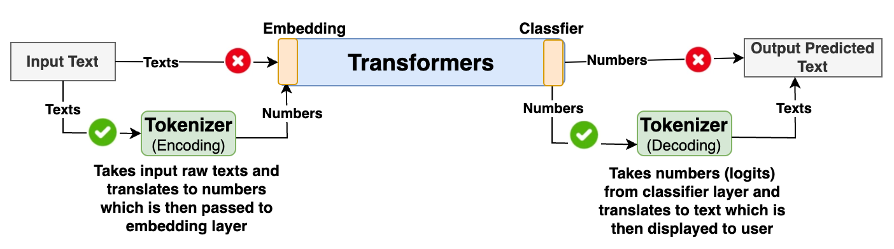
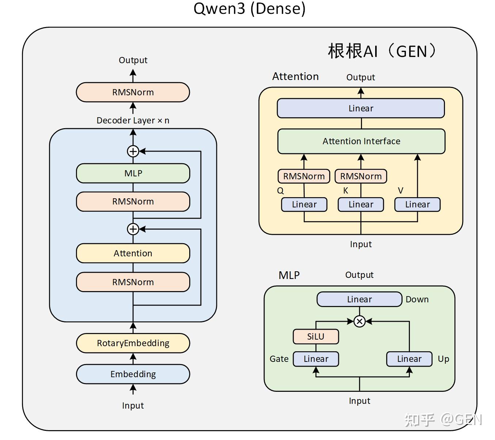
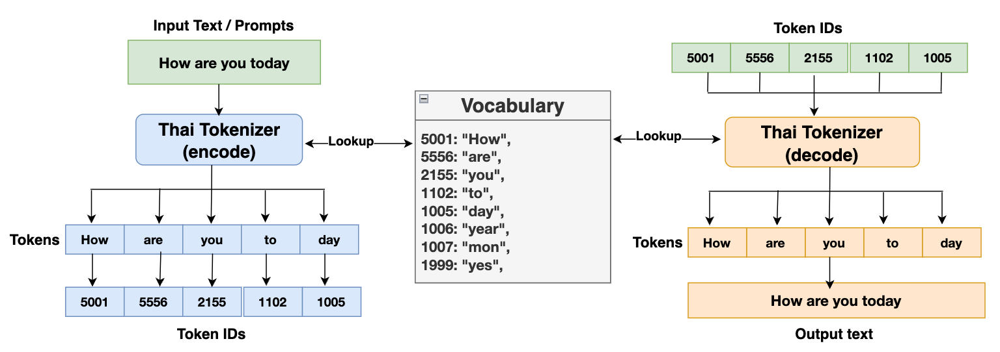
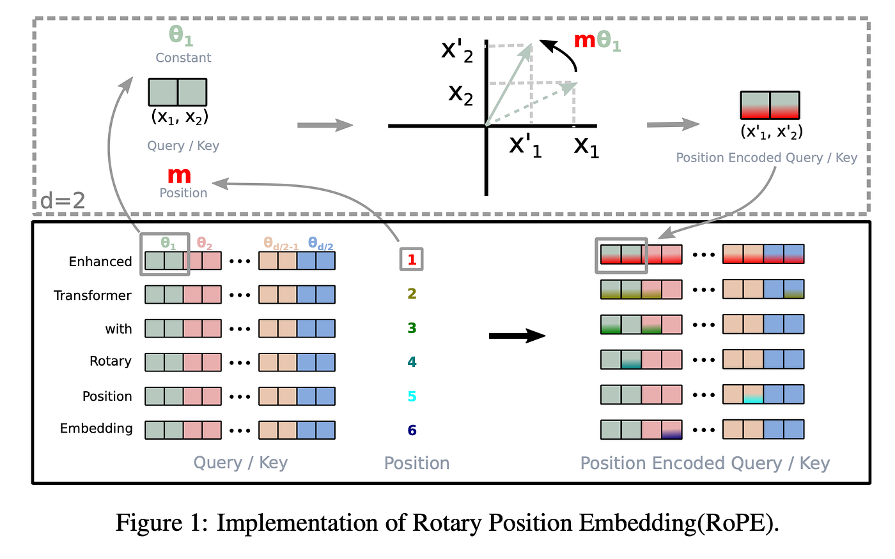
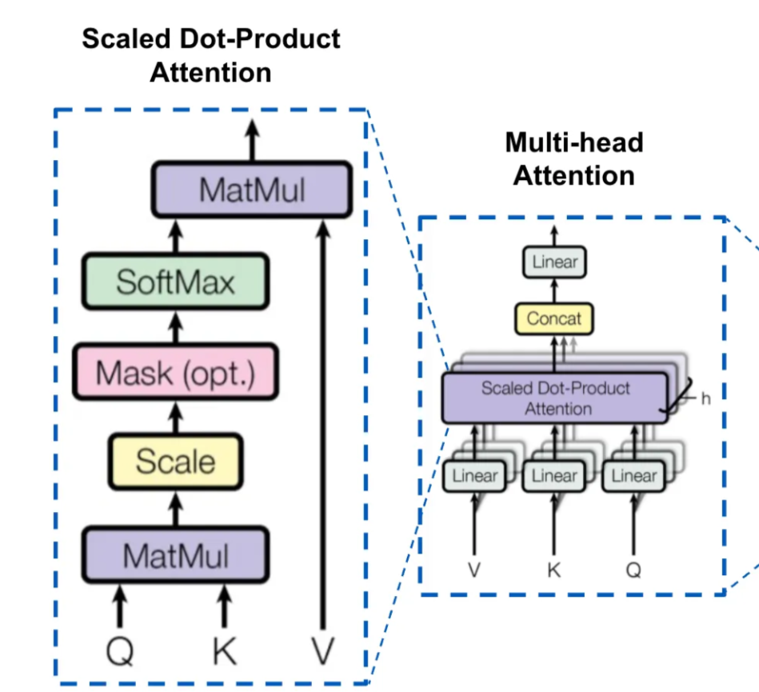
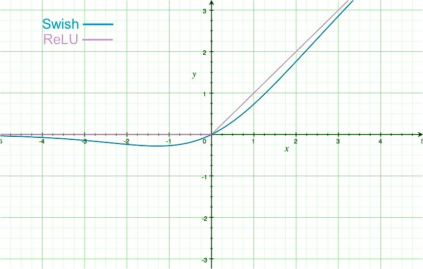

# Lesson 1：LLM 基础（Tokenizer、Decoder-only Transformer、Attention、参数量）

<div style="background: linear-gradient(135deg, #667eea 0%, #764ba2 100%); padding: 20px; border-radius: 12px; margin: 20px 0;">
<h2 style="color: white; margin: 0 0 12px 0; font-size: 1.5em;">📌 课程定位说明</h2>
<p style="color: white; font-size: 1.2em; line-height: 1.6; margin: 0;">
本课程主要侧重于 <strong>AI Infra（基础设施/系统）</strong> 角度，而非算法研究。因此在算法原理上不会讲得特别深入，对于 AI Infra 工程师来说，只需了解实现原理即可，不必深究数学推导细节。
</p>
<p style="color: #e0e0e0; font-size: 1.1em; line-height: 1.6; margin: 12px 0 0 0;">
🔖 本课程以 <strong style="color: #ffd700;">Qwen3-8B</strong> 的网络架构为例进行讲解，帮助大家理解现代 LLM 的核心组件和实现细节。
</p>
</div>

- **Tokenizer**：文本 → token ID（数字）
- **Decoder-only Transformer**：token ID → 词表上的 logits
- **生成（Generation）**：不断产生下一个 token ID，再 decode 回文本





---

## 核心概念

### 1) Tokenization：text → tokens → IDs

LLM 不是直接“读文字”，它读的是 **token ID**（整数序列）。

典型流程：

```
Text ──► (Tokenizer) ──► Tokens（字符串片段） ──► Token IDs（整数）
```

为什么 tokenizer 很重要：

- **上下文长度**按 token 数计算，而不是字符数
- **速度/吞吐**常常按“每生成 1 个 token 的成本”衡量
- token 的切分边界会影响模型表达（人名、代码、不同语言等）


你可以把 tokenizer 理解成一个“**可逆的字典压缩器**”：



- **Vocabulary（词表）**：一个固定字典，列出允许出现的“片段”（token）
- **Encode**：把文本拆成这些片段，并把每个片段映射成数字（token ID）
- **Decode**：把 token ID 再映射回片段，并拼回文本（因此它需要尽量可逆、稳定）

为什么不直接按“字符”或“词”？

- **字符级**：序列会变很长（token 数更多），注意力计算更贵，生成更慢
- **词级**：词表会爆炸（新词、拼写变化、人名、代码标识符），还会频繁遇到 OOV（词表外）问题

实际工程里常用的折中是 **子词/片段（subword pieces）**：

- 常见片段变成一个 token（更短的序列）
- 罕见词可以由多个片段组合（避免完全 OOV）
- 词表规模可控（常见是几万到十几万）

此外还有一类非常重要：**特殊 token（special tokens）**，比如：

- `<bos>` / `<eos>`：句子开始/结束
- `<pad>`：batch 对齐用的填充
- 以及聊天模型模板（role、分隔符等）

你后面会反复遇到一句话：**上下文长度、KV cache 大小、吞吐（tokens/s）基本都按 token 数来算**。

---

### 2) Embedding：token ID → 向量

Tokenizer 输出的是整数序列（token IDs），但神经网络需要的是**连续向量**。Embedding 层就是这个桥梁。

```
Token IDs: [1024, 5678, 42]
    │
    ▼
┌─────────────────────────────────┐
│  Embedding 查表                  │
│  (vocab_size × hidden_size)     │
└─────────────────────────────────┘
    │
    ▼
Hidden States: [[0.1, -0.2, ...], [0.3, 0.5, ...], [0.2, 0.1, ...]]
               形状: (seq_len, hidden_size)
```

**核心实现**：

```python
class Embedding(nn.Module):
    def __init__(self, vocab_size: int, hidden_size: int):
        super().__init__()
        # 创建一个可学习的查找表
        self.weight = nn.Parameter(torch.randn(vocab_size, hidden_size))

    def forward(self, token_ids: torch.Tensor) -> torch.Tensor:
        # token_ids: (batch_size, seq_len)
        # 返回: (batch_size, seq_len, hidden_size)
        return self.weight[token_ids]
```

**参数量**：`vocab_size × hidden_size`

以 Qwen3-8B 为例：`151936 × 4096 ≈ 622M` 参数（约占模型的 7%）

**关键点**：
- Embedding 本质上是一个"查表"操作，不涉及矩阵乘法
- 每个 token ID 对应一个固定的向量（训练时学习得到）
- 输出形状从 `(batch, seq_len)` 变为 `(batch, seq_len, hidden_size)`

---

### 3) LayerNorm 与 RMSNorm：层归一化

Normalization（归一化）是深度学习训练稳定的关键技术。没有归一化，深层网络很容易出现梯度爆炸或梯度消失。

#### 为什么需要归一化？

神经网络每一层的输出分布会随着训练不断变化（Internal Covariate Shift），这会导致：
- 后续层需要不断适应新的输入分布
- 训练不稳定，需要更小的学习率
- 收敛速度变慢

归一化的目标：**将每一层的输出"拉回"到稳定的分布**（均值≈0，方差≈1）。

#### LayerNorm 详解

**核心公式**：

对于输入向量 $x = [x_1, x_2, ..., x_d]$（d 是 hidden_size）：

$$
\text{LayerNorm}(x) = \gamma \cdot \frac{x - \mu}{\sqrt{\sigma^2 + \epsilon}} + \beta
$$

其中：
- $\mu = \frac{1}{d}\sum_{i=1}^{d} x_i$（均值）
- $\sigma^2 = \frac{1}{d}\sum_{i=1}^{d} (x_i - \mu)^2$（方差）
- $\gamma$（scale）和 $\beta$（shift）是可学习参数
- $\epsilon$ 是防止除零的小常数（如 1e-6）

**LayerNorm 核心实现**：

```python
class LayerNorm(nn.Module):
    def __init__(self, hidden_size: int, eps: float = 1e-6):
        super().__init__()
        self.gamma = nn.Parameter(torch.ones(hidden_size))   # 缩放参数
        self.beta = nn.Parameter(torch.zeros(hidden_size))   # 平移参数
        self.eps = eps

    def forward(self, x: torch.Tensor) -> torch.Tensor:
        # x: (batch, seq_len, hidden_size)

        # 1. 计算均值 (在最后一个维度上)
        mean = x.mean(dim=-1, keepdim=True)

        # 2. 计算方差
        var = x.var(dim=-1, keepdim=True, unbiased=False)

        # 3. 归一化: (x - mean) / sqrt(var + eps)
        x_norm = (x - mean) / torch.sqrt(var + self.eps)

        # 4. 缩放和平移: gamma * x_norm + beta
        return self.gamma * x_norm + self.beta
```

**参数量**：`2 × hidden_size`（gamma 和 beta 各 hidden_size 个）

#### 为什么 γ 和 β 很重要？

如果只做归一化（强制均值=0，方差=1），会限制网络的表达能力。通过可学习的 γ 和 β：

- 网络可以"学习"恢复原始分布（如果需要的话）
- 当 γ=σ, β=μ 时，相当于恒等变换（什么都不做）
- 网络可以在"归一化"和"保持原样"之间自由选择

#### RMSNorm：更简单的替代方案

现代 LLM（如 Llama、Qwen、Mistral）普遍使用 **RMSNorm** 替代 LayerNorm。

**核心公式**：

$$
\text{RMSNorm}(x) = \gamma \cdot \frac{x}{\text{RMS}(x)}
$$

其中：

$$
\text{RMS}(x) = \sqrt{\frac{1}{d}\sum_{i=1}^{d} x_i^2 + \epsilon}
$$

**关键区别**：

| 特性 | LayerNorm | RMSNorm |
|------|-----------|---------|
| 减均值（中心化） | ✅ 是 | ❌ 否 |
| 除标准差 | ✅ 是 | ❌ 否（除 RMS） |
| 加偏置 β | ✅ 是 | ❌ 否 |
| 参数量 | 2d | d |
| 计算量 | 较多 | 较少 |

**为什么 RMSNorm 有效**：

研究表明，LayerNorm 的主要作用来自**缩放**（除以某个统计量），而不是**中心化**（减均值）。RMSNorm 去掉了中心化步骤，但保留了核心的缩放作用，同时：
- 减少 ~50% 的计算量
- 减少 50% 的参数量
- 实验效果相当甚至更好

**RMSNorm 核心实现**：

```python
class RMSNorm(nn.Module):
    """Root Mean Square Layer Normalization"""
    def __init__(self, hidden_size: int, eps: float = 1e-6):
        super().__init__()
        self.weight = nn.Parameter(torch.ones(hidden_size))  # gamma
        self.eps = eps

    def forward(self, x: torch.Tensor) -> torch.Tensor:
        # x: (batch, seq_len, hidden_size)
        # 1. 计算 RMS: sqrt(mean(x^2))
        rms = torch.sqrt(x.pow(2).mean(dim=-1, keepdim=True) + self.eps)
        # 2. 归一化并缩放
        return (x / rms) * self.weight
```

**参数量**：`hidden_size`（只有 gamma，没有 beta）

---

### 4) Q/K/V 生成（Linear 投影）

Attention 的核心是 Query、Key、Value 三个向量。它们通过**线性投影**从输入 hidden states 生成。

```
Hidden States (batch, seq_len, hidden_size)
        │
        ├──► Wq ──► Q (Query)   : "我在找什么"
        │
        ├──► Wk ──► K (Key)     : "我有什么"
        │
        └──► Wv ──► V (Value)   : "我的内容是什么"
```

#### Linear 层基础：矩阵乘法

在深入 Q/K/V 之前，先理解 **Linear 层**（也叫全连接层、Dense 层）的本质。

**数学定义**：

$$
y = xW^T + b
$$

其中：
- $x$：输入向量，形状 `(*, in_features)`
- $W$：权重矩阵，形状 `(out_features, in_features)`
- $b$：偏置向量，形状 `(out_features)`（可选）
- $y$：输出向量，形状 `(*, out_features)`

**矩阵乘法图解**：

```
输入 x              权重 W^T              输出 y
(1, in_features)   (in_features, out)   (1, out_features)

[x₀ x₁ x₂ x₃]  ×  [w₀₀ w₀₁ w₀₂]   =   [y₀ y₁ y₂]
                   [w₁₀ w₁₁ w₁₂]
                   [w₂₀ w₂₁ w₂₂]
                   [w₃₀ w₃₁ w₃₂]

每个输出元素:
y₀ = x₀·w₀₀ + x₁·w₁₀ + x₂·w₂₀ + x₃·w₃₀  (输入与第 0 列点积)
y₁ = x₀·w₀₁ + x₁·w₁₁ + x₂·w₂₁ + x₃·w₃₁  (输入与第 1 列点积)
y₂ = x₀·w₀₂ + x₁·w₁₂ + x₂·w₂₂ + x₃·w₃₂  (输入与第 2 列点积)
```

**PyTorch 实现**：

```python
import torch.nn as nn

# 创建一个 Linear 层：4 维输入 → 3 维输出
linear = nn.Linear(in_features=4, out_features=3, bias=False)

# 查看权重形状
print(linear.weight.shape)  # torch.Size([3, 4])  即 (out_features, in_features)

# 前向传播
x = torch.randn(2, 5, 4)    # (batch=2, seq_len=5, in_features=4)
y = linear(x)               # (batch=2, seq_len=5, out_features=3)
```

**关键理解**：

| 概念 | 说明 |
|------|------|
| **线性变换** | Linear 层本质是对输入做线性变换（旋转、缩放、投影） |
| **参数量** | `in_features × out_features`（+ out_features 如果有 bias） |
| **无激活函数** | Linear 本身不含非线性，需配合 ReLU/SiLU 等使用 |
| **批量处理** | 对 batch 和 seq_len 维度独立作用，只变换最后一维 |

**在 LLM 中的应用**：

```python
# Q/K/V 投影就是 3 个 Linear 层
self.q_proj = nn.Linear(4096, 4096, bias=False)  # hidden → Q
self.k_proj = nn.Linear(4096, 1024, bias=False)  # hidden → K (GQA: 更小)
self.v_proj = nn.Linear(4096, 1024, bias=False)  # hidden → V (GQA: 更小)

# 计算量：每个 token 需要 in × out 次乘加操作
# Q: 4096 × 4096 = 16.7M FLOPs/token
```

**核心实现**：

```python
# 简化版（不考虑多头）
self.q_proj = nn.Linear(hidden_size, hidden_size, bias=False)
self.k_proj = nn.Linear(hidden_size, hidden_size, bias=False)
self.v_proj = nn.Linear(hidden_size, hidden_size, bias=False)

# 前向传播
Q = self.q_proj(hidden_states)  # (batch, seq_len, hidden_size)
K = self.k_proj(hidden_states)
V = self.v_proj(hidden_states)
```

**Multi-Head Attention（多头注意力）**：

实际上我们会把 hidden_size 拆成多个"头"：

```python
# Qwen3-8B 配置
hidden_size = 4096
num_heads = 32
head_dim = hidden_size // num_heads  # = 128

# Q 实际形状
Q: (batch, seq_len, hidden_size)
   ──reshape──► (batch, seq_len, num_heads, head_dim)
   ──transpose──► (batch, num_heads, seq_len, head_dim)
```

**Grouped Query Attention (GQA)**：

现代 LLM（如 Llama2-70B、Qwen3）使用 GQA 来减少 KV cache 大小：

```
MHA:  32 个 Q heads, 32 个 K heads, 32 个 V heads
MQA:  32 个 Q heads,  1 个 K head,   1 个 V head
GQA:  32 个 Q heads,  8 个 K heads,  8 个 V heads（Qwen3-8B）
                      ↑
              每 4 个 Q heads 共享一组 KV
```

```python
# GQA 实现
self.q_proj = nn.Linear(hidden_size, num_heads * head_dim)       # 32 * 128 = 4096
self.k_proj = nn.Linear(hidden_size, num_kv_heads * head_dim)    # 8 * 128 = 1024
self.v_proj = nn.Linear(hidden_size, num_kv_heads * head_dim)    # 8 * 128 = 1024
```

**参数量**：
- Q: `hidden_size × (num_heads × head_dim)` = `4096 × 4096` ≈ 16.8M
- K: `hidden_size × (num_kv_heads × head_dim)` = `4096 × 1024` ≈ 4.2M
- V: `hidden_size × (num_kv_heads × head_dim)` = `4096 × 1024` ≈ 4.2M
- O (输出投影): `4096 × 4096` ≈ 16.8M
- **每层 Attention 总计**：约 42M 参数

---

### 5) RoPE：旋转位置编码

Transformer 的核心操作（矩阵乘法）本身是**位置无关**的——打乱输入顺序，输出也只是相应打乱。为了让模型理解"谁在前、谁在后"，我们需要注入位置信息。

**位置编码的演进**：

```
绝对位置编码 (GPT-1/2)     →  学习固定位置向量，直接加到 embedding
正弦位置编码 (Transformer)  →  用 sin/cos 生成位置向量，加到 embedding
相对位置编码 (T5, ALiBi)    →  在 attention 分数上加偏置
RoPE (Llama, Qwen, ...)    →  旋转 Q 和 K 向量 ← 现代主流
```

**RoPE 的核心思想**：

把位置信息"旋转"进 Q 和 K 向量中，使得两个位置 m 和 n 的向量点积自然包含它们的**相对距离** (m-n)。



下面我们按**计算流程**，一步一步推导 RoPE 是如何实现的。

---

#### Step 1：计算 head_dim 维度上的旋转频率 `inv_freq`

RoPE 的第一步是为 Q/K 向量的每个维度对分配一个**旋转频率**。

以 head_dim=128 为例，我们把 128 维向量分成 **64 对**，每对使用不同频率的 θ：

```
θ₀ = 1 / base^(0/128)    → 频率最高，旋转最快（捕捉近距离关系）
θ₁ = 1 / base^(2/128)    →
θ₂ = 1 / base^(4/128)    →
  ...
θ₆₃ = 1 / base^(126/128)  → 频率最低，旋转最慢（捕捉远距离关系）
```

**直觉**：类似钟表——秒针转得快（高频，感知短间隔），时针转得慢（低频，感知长间隔）。64 个频率组合在一起，可以精确编码任意位置。

```python
# inv_freq 形状: (head_dim / 2,) = (64,)
inv_freq = 1.0 / (base ** (torch.arange(0, head_dim, 2).float() / head_dim))
#                           [0, 2, 4, ..., 126] / 128
# 结果: [1.0, 0.93, 0.87, ..., 0.00001]  ← 从高频到低频
```

其中 `base` 通常是 10000（原始 Transformer）或 1000000（Qwen3 长上下文）。base 越大，低频成分变化越慢，能编码的最大距离越远。

---

#### Step 2：乘以位置 ID，得到每个位置的旋转角度

将步骤 1 的频率向量与位置索引 `[0, 1, 2, ..., seq_len-1]` 做**外积**，得到每个位置在每个维度对上的旋转角度：

```
                        inv_freq (64 个频率)
                    θ₀      θ₁      θ₂     ...   θ₆₃
位置 0:          0·θ₀    0·θ₁    0·θ₂    ...   0·θ₆₃     ← 不旋转
位置 1:          1·θ₀    1·θ₁    1·θ₂    ...   1·θ₆₃     ← 旋转一点
位置 2:          2·θ₀    2·θ₁    2·θ₂    ...   2·θ₆₃     ← 旋转更多
  ...
位置 m:          m·θ₀    m·θ₁    m·θ₂    ...   m·θ₆₃
```

```python
# 位置索引
t = torch.arange(seq_len, dtype=torch.float32)  # [0, 1, 2, ..., seq_len-1]

# 外积: (seq_len,) × (head_dim/2,) → (seq_len, head_dim/2)
freqs = torch.outer(t, inv_freq)
# freqs[m, i] = m × θ_i  表示位置 m 在第 i 个维度对上的旋转角度
```

---

#### Step 3：计算 cos 和 sin 值

将角度矩阵复制一份（匹配完整的 head_dim），然后计算 cos 和 sin：

```python
# 复制以匹配 head_dim: (seq_len, head_dim/2) → (seq_len, head_dim)
emb = torch.cat((freqs, freqs), dim=-1)

# 计算 cos/sin: (seq_len, head_dim)
cos = emb.cos()   # cos(m·θ_i) 矩阵
sin = emb.sin()   # sin(m·θ_i) 矩阵
```

> **为什么要 cat 复制？** 因为每对维度共享同一个频率。head_dim=128 分成 64 对，每对 (x₀, x₁) 用同一个 θ，所以 cos/sin 需要扩展为 128 维来逐元素操作。

---

#### Step 4：旋转矩阵乘法

有了每个位置的 cos/sin 值，就可以对 Q/K 向量做旋转了。

**2D 旋转的数学原理**：

对于一对维度 (x₀, x₁)，位置 m 的旋转矩阵为：

```
[cos(mθ)  -sin(mθ)]   [x₀]   [x₀·cos(mθ) - x₁·sin(mθ)]
[sin(mθ)   cos(mθ)] × [x₁] = [x₀·sin(mθ) + x₁·cos(mθ)]
```

对于高维向量（head_dim=128），64 对维度各自独立旋转（互不干扰），相当于一个分块对角矩阵。

**PyTorch 的高效实现**：

论文描述的是相邻维度配对 (0,1), (2,3), ...，但 PyTorch 实际使用**前后半配对**——将向量分成前半 `x[:64]` 和后半 `x[64:]`，配对为 (0,64), (1,65), (2,66), ...

这样做是为了利用连续内存访问，避免交错索引：

```python
def rotate_half(x):
    """将前半部分和后半部分交换并取反"""
    x1 = x[..., : x.shape[-1] // 2]    # 前半: [x₀, x₁, ..., x₆₃]
    x2 = x[..., x.shape[-1] // 2 :]    # 后半: [x₆₄, x₆₅, ..., x₁₂₇]
    return torch.cat((-x2, x1), dim=-1) # [-x₆₄, ..., -x₁₂₇, x₀, ..., x₆₃]

# 旋转公式（等价于矩阵乘法，但更高效）:
x_rotated = x * cos + rotate_half(x) * sin
```

**两种配对方式数学上完全等价**，只是维度排列不同。

---

#### Step 5：应用到 Q 和 K

在 Attention 计算中，RoPE **只应用于 Q 和 K，不应用于 V**：

```
Q_proj ──► Q ──► 应用 RoPE ──┐
                              ├──► Q·K^T ──► Attention Score ──► ...
K_proj ──► K ──► 应用 RoPE ──┘

V_proj ──► V ──────────────────────────────────────────────► ...
                           （V 不需要 RoPE）
```

```python
def apply_rotary_pos_emb(q, k, cos, sin):
    """
    q, k: (batch, num_heads, seq_len, head_dim)
    cos, sin: (1, 1, seq_len, head_dim)  — 广播到所有 batch 和 head
    """
    q_embed = q * cos + rotate_half(q) * sin
    k_embed = k * cos + rotate_half(k) * sin
    return q_embed, k_embed
```

**为什么 RoPE 能编码相对位置？**

当计算位置 m 的 Q 和位置 n 的 K 的点积时：

```
Q_m · K_n = (R(mθ) · q) · (R(nθ) · k)
          = q · R((m-n)θ) · k    ← 只依赖相对距离 (m-n)！
```

旋转矩阵 R 具有正交性：$R(a)^T \cdot R(b) = R(b-a)$。所以 attention score 自然包含了两个 token 之间的相对距离，不需要额外计算。

---

#### 完整代码

将以上 5 步串起来：

```python
class RotaryEmbedding(nn.Module):
    def __init__(self, head_dim: int, base: float = 1000000.0):
        super().__init__()
        # Step 1: 计算 head_dim 维度上的旋转频率
        inv_freq = 1.0 / (base ** (torch.arange(0, head_dim, 2).float() / head_dim))
        self.register_buffer("inv_freq", inv_freq)

    def forward(self, position_ids):
        # Step 2: 乘以位置 ID → 每个位置的旋转角度
        freqs = torch.outer(position_ids[0].float(), self.inv_freq)  # (seq_len, head_dim/2)

        # Step 3: 计算 cos/sin
        emb = torch.cat((freqs, freqs), dim=-1)  # (seq_len, head_dim)
        return emb.cos().unsqueeze(0), emb.sin().unsqueeze(0)  # (1, seq_len, head_dim)


def apply_rotary_pos_emb(q, k, cos, sin):
    """Step 4 & 5: 旋转矩阵乘法，应用到 Q 和 K"""
    cos = cos.unsqueeze(1)  # (1, 1, seq_len, head_dim)
    sin = sin.unsqueeze(1)

    def rotate_half(x):
        x1, x2 = x.chunk(2, dim=-1)
        return torch.cat((-x2, x1), dim=-1)

    q_embed = q * cos + rotate_half(q) * sin   # Step 4: 旋转
    k_embed = k * cos + rotate_half(k) * sin   # Step 5: 应用到 Q 和 K
    return q_embed, k_embed
```

---

#### RoPE 总结

| 特性 | 说明 |
|------|------|
| **相对位置** | Q·K 点积自然包含相对距离，无需显式计算 |
| **外推能力** | 理论上可处理训练时未见过的长度 |
| **零参数量** | inv_freq 是固定公式计算的，不需要学习 |
| **计算高效** | 只需简单的逐元素乘法和加法 |
| **兼容性好** | 可与 Flash Attention 等优化技术结合 |

**长上下文扩展**：

Qwen3 使用 `base=1000000`（而非原始的 10000），使低频成分变化更慢，从而支持更长的上下文（40K+ tokens）。这种技术称为 **NTK-aware scaling** 或 **Dynamic NTK**。

---

### 6) Softmax 函数：概率归一化

在进入 Attention 之前，我们需要理解 **Softmax** 函数——它是 Attention 机制的核心组件。

#### Softmax 是什么？

Softmax 函数将任意实数向量转换为**概率分布**（所有元素非负且和为 1）。

**数学定义**：

对于输入向量 $z = [z_1, z_2, ..., z_n]$：

$$
\text{softmax}(z_i) = \frac{e^{z_i}}{\sum_{j=1}^{n} e^{z_j}}
$$

**直观理解**：

```
输入 scores:  [2.0,  1.0,  0.1]
              ↓ 取指数 e^x
指数化:       [7.39, 2.72, 1.11]
              ↓ 除以总和 (7.39+2.72+1.11=11.22)
概率分布:     [0.66, 0.24, 0.10]  ← 和为 1.0
```

**核心性质**：

| 性质 | 说明 |
|------|------|
| **归一化** | 输出和为 1，可解释为概率 |
| **保序** | 输入越大，输出概率越高 |
| **可微分** | 梯度友好，适合反向传播 |
| **放大差异** | 指数函数放大大值、抑制小值 |

**Softmax 的"温度"效应**：

```python
# 温度参数控制分布的"尖锐程度"
def softmax_with_temperature(x, temperature=1.0):
    return F.softmax(x / temperature, dim=-1)

# 示例：x = [2.0, 1.0, 0.0]
# T=1.0 (默认):  [0.67, 0.24, 0.09]  ← 正常分布
# T=0.5 (低温):  [0.84, 0.11, 0.04]  ← 更尖锐，接近 argmax
# T=2.0 (高温):  [0.51, 0.31, 0.19]  ← 更平滑，接近均匀分布
```

**数值稳定性问题**：

直接计算 $e^{z_i}$ 可能导致数值溢出（当 $z_i$ 很大时）。实际实现会减去最大值：

```python
def stable_softmax(x, dim=-1):
    # 减去最大值，防止 exp 溢出
    x_max = x.max(dim=dim, keepdim=True).values
    exp_x = torch.exp(x - x_max)
    return exp_x / exp_x.sum(dim=dim, keepdim=True)
```

**为什么这样做是安全的**：

$$
\frac{e^{z_i}}{\sum_j e^{z_j}} = \frac{e^{z_i - c}}{\sum_j e^{z_j - c}}
$$

减去常数 $c = \max(z)$ 后，最大的指数变成 $e^0 = 1$，其他都是小于 1 的正数，避免了溢出。

**PyTorch 实现深入**：

```python
# PyTorch 的 F.softmax 已经处理了数值稳定性
import torch.nn.functional as F

x = torch.tensor([1000.0, 1000.1, 1000.2])  # 很大的数
probs = F.softmax(x, dim=0)
print(probs)  # tensor([0.0900, 0.2447, 0.6652]) ← 正常工作

# 手动实现（不安全）会溢出
# exp(1000) = inf!
```

#### Softmax 在 Attention 中的作用

在 Attention 中，Softmax 将**注意力分数（scores）**转换为**注意力权重（weights）**：

```
Q·K^T 分数:     [2.1,  -0.5,  1.3,  0.8]
              ↓ softmax
注意力权重:     [0.42,  0.03,  0.29,  0.26]  ← 概率分布
              │
              ▼ 加权求和 V
输出:          weighted sum of V vectors
```

这意味着：
- **高分位置**：模型"注意"这些位置，给予更高权重
- **低分位置**：被"忽略"，权重接近 0
- **权重和为 1**：输出是 V 的凸组合

---

### 7) Attention：注意力机制
**核心公式**：

$$
\text{Attention}(Q, K, V) = \text{softmax}\left(\frac{QK^T}{\sqrt{d_k}}\right) V
$$

其中：
- $Q$（Query）：查询矩阵，表示"我在找什么"
- $K$（Key）：键矩阵，表示"我有什么"
- $V$（Value）：值矩阵，表示"我的内容是什么"
- $d_k$：Key 向量的维度（用于缩放）



---

#### 为什么需要 Attention？

传统的序列模型（如 RNN）有一个根本问题：**信息瓶颈**。

```
RNN: 所有历史信息必须压缩到固定大小的隐藏状态
      序列很长时，早期信息会被"遗忘"

Attention: 每个位置可以直接访问任意其他位置
           没有信息压缩损失
```

**Attention 的核心思想**：对于每个查询（Query），在所有键值对（Key-Value）中找到相关的内容，然后加权汇总。

#### Q、K、V 的直观理解

把 Attention 想象成一个**信息检索系统**：

```
   你在图书馆找书
        │
        ▼
   Query (Q): 你的问题/需求
        "我想找关于 Python 的入门书"
        │
        ▼
   Key (K): 每本书的索引/标签
        ["Python入门", "Java高级", "数据结构", ...]
        │
        ▼
   匹配程度 = Q · K^T
        [0.95, 0.1, 0.3, ...]  ← 相关性分数
        │
        ▼
   Softmax → 注意力权重
        [0.7, 0.01, 0.15, ...]  ← 归一化后
        │
        ▼
   Value (V): 每本书的实际内容
        取出相关书籍，根据相关性加权组合
```

**Self-Attention（自注意力）**：

在 Transformer 中，Q、K、V 都来自**同一个输入序列**（经过不同的线性投影）。

```python
# 输入: "The cat sat on the mat"
# 每个词都生成自己的 Q, K, V

# 当处理 "sat" 这个词时:
Q_sat = "sat 想要查找什么信息？"
K_*   = "所有词在'被查找'时的表示"
V_*   = "所有词的实际语义内容"

# sat 的输出 = 加权组合所有词的 V
#   如果 sat 与 cat 相关，cat 的 V 权重会较高
```

#### Attention 完整计算流程

```
         Q        K^T           Softmax          V
      (seq, d) × (d, seq)  →  (seq, seq)  ×  (seq, d)  →  (seq, d)
         │          │            │             │
         └────┬────┘            │             │
              ▼                  │             │
           scores               ▼             │
         (seq, seq)          weights          │
              │             (seq, seq)         │
              └────────────────┬───────────────┘
                               ▼
                            output
                           (seq, d)
```

**分步详解**：

**Step 1: 计算注意力分数（Scores）**

$$
\text{scores} = QK^T
$$

```python
# Q: (batch, heads, seq_len, head_dim) = (1, 1, 4, 3)
# K: (batch, heads, seq_len, head_dim) = (1, 1, 4, 3)

# 矩阵乘法: Q @ K.T
# 形状变化: (4, 3) @ (3, 4) = (4, 4)

# 结果 scores[i][j] = Q[i] 与 K[j] 的点积
#                   = 位置 i 对位置 j 的"原始注意力"
```

**点积如何衡量相似度**：

```
向量 A = [1, 0]
向量 B = [1, 0]  → A·B = 1  (相同方向，高相似)
向量 C = [0, 1]  → A·C = 0  (正交，不相关)
向量 D = [-1, 0] → A·D = -1 (相反方向，负相关)
```

**Step 2: 缩放（Scaling）**

$$
\text{ScaledScores} = \frac{QK^T}{\sqrt{d_k}}
$$

```python
d_k = head_dim  # 128 for Qwen3
scores = scores / math.sqrt(d_k)
```

**为什么要除以 √d_k**：

当 $d_k$ 很大时，点积的**方差**会变大：

```
假设 Q 和 K 的每个元素都是 ~N(0,1)

点积 = sum(Q[i] * K[i] for i in range(d_k))
     = d_k 个独立随机变量的和

方差 = d_k  (每项方差=1)
标准差 = √d_k

当 d_k=128 时，点积值可能在 [-20, 20] 范围
Softmax 会变得非常"尖锐" → 梯度消失
```

除以 √d_k 后，方差回到 ~1，softmax 输出更平滑。

**Step 3: 应用掩码（Masking）**

对于因果语言模型（如 GPT），位置 t 不能看到 t+1, t+2, ... 的信息：

```python
# 掩码矩阵（4x4 的例子）
mask = [
    [  0, -∞, -∞, -∞],   # 位置0 只能看位置0
    [  0,  0, -∞, -∞],   # 位置1 能看 0,1
    [  0,  0,  0, -∞],   # 位置2 能看 0,1,2
    [  0,  0,  0,  0],   # 位置3 能看 0,1,2,3
]

scores = scores + mask
# -∞ 的位置在 softmax 后会变成 0
```

**Step 4: Softmax 归一化**

$$
\text{Weights} = \text{softmax}(\text{ScaledScores})
$$

```python
attn_weights = F.softmax(scores, dim=-1)
# 每一行和为 1
# attn_weights[i] 表示位置 i 对所有位置的注意力分布
```

**Step 5: 加权求和 Value**

$$
\text{Output} = \text{Weights} \cdot V
$$

```python
output = torch.matmul(attn_weights, V)
# output[i] = sum(weights[i][j] * V[j] for all j)
#           = 所有位置 V 的加权组合
```

#### 核心实现

```python
def scaled_dot_product_attention(Q, K, V, mask=None):
    """
    Q, K, V: (batch, num_heads, seq_len, head_dim)
    """
    d_k = Q.shape[-1]

    # 1. 计算注意力分数
    scores = torch.matmul(Q, K.transpose(-2, -1)) / math.sqrt(d_k)
    # scores: (batch, num_heads, seq_len, seq_len)

    # 2. 应用因果掩码（autoregressive generation）
    if mask is not None:
        scores = scores + mask  # mask 中未来位置是 -inf

    # 3. Softmax 归一化
    attn_weights = F.softmax(scores, dim=-1)
    # attn_weights: (batch, num_heads, seq_len, seq_len)

    # 4. 加权求和
    output = torch.matmul(attn_weights, V)
    # output: (batch, num_heads, seq_len, head_dim)

    return output, attn_weights
```

#### 因果掩码（Causal Mask）

对于自回归生成，位置 t 只能看到位置 0~t，不能看到未来：

```python
def causal_mask(seq_len):
    """
    返回:
    [[  0, -inf, -inf, -inf],
     [  0,    0, -inf, -inf],
     [  0,    0,    0, -inf],
     [  0,    0,    0,    0]]
    """
    mask = torch.full((seq_len, seq_len), float("-inf"))
    mask = torch.triu(mask, diagonal=1)
    return mask
```

#### Attention 的可视化理解

```
输入句子: "The cat sat on the mat"

Attention 权重矩阵（某一层某一头）:

          The   cat   sat   on   the   mat
    The  [0.9   0.05  0.02  0.01  0.01  0.01]
    cat  [0.3   0.5   0.1   0.05  0.03  0.02]
    sat  [0.1   0.4   0.3   0.1   0.05  0.05]  ← sat 主要关注 cat
    on   [0.1   0.1   0.2   0.4   0.1   0.1 ]
    the  [0.05  0.1   0.1   0.1   0.3   0.35]
    mat  [0.05  0.2   0.1   0.1   0.15  0.4 ]  ← mat 关注自己和 cat
```

**不同层的 Attention 模式**：

- **浅层**：通常关注局部上下文、语法结构
- **深层**：捕捉语义关系、长距离依赖
- **某些头**：专门关注"前一个词"或"标点"
- **某些头**：专门关注"主谓关系"或"指代"

#### 复杂度分析

| 操作 | 复杂度 | 说明 |
|------|--------|------|
| Q·K^T | O(n² · d) | n=序列长度，d=head_dim |
| Softmax | O(n²) | 每行 n 个元素 |
| Weights·V | O(n² · d) | 矩阵乘法 |
| **总计** | **O(n² · d)** | 这是长上下文的主要瓶颈 |

**为什么 O(n²) 是问题**：

```
n = 1K   → n² = 1M 次操作    ← 可接受
n = 4K   → n² = 16M 次操作   ← 开始变慢
n = 32K  → n² = 1B 次操作    ← 很慢
n = 128K → n² = 16B 次操作   ← 非常慢，显存爆炸
```

**Flash Attention 等优化**：通过巧妙的分块计算，在保持 O(n²) 计算量的同时，大幅减少**显存占用**（从 O(n²) 降到 O(n)）。

---

### 8) 激活函数：神经网络的"非线性魔法"

在讲 MLP 之前，我们需要理解**激活函数**——它是神经网络表达能力的关键。

#### 为什么需要激活函数？

如果没有激活函数，神经网络无论多少层，本质上都是**线性变换**：

```
线性层1: y₁ = W₁x + b₁
线性层2: y₂ = W₂y₁ + b₂ = W₂(W₁x + b₁) + b₂ = (W₂W₁)x + (W₂b₁ + b₂)
                                                ↑           ↑
                                           等效单层权重   等效偏置
```

**多层线性网络 = 单层线性网络**！无法学习复杂的非线性模式。

激活函数在每层之间引入**非线性**，使网络能够逼近任意复杂的函数。

#### 常见激活函数

**1. ReLU（Rectified Linear Unit）**

最简单也最常用的激活函数：

$$
\text{ReLU}(x) = \max(0, x)
$$

```python
def relu(x):
    return torch.maximum(x, torch.zeros_like(x))
```

```
输入:  [-2, -1, 0, 1, 2]
输出:  [ 0,  0, 0, 1, 2]
```

**优点**：计算简单、梯度不会饱和（正区间）
**缺点**：负数区域梯度为0（"死亡ReLU"问题）

**2. GELU（Gaussian Error Linear Unit）**

BERT、GPT-2 等早期 Transformer 模型使用：

$$
\text{GELU}(x) = x \cdot \Phi(x)
$$

其中 $\Phi(x)$ 是标准正态分布的累积分布函数。

```python
def gelu(x):
    # 近似实现
    return 0.5 * x * (1 + torch.tanh(math.sqrt(2/math.pi) * (x + 0.044715 * x**3)))
```

**特点**：比 ReLU 更平滑，概率性地"抑制"输入

**3. SiLU / Swish（现代 LLM 主流）**

Llama、Qwen、Mistral 等现代 LLM 使用：

$$
\text{SiLU}(x) = x \cdot \sigma(x) = \frac{x}{1 + e^{-x}}
$$

```python
def silu(x):
    return x * torch.sigmoid(x)
```

```
输入:  [-2,   -1,    0,   1,     2   ]
输出:  [-0.24, -0.27, 0,   0.73,  1.76]
```

**可视化对比**：



**为什么 SiLU 成为主流**：

| 特性 | ReLU | GELU | SiLU |
|------|------|------|------|
| 平滑性 | ❌ 不平滑 | ✅ 平滑 | ✅ 平滑 |
| 负值区域 | 全部归零 | 大部分归零 | 保留少量负值 |
| 计算效率 | ⭐⭐⭐ | ⭐⭐ | ⭐⭐⭐ |
| 实际性能 | 良好 | 更好 | 最佳 |


#### 激活函数在 LLM 中的位置

激活函数主要出现在 **MLP 层**中：

```
MLP 结构:
input ──► Linear ──► 激活函数 ──► Linear ──► output
                        ↑
                   引入非线性
```

---

### 9) MLP（前馈网络）

每个 Transformer 层的另一半是 MLP（也叫 FFN）。它对每个 token 位置独立做非线性变换。

**传统 FFN**：

```
x ──► Linear(d→4d) ──► ReLU ──► Linear(4d→d) ──► output
```

**现代 LLM 使用 SwiGLU**（Qwen3、Llama）：

```
        ┌──► gate_proj ──► SiLU ───┐
        │                          │
x ──────┤                          ├──► 逐元素乘 ──► down_proj ──► output
        │                          │
        └──► up_proj ──────────────┘
```

**SwiGLU 算法原理**：

SwiGLU（Swish-Gated Linear Unit）由 Noam Shazeer 在 2020 年提出，是 GLU（Gated Linear Unit）变体家族中的一种。其核心思想是用**门控机制**替代传统 FFN 中的单一激活函数：

$$\text{SwiGLU}(x) = \text{SiLU}(xW_{\text{gate}}) \otimes (xW_{\text{up}})$$

其中：
- $\text{SiLU}(x) = x \cdot \sigma(x)$（也叫 Swish），是一个**平滑的非单调**激活函数
- $W_{\text{gate}}$ 和 $W_{\text{up}}$ 是两个独立的线性投影，将输入从 $d$ 维映射到中间维度
- $\otimes$ 表示逐元素相乘，即 gate 分支控制 up 分支中哪些信息被保留或抑制
- 最后通过 $W_{\text{down}}$ 将中间维度映射回 $d$ 维

**与传统 FFN 的区别**：传统 FFN 只有一条路径 + 一个激活函数（如 ReLU），而 SwiGLU 将输入分成两条路径——一条提供内容（up_proj），一条提供门控信号（gate_proj + SiLU），两者相乘做信息筛选。这使模型能更精细地控制信息流动，实验表明在相同参数量下性能优于 ReLU/GELU 等传统方案。

**核心实现**：

```python
class MLP(nn.Module):
    def __init__(self, hidden_size: int, intermediate_size: int):
        super().__init__()
        # Qwen3-8B: hidden_size=4096, intermediate_size=14336
        self.gate_proj = nn.Linear(hidden_size, intermediate_size, bias=False)
        self.up_proj = nn.Linear(hidden_size, intermediate_size, bias=False)
        self.down_proj = nn.Linear(intermediate_size, hidden_size, bias=False)

    def forward(self, x):
        # SwiGLU: silu(gate(x)) * up(x)
        gate = F.silu(self.gate_proj(x))  # SiLU = x * sigmoid(x)
        up = self.up_proj(x)
        return self.down_proj(gate * up)
```

**参数量**（每层 MLP）：
- gate_proj: `4096 × 14336` ≈ 58.7M
- up_proj: `4096 × 14336` ≈ 58.7M
- down_proj: `14336 × 4096` ≈ 58.7M
- **每层 MLP 总计**：约 176M 参数

**关键点**：MLP 通常占模型参数量的 **60-70%**！

---

### 10) Attention vs MLP：分工与协作

Attention 和 MLP 是 Transformer 的两大核心组件，它们**功能互补**，缺一不可。

#### 核心功能对比

| 维度 | Attention | MLP |
|------|-----------|-----|
| **主要功能** | Token 间的信息交互 | 每个 Token 的特征变换 |
| **作用范围** | 跨位置（全局） | 单位置（局部） |
| **核心操作** | 加权聚合其他位置的信息 | 非线性特征映射 |
| **类比** | "开会讨论" — 收集他人意见 | "独立思考" — 处理消化信息 |
| **参数占比** | ~20-30% | ~70-80% |


#### 两者如何协作？

在每个 Transformer 层中，Attention 和 MLP **串行配合**：

```
输入 Token 表示
       │
       ▼
┌─────────────────────────────────────────┐
│  Attention: "看看周围的 Token"           │
│                                          │
│  - Q: 我需要什么信息？                    │
│  - K: 其他位置有什么信息？                │
│  - V: 取回相关信息                        │
│  - 输出: 融合了上下文的表示               │
└─────────────────────────────────────────┘
       │
       ▼ (+ 残差连接)
       │
       ▼
┌─────────────────────────────────────────┐
│  MLP: "处理这些信息"                      │
│                                          │
│  - 对每个位置独立做非线性变换             │
│  - 提取更高层次的特征                     │
│  - 注入"世界知识"（存储在权重中）         │
│  - 输出: 更丰富的表示                     │
└─────────────────────────────────────────┘
       │
       ▼ (+ 残差连接)
       │
       ▼
输出 Token 表示
```

#### 为什么这种分工有效？

**1. 信息流动 vs 信息处理**

```
Attention 只做"加权平均"，是线性操作（对 V 而言）
→ 需要 MLP 的非线性来提升表达能力

MLP 只看单个位置，无法获取上下文
→ 需要 Attention 来收集其他位置的信息
```

**2. "知识存储"的分工**

研究表明：
- **Attention**：主要学习"如何组合信息"（语法结构、指代关系等）
- **MLP**：主要存储"事实知识"（巴黎是法国首都、水的化学式是 H₂O 等）

这也是为什么 **MLP 参数量远大于 Attention** — 需要存储大量世界知识！

**3. 层数堆叠的效果**

```
Layer 1:  Attention → MLP
             ↓
Layer 2:  Attention → MLP    每层都在前一层的基础上
             ↓               进一步提取和抽象特征
Layer 3:  Attention → MLP
            ...

```

#### 一句话总结

> **Attention 负责"看到"上下文，MLP 负责"理解"看到的内容。两者互补，缺一不可。**

---

### 11) 完整的 Transformer 层

把上面的组件组合起来，一个完整的 Transformer 层（Pre-Norm 架构）如下：

```
Input Hidden States
        │
        ▼
   ┌─────────┐
   │ RMSNorm │ ←── input_layernorm
   └────┬────┘
        │
        ▼
   ┌─────────────────────────────────────┐
   │           Self-Attention             │
   │  ┌─────────────────────────────┐    │
   │  │ Q/K/V Proj ──► RoPE ──► Attn │    │
   │  └─────────────────────────────┘    │
   │               │                      │
   │               ▼ O Proj               │
   └─────────────────────────────────────┘
        │
        ├──────── + Residual ◄──────────────┐
        │                                   │
        ▼                                   │
   ┌─────────┐                              │
   │ RMSNorm │ ←── post_attention_layernorm │
   └────┬────┘                              │
        │                                   │
        ▼                                   │
   ┌─────────────────┐                      │
   │      MLP        │                      │
   │    (SwiGLU)     │                      │
   └────────┬────────┘                      │
            │                               │
            ├──────── + Residual ◄──────────┘
            │
            ▼
     Output Hidden States
```

**代码实现**：

```python
class TransformerBlock(nn.Module):
    def __init__(self, config):
        super().__init__()
        self.input_layernorm = RMSNorm(config.hidden_size)
        self.self_attn = Attention(config)
        self.post_attention_layernorm = RMSNorm(config.hidden_size)
        self.mlp = MLP(config)

    def forward(self, x, attention_mask=None, position_ids=None):
        # 1. Self-Attention (with residual)
        residual = x
        x = self.input_layernorm(x)
        x = self.self_attn(x, attention_mask, position_ids)
        x = residual + x

        # 2. MLP (with residual)
        residual = x
        x = self.post_attention_layernorm(x)
        x = self.mlp(x)
        x = residual + x

        return x
```

---

### 12) 参数量从哪里来？

理解 LLM 的参数量分布对于模型部署、显存估算和性能优化至关重要。下面我们以 **Qwen3-8B** 为例，逐层详细计算每个组件的参数量。

#### Qwen3-8B 模型配置

首先，列出 Qwen3-8B 的关键配置参数：

```python
# Qwen3-8B 配置
vocab_size = 151936          # 词表大小
hidden_size = 4096           # 隐藏层维度 (d_model)
num_hidden_layers = 36       # Transformer 层数
num_attention_heads = 32     # Q 的注意力头数
num_key_value_heads = 8      # K/V 的注意力头数 (GQA)
head_dim = 128               # 每个头的维度 (hidden_size / num_attention_heads)
intermediate_size = 14336    # MLP 中间层维度
rms_norm_eps = 1e-6          # RMSNorm epsilon
```

#### 参数量计算公式

对于 Linear 层（无 bias）：**参数量 = input_dim × output_dim**

---

#### 第一部分：Embedding 层

```
┌─────────────────────────────────────────────────────────────┐
│                      Embedding 层                            │
├─────────────────────────────────────────────────────────────┤
│  embed_tokens: vocab_size × hidden_size                      │
│              = 151936 × 4096                                 │
│              = 622,329,856 ≈ 622.3M                          │
└─────────────────────────────────────────────────────────────┘
```

**计算详解**：
- 词表中每个 token 需要一个 `hidden_size` 维的向量
- 总参数 = 151,936 × 4,096 = **622,329,856** (约 622M)

---

#### 第二部分：单个 Transformer 层

每个 Transformer 层包含 **Self-Attention** 和 **MLP** 两大部分。

##### 2.1 Self-Attention 部分

```
┌─────────────────────────────────────────────────────────────┐
│                    Self-Attention 层                         │
├─────────────────────────────────────────────────────────────┤
│                                                              │
│  ① Q Projection (q_proj)                                    │
│     输入: hidden_size = 4096                                 │
│     输出: num_heads × head_dim = 32 × 128 = 4096            │
│     参数: 4096 × 4096 = 16,777,216 ≈ 16.78M                 │
│                                                              │
│  ② K Projection (k_proj) — GQA: 只有 8 个 KV heads          │
│     输入: hidden_size = 4096                                 │
│     输出: num_kv_heads × head_dim = 8 × 128 = 1024          │
│     参数: 4096 × 1024 = 4,194,304 ≈ 4.19M                   │
│                                                              │
│  ③ V Projection (v_proj) — GQA: 只有 8 个 KV heads          │
│     输入: hidden_size = 4096                                 │
│     输出: num_kv_heads × head_dim = 8 × 128 = 1024          │
│     参数: 4096 × 1024 = 4,194,304 ≈ 4.19M                   │
│                                                              │
│  ④ Output Projection (o_proj)                               │
│     输入: num_heads × head_dim = 32 × 128 = 4096            │
│     输出: hidden_size = 4096                                 │
│     参数: 4096 × 4096 = 16,777,216 ≈ 16.78M                 │
│                                                              │
├─────────────────────────────────────────────────────────────┤
│  Attention 总计: 16.78M + 4.19M + 4.19M + 16.78M            │
│                = 41,943,040 ≈ 41.94M                         │
└─────────────────────────────────────────────────────────────┘
```

**GQA (Grouped Query Attention) 说明**：
```
标准 MHA:  Q=32头, K=32头, V=32头  →  K/V 各需 16.78M 参数
GQA-8:    Q=32头, K=8头,  V=8头   →  K/V 各只需 4.19M 参数
                                      ↓
                              节省 75% 的 KV 参数！
                              同时减少 KV cache 大小
```

##### 2.2 MLP 部分 (SwiGLU)

```
┌─────────────────────────────────────────────────────────────┐
│                       MLP 层 (SwiGLU)                        │
├─────────────────────────────────────────────────────────────┤
│                                                              │
│  ⑤ Gate Projection (gate_proj)                              │
│     输入: hidden_size = 4096                                 │
│     输出: intermediate_size = 14336                          │
│     参数: 4096 × 14336 = 58,720,256 ≈ 58.72M                │
│                                                              │
│  ⑥ Up Projection (up_proj)                                  │
│     输入: hidden_size = 4096                                 │
│     输出: intermediate_size = 14336                          │
│     参数: 4096 × 14336 = 58,720,256 ≈ 58.72M                │
│                                                              │
│  ⑦ Down Projection (down_proj)                              │
│     输入: intermediate_size = 14336                          │
│     输出: hidden_size = 4096                                 │
│     参数: 14336 × 4096 = 58,720,256 ≈ 58.72M                │
│                                                              │
├─────────────────────────────────────────────────────────────┤
│  MLP 总计: 58.72M × 3 = 176,160,768 ≈ 176.16M               │
└─────────────────────────────────────────────────────────────┘
```

**为什么 intermediate_size = 14336？**
```
传统 FFN: intermediate = 4 × hidden = 4 × 4096 = 16384
SwiGLU:   多了一个 gate_proj，为保持计算量一致，
          intermediate = (4 × hidden × 2) / 3 ≈ 14336
          (因为 SwiGLU 有 3 个投影矩阵而不是 2 个)
```

##### 2.3 RMSNorm 层

```
┌─────────────────────────────────────────────────────────────┐
│                       RMSNorm 层                             │
├─────────────────────────────────────────────────────────────┤
│                                                              │
│  ⑧ input_layernorm (Attention 前)                           │
│     参数: hidden_size = 4096                                 │
│                                                              │
│  ⑨ post_attention_layernorm (MLP 前)                        │
│     参数: hidden_size = 4096                                 │
│                                                              │
├─────────────────────────────────────────────────────────────┤
│  RMSNorm 总计: 4096 × 2 = 8,192 ≈ 8.19K                     │
└─────────────────────────────────────────────────────────────┘
```

##### 2.4 单层汇总

```
┌─────────────────────────────────────────────────────────────┐
│              单个 Transformer 层参数量汇总                    │
├──────────────────────┬──────────────────┬───────────────────┤
│        组件          │     参数量        │       占比        │
├──────────────────────┼──────────────────┼───────────────────┤
│ q_proj               │   16,777,216     │       7.69%       │
│ k_proj               │    4,194,304     │       1.92%       │
│ v_proj               │    4,194,304     │       1.92%       │
│ o_proj               │   16,777,216     │       7.69%       │
├──────────────────────┼──────────────────┼───────────────────┤
│ **Attention 小计**   │ **41,943,040**   │    **19.22%**     │
├──────────────────────┼──────────────────┼───────────────────┤
│ gate_proj            │   58,720,256     │      26.91%       │
│ up_proj              │   58,720,256     │      26.91%       │
│ down_proj            │   58,720,256     │      26.91%       │
├──────────────────────┼──────────────────┼───────────────────┤
│ **MLP 小计**         │ **176,160,768**  │    **80.73%**     │
├──────────────────────┼──────────────────┼───────────────────┤
│ input_layernorm      │        4,096     │       ~0%         │
│ post_attn_layernorm  │        4,096     │       ~0%         │
├──────────────────────┼──────────────────┼───────────────────┤
│ **RMSNorm 小计**     │     **8,192**    │      **~0%**      │
├──────────────────────┼──────────────────┼───────────────────┤
│ **单层总计**         │ **218,112,000**  │     **100%**      │
│                      │   **(≈218.1M)**  │                   │
└──────────────────────┴──────────────────┴───────────────────┘
```

**关键发现**：MLP 占单层参数的 **~81%**，Attention 只占 **~19%**！

---

#### 第三部分：所有 Transformer 层

```
36 层 × 218,112,000 = 7,852,032,000 ≈ 7.852B
```

---

#### 第四部分：输出层

```
┌─────────────────────────────────────────────────────────────┐
│                        输出层                                │
├─────────────────────────────────────────────────────────────┤
│                                                              │
│  ⑩ Final RMSNorm (norm)                                     │
│     参数: hidden_size = 4096                                 │
│                                                              │
│  ⑪ Language Model Head (lm_head)                            │
│     输入: hidden_size = 4096                                 │
│     输出: vocab_size = 151936                                │
│     参数: 4096 × 151936 = 622,329,856 ≈ 622.3M              │
│                                                              │
│     注: 很多模型会让 lm_head 与 embed_tokens 共享权重        │
│     (tie_word_embeddings=True)，这样可节省 622M 参数         │
│                                                              │
├─────────────────────────────────────────────────────────────┤
│  输出层总计: 4096 + 622,329,856 = 622,333,952 ≈ 622.3M      │
│  (如果权重共享，则只有 4096)                                  │
└─────────────────────────────────────────────────────────────┘
```

---

#### 完整模型参数量汇总

```
┌─────────────────────────────────────────────────────────────┐
│                  Qwen3-8B 完整参数量计算                     │
├──────────────────────────────┬──────────────────────────────┤
│            组件              │          参数量              │
├──────────────────────────────┼──────────────────────────────┤
│ embed_tokens                 │       622,329,856            │
│                              │        (622.3M)              │
├──────────────────────────────┼──────────────────────────────┤
│ 36 × Transformer Layer       │     7,852,032,000            │
│   ├─ 36 × Attention          │     1,509,949,440 (1.51B)    │
│   ├─ 36 × MLP                │     6,341,787,648 (6.34B)    │
│   └─ 36 × RMSNorm×2          │           294,912 (0.3M)     │
├──────────────────────────────┼──────────────────────────────┤
│ Final norm                   │             4,096            │
├──────────────────────────────┼──────────────────────────────┤
│ lm_head (若不共享)            │       622,329,856            │
│                              │        (622.3M)              │
├──────────────────────────────┼──────────────────────────────┤
│ **总计 (不共享权重)**         │   **9,096,695,808**          │
│                              │      **(≈9.1B)**             │
├──────────────────────────────┼──────────────────────────────┤
│ **总计 (共享权重)**           │   **8,474,365,952**          │
│                              │      **(≈8.47B)**            │
└──────────────────────────────┴──────────────────────────────┘
```

**注**：实际 Qwen3-8B 使用 `tie_word_embeddings=False`（不共享），所以总参数约 **8.3B**。

---

#### 参数量分布可视化

```
参数量分布（不共享权重，约 9.1B）:

Embedding (622M)    ████████ 6.8%

Attention (1.51B)   ████████████████ 16.6%

MLP (6.34B)         ██████████████████████████████████████████████████████████████ 69.7%

lm_head (622M)      ████████ 6.8%

其他 (<1M)          ▏ ~0%
```

---

#### 验证计算

你可以通过代码验证上述计算：

```python
from transformers import AutoModelForCausalLM

model = AutoModelForCausalLM.from_pretrained(
    "Qwen/Qwen3-8B",
    torch_dtype="auto",
    trust_remote_code=True
)

# 统计各部分参数量
def count_parameters(model):
    total = 0
    embed = 0
    attn = 0
    mlp = 0
    norm = 0
    lm_head = 0

    for name, param in model.named_parameters():
        num = param.numel()
        total += num

        if 'embed_tokens' in name:
            embed += num
        elif 'lm_head' in name:
            lm_head += num
        elif any(x in name for x in ['q_proj', 'k_proj', 'v_proj', 'o_proj']):
            attn += num
        elif any(x in name for x in ['gate_proj', 'up_proj', 'down_proj']):
            mlp += num
        elif 'norm' in name:
            norm += num

    print(f"Total:     {total:,} ({total/1e9:.2f}B)")
    print(f"Embedding: {embed:,} ({embed/1e6:.1f}M)")
    print(f"Attention: {attn:,} ({attn/1e9:.2f}B)")
    print(f"MLP:       {mlp:,} ({mlp/1e9:.2f}B)")
    print(f"Norm:      {norm:,} ({norm/1e3:.1f}K)")
    print(f"LM Head:   {lm_head:,} ({lm_head/1e6:.1f}M)")

count_parameters(model)
```

---

#### 关键结论

| 发现 | 说明 |
|------|------|
| **MLP 是参数大户** | 占总参数的 ~70%，主要用于存储知识 |
| **Attention 相对轻量** | GQA 进一步减少了 KV 投影的参数 |
| **Embedding 不可忽视** | 词表大，embedding 占比 ~7% |
| **RMSNorm 几乎不占** | 每层只有 8K 参数 |
| **权重共享节省参数** | 共享 embed/lm_head 可省 ~600M |

---
## 参考资料

- [The Illustrated Transformer](https://jalammar.github.io/illustrated-transformer/)
- [Attention Is All You Need](https://arxiv.org/abs/1706.03762)
- [The Illustrated GPT-2](https://jalammar.github.io/illustrated-gpt2/)


