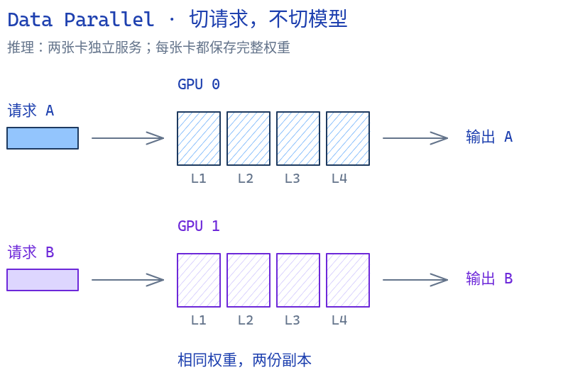
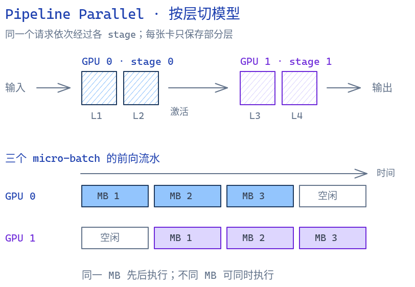
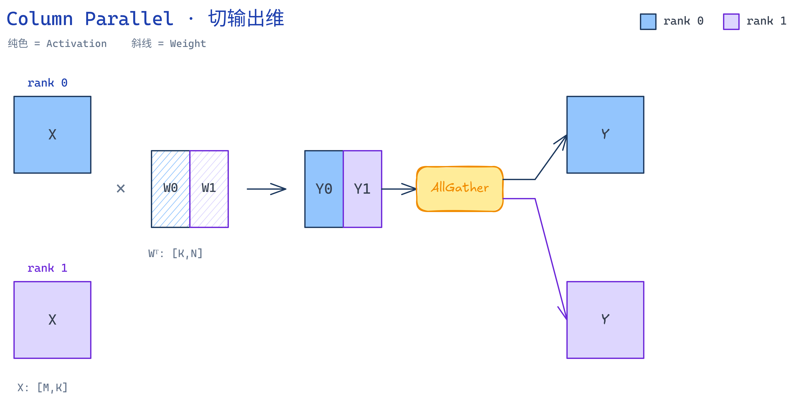
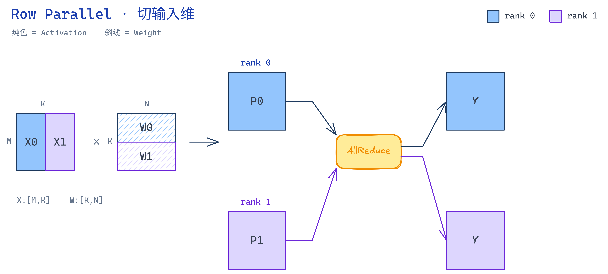
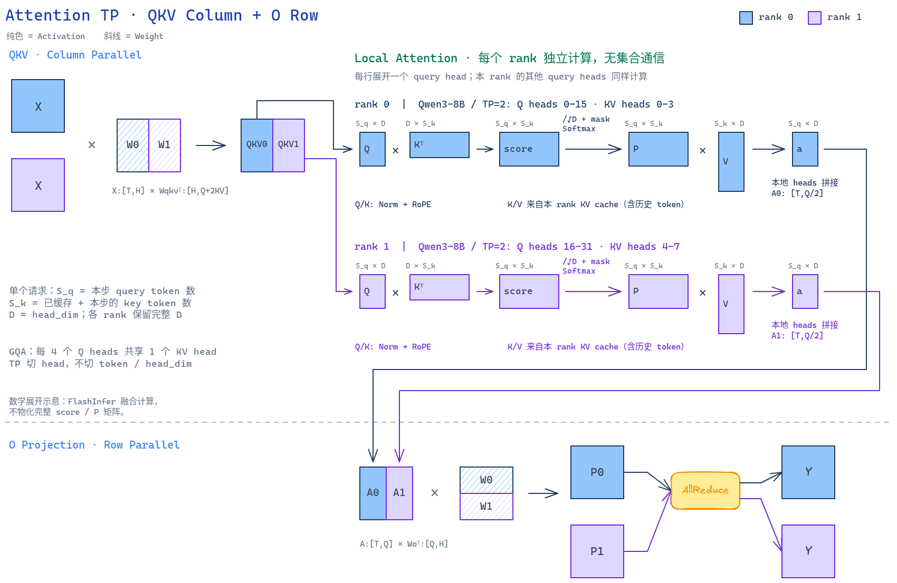
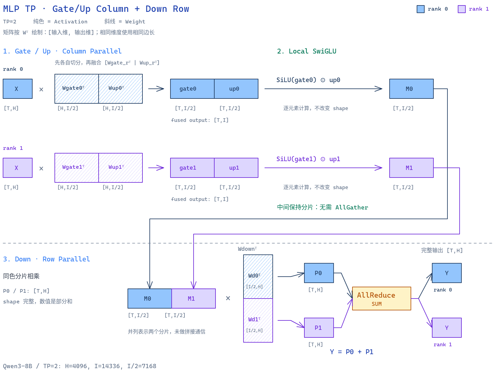
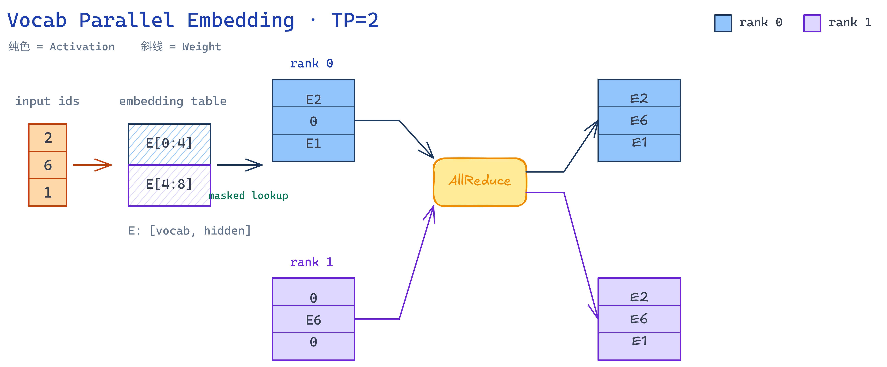
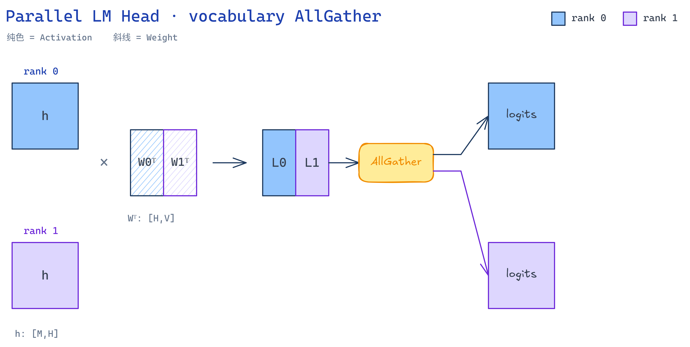
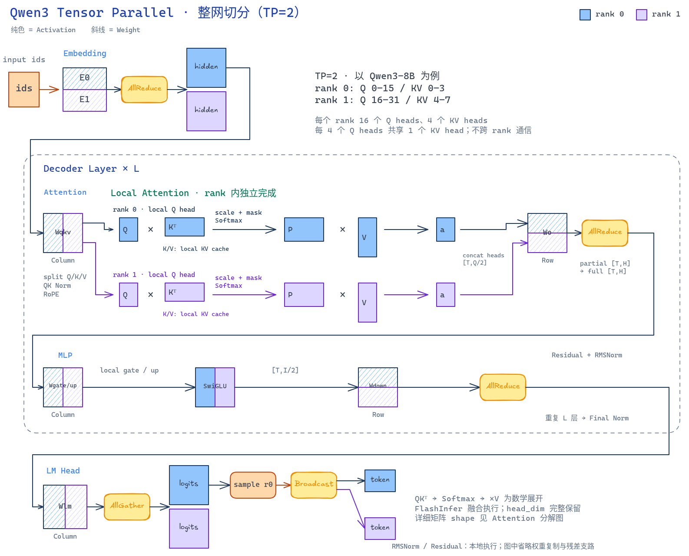

# Lesson 12：Tensor Parallelism（张量并行）

本课把一个 Qwen3 模型从一张 GPU 拆到多张 GPU。目标首先是**模型容量**：让单卡放不下的权重能够推理；性能是否提升取决于 GEMM 规模和 GPU 间通信带宽。

完成后，AIOS 支持：

- `torchrun` 一张 GPU 一个进程；
- Column / Row / QKV / Vocabulary Parallel；
- rank-local 权重、attention heads 与 KV cache；
- rank 0 采样、全体 rank 同步 token；
- `TP=1` 与此前单卡路径兼容。

阅读顺序：[为什么拆模型](#1-背景background--why) → [矩阵乘与整网切分](#2-原理principle--what) → [沿代码执行顺序理解实现](#3-具体实现implementation--how) → [运行与性能结果](#4-验证结果verify)。

---

## 1. 背景（Background / Why）

### 1.1 问题与解决思路

此前课程优化了 Paged KV Cache、continuous batching、fused layers 与 CUDA Graph，但每张 GPU 仍保存完整模型权重。BF16 权重的理论下限是：

```text
参数量 × 2 bytes
```

32B 模型仅权重约 64 GB；再加上 KV cache 和临时张量，无法放入一张 24 GB GPU。

直接的解决方案是把模型权重切分到多张 GPU：每张卡只保存并计算一部分权重，再通过通信组合局部结果。这样既突破单卡显存上限，也让多张 GPU 同时提供算力；当分片计算节省大于通信开销时，还能降低延迟或提高吞吐。

```text
完整模型放不进单卡
    -> 权重切分到多卡
    -> 多卡并行计算
    -> 通信恢复完整结果
```

容量收益是确定的，性能收益则取决于模型大小、batch、prefill/decode 比例与 GPU 互联带宽。本课实测 Qwen3-8B 的 prefill-heavy 场景达到 `1.07×`，而小 batch decode 可能因通信开销变慢。

### 1.2 常见的多卡并行方式

#### 数据并行（Data Parallelism，DP）

每张 GPU 保存一份**完整模型**，但处理不同的数据或请求。训练时，各副本通过 AllReduce 同步梯度；推理时通常让不同副本独立服务不同请求。



图中用四层模型示意；两张卡的权重相同，请求不同。[NVIDIA 原动画](https://docs.nvidia.com/nemo/megatron-bridge/nightly/_images/ddp.gif)。

优点是吞吐扩展简单；缺点是每张卡仍需放下完整模型，因此不能解决“单个模型放不下”的问题。

#### 流水线并行（Pipeline Parallelism，PP）

把连续的网络层分成多个 stage，每张 GPU 负责一段层，activation 按顺序从前一 stage 传到后一 stage。多个 micro-batch 可以像流水线一样交错执行。



图中每个方块 `MB` 表示一个 micro-batch 的前向计算；假设两个 stage 耗时相同，省略通信耗时。空心块表示空闲，不是缺失的网络层。[NVIDIA 原动画](https://docs.nvidia.com/nemo/megatron-bridge/nightly/_images/pp.gif)。

PP 能降低每卡权重占用，而且 stage 间只传 activation；但单个请求仍要依次经过所有 stage，micro-batch 不足时会出现 pipeline bubble。LLM decode 每步只有少量 token，bubble 尤其明显。

一种常见优化是把每张 GPU 上的层再拆成多个 **virtual stage（model chunk）**，让不同 micro-batch 以 interleaved schedule 交错执行：


图中横轴是时间、每一行是一张 GPU，方块编号表示 micro-batch；深色和浅色表示同一 GPU 上的两个 model chunk，灰色为空闲的 pipeline bubble。拆成更短的 virtual stage 后，后续 GPU 能更早收到工作；代价是 stage 边界增多，点对点通信更频繁。

> 这张 NVIDIA Megatron 图展示的是训练中的 1F1B 调度：`F` 为 forward，`B` 为 backward。推理没有 backward，但优化原则相同——用多个请求或 micro-batch 填满不同 stage，减少 GPU 等待时间。

#### 张量并行（Tensor Parallelism，TP）

把**同一层内部的权重张量**切到多张 GPU。所有 rank 同时计算这一层的不同分片，再通过 AllReduce、AllGather 等集合通信恢复完整结果。


TP 同时减少单卡权重与部分 activation/KV cache，并能并行执行大矩阵乘法；代价是层内通信频繁，因此通常放在 NVLink/NVSwitch 等高速互联的单机内。

三种方法的核心区别是“切什么”：

| 方式 | 切分对象 | 每卡是否保存完整模型 | 主要价值 | 主要代价 |
|---|---|---|---|---|
| DP | batch / requests | 是 | 提高系统吞吐 | 不解决单模型显存问题 |
| PP | 连续 layers | 否 | 跨卡容纳大模型 | stage 通信与 pipeline bubble |
| TP | layer 内 tensor | 否 | 容量 + 层内并行计算 | 每层 collective 通信 |

实际的大模型系统通常组合使用：节点内 TP、节点间 PP，再用 DP 复制多组模型实例。本课只聚焦 Tensor Parallelism。

以上图片与定义参考 [NVIDIA Megatron Bridge Parallelisms Guide](https://docs.nvidia.com/nemo/megatron-bridge/nightly/parallelisms.html) 与 [NVIDIA Megatron Pipeline Parallelism](https://developer.nvidia.com/blog/scaling-language-model-training-to-a-trillion-parameters-using-megatron/)；关于 DDP 的进程与完整模型副本语义，也可参考 [PyTorch DDP Tutorial](https://docs.pytorch.org/tutorials/intermediate/ddp_tutorial.html)。

### 1.3 本课范围

包含单机多 GPU、NCCL process group、dense Qwen3 的 TP、TP-aware KV cache 与 CUDA Graph 兼容。

暂不包含 Pipeline / Expert Parallelism、多机容错，以及 Prefix Cache、API Server 的请求 IPC。

---

## 2. 原理（Principle / What）

### 2.1 从一个矩阵乘法开始

线性层为：

```text
Y = XWᵀ + b

X: [tokens, input_size]
W: [output_size, input_size]
Y: [tokens, output_size]
```

GPU 显存彼此独立。若 `W` 被拆成 `W_r`，任一 rank 只拥有局部信息，不可能独自求得完整 `Y`。因此 TP 必须同时完成两件事：

```text
分片：减少每卡保存的参数和激活。
合成：交换局部结果，恢复原公式的完整结果。
```

分片维度决定合成方式：

| 分片方式 | 每个 rank 得到 | 怎样恢复 |
|---|---|---|
| 切输出维（Column） | 不同输出坐标 | 按最后一维拼接；可延后 |
| 切输入维（Row） | 同一输出坐标的 partial sum | `AllReduce(SUM)` |

通信不是额外补丁，而是矩阵分解的一部分。

### 2.2 Column 与 Row：一对配合的算子

后续图统一用颜色区分 rank（蓝色 rank 0、紫色 rank 1），用填充区分张量类型（纯色是 activation，斜线是 weight）。矩阵边长严格对应 shape：`M` 是行数，`K` 是乘法收缩维，`N` 是输出维。

**Column Parallel** 沿权重输出维切分：

```text
W = [W0]
    [W1]

rank 0: Y0 = X W0ᵀ
rank 1: Y1 = X W1ᵀ
Y = concat(Y0, Y1, dim=-1)
```



每个 `Y_r` 是不同的输出通道，不能相加。若下一算子也接受相同分片，实际执行不必立即拼接。

**Row Parallel** 同时切 `X` 的最后一维和 `W` 的输入维：

```text
X = [X0 | X1]       W = [W0 | W1]
Y = X0 W0ᵀ + X1 W1ᵀ

rank 0: P0 = X0 W0ᵀ  ┐
rank 1: P1 = X1 W1ᵀ  ├-> AllReduce(SUM) -> Y
                           ┘
```



Row Parallel 的每个 `P_r` shape 已经与 `Y` 相同，但数值只是一部分点积；bias 只能由一个 rank 加一次，避免 AllReduce 后变成 `TP × bias`。

Qwen3 使用这个配对来减少通信：

```text
Attention: QKV Column -> local attention -> O Row -> AllReduce
MLP:       Gate/Up Column -> local SwiGLU -> Down Row -> AllReduce
```

### 2.3 集合通信与 PyTorch 接口

多张 GPU 进程不共享 Python 内存。**collective communication** 让 process group 内全部 rank 共同完成一个数学操作；NCCL 在底层选择 ring、tree 等传输算法。

| 操作 | 每张卡的输入 | 所有 rank 完成后的结果 | AIOS 用途 |
|---|---|---|---|
| `AllReduce(SUM)` | 同一坐标的局部贡献 | 每卡得到逐元素总和 | Row Parallel、Embedding |
| `AllGather` | 不同坐标的分片 | 每卡得到所有 shard | LM head logits |
| `Broadcast` | 仅源 rank 有权威值 | 每卡得到源 rank 的值 | 采样 token |

最重要的运行时契约：**所有 rank 必须以相同顺序参与同一 collective，且 tensor 的 shape、dtype、device 兼容。** 否则会互相等待直到超时。

单机双卡的启动与生命周期：

```bash
torchrun --standalone --nproc-per-node=2 -m aios \
  --model /path/to/Qwen3-0.6B --tensor-parallel-size 2
```

```python
torch.cuda.set_device(local_rank)
dist.init_process_group(backend="nccl", init_method="env://")

dist.all_reduce(x, op=dist.ReduceOp.SUM)  # in-place
dist.all_gather_into_tensor(output, x.contiguous())
dist.broadcast(next_tokens, src=0)        # in-place

dist.destroy_process_group()
```

`torchrun` 注入三个身份字段：

| 字段 | 含义 | 当前用途 |
|---|---|---|
| `rank` | 全局进程编号 | `rank==0`、NCCL、broadcast 源 |
| `world_size` | 全局进程数 | 必须等于 TP size |
| `local_rank` | 当前节点内的进程编号 | 一进程一卡时选择可见 GPU |

单机时 `rank` 和 `local_rank` 数值恰好相同；多机时 `local_rank` 会在每台机器从 0 重新编号。AIOS 的 `DistributedCommunicator` 在 `TP=1` 时直接返回输入，使模型代码无需散落单卡分支。

接口语义参考 [PyTorch distributed](https://docs.pytorch.org/docs/stable/distributed.html) 与 [torchrun](https://docs.pytorch.org/docs/stable/elastic/run.html)；本课封装的具体 shape 约定见第 3 节。

### 2.4 Qwen3 Decoder 算子：Attention、MLP 与 Norm

先统一符号。PyTorch 线性层的权重按 `[out_features, in_features]` 保存，`F.linear(X, W)` 实际计算 `X @ Wᵀ`：

| 符号 | 含义 |
|---|---|
| `T` | 本次 forward 的扁平 token 总数 |
| `H` | hidden size |
| `I` | MLP intermediate size |
| `P` | tensor parallel size |
| `Nq / Nkv` | Query heads / KV heads |
| `D` | head dim |
| `Q=Nq×D`、`KV=Nkv×D` | Q 与单份 K/V 的投影宽度 |

以下默认各维度可整除 `P`；Qwen3 线性层没有 bias。

#### 2.4.1 Attention：QKV Column，O Row

Q、K、V 在 checkpoint 中是三个独立权重：

```text
Wq: [Q, H]    Wk: [KV, H]    Wv: [KV, H]
```

加载时先沿输出维 `dim=0` 分片，再拼成本 rank 的 fused QKV 权重：

```text
Wq_r: [Q/P, H]
Wk_r: [KV_local, H]
Wv_r: [KV_local, H]

Wqkv_r = cat(Wq_r, Wk_r, Wv_r, dim=0)
shape: [Q/P + 2×KV_local, H]
```

其中正常 GQA 场景 `P <= Nkv` 时，`KV_local = KV/P`。若 `P > Nkv`，一个 head 不能继续切碎，代码会让多个 query rank 复制同一个完整 KV head，此时 `KV_local = D`。

完整 Attention shape 流如下：

| 阶段 | 未切分 / 全局 shape | 每个 rank 的 shape | 通信 |
|---|---|---|---|
| 输入 hidden | `X: [T,H]` | `[T,H]`，每个 rank 相同 | 无 |
| QKV 权重 | `[Q+2KV,H]` | `[Q/P+2KV_local,H]` | 无 |
| fused QKV 输出 | `[T,Q+2KV]` | `[T,Q/P+2KV_local]` | 无 |
| Q view | `[T,Nq,D]` | `[T,Nq/P,D]` | 无 |
| K/V view | `[T,Nkv,D]` | `[T,Nkv_local,D]` | 无 |
| local attention 输出 | `[T,Nq,D]` | `[T,Nq/P,D]`，展平为 `[T,Q/P]` | 无 |
| O 权重 | `Wo: [H,Q]` | `Wo_r: [H,Q/P]`，沿输入维 `dim=1` 切 | 无 |
| O partial output | — | `[T,H]`，只是本 rank 的部分点积 | 无 |
| Attention 输出 | `[T,H]` | `[T,H]`，每个 rank 相同 | `AllReduce(SUM)` |

也就是：

```text
X [T,H]
  -> QKV Column: [T,Q/P+2KV_local]
  -> local Q/K/V + RoPE + attention: [T,Q/P]
  -> O Row: partial [T,H]
  -> AllReduce: full [T,H]
```



图中两行分别展开 rank 0 / 1 内一个 query head 的计算：`Q[S_q,D] × Kᵀ[D,S_k] → scale + causal mask → Softmax → P[S_q,S_k] × V[S_k,D] → a[S_q,D]`。`S_q` 是单个请求本步的 query 长度，`S_k` 包含历史与本步 KV；decode 时 `S_q=1`。Q/K 先经过 QK Norm 和 RoPE，新 K/V 写入本 rank 的 KV cache，再计算 attention。GQA 中多个本地 Q heads 共享对应的 KV head；所有本地 head 的结果拼成 `A_r[T,Q/P]`，直接交给 O Row，无需跨 rank 拼接。图中 score / P 是数学中间量，FlashInfer 实际融合计算，不会物化完整矩阵。

以 Qwen3-8B、`P=2` 为例：`H=4096`、`I=14336`、`Nq=32`、`Nkv=8`、`D=128`。

```text
X                    [T, 4096]
Wq_r                 [2048, 4096]
Wk_r / Wv_r          [ 512, 4096]
Wqkv_r               [3072, 4096]
qkv_r                [T, 3072]
q / k / v            [T,16,128] / [T,4,128] / [T,4,128]
local attention      [T,16,128] -> [T,2048]
Wo_r                 [4096,2048]
partial / full output [T,4096] -> AllReduce -> [T,4096]
```

Q/K Norm 权重都是 `[D]`，在各 rank 复制，并直接作用于 local heads。RoPE、FlashInfer 也只处理 local Q/KV heads，因此中间不需要 AllGather。KV cache 相应变为：

```text
[K/V, layers, pages, page_size, Nkv_local, D]
```

#### 2.4.2 MLP：Gate/Up Column，Down Row

SwiGLU MLP 的未切分计算为：

```text
gate = X @ Wgateᵀ       Wgate: [I,H]
up   = X @ Wupᵀ         Wup:   [I,H]
mid  = silu(gate) * up  mid:   [T,I]
Y    = mid @ Wdownᵀ     Wdown: [H,I]
```

`gate_proj` 与 `up_proj` 都沿输出维 `dim=0` 切分，然后融合；`down_proj` 沿输入维 `dim=1` 切分：



图中 `TP=2`，蓝、紫表示不同 rank；斜线是权重，纯色是激活。权重按转置后的乘法方向绘制：`X[T,H] × [Wgate_rᵀ | Wup_rᵀ][H,I]` 得到本地 fused 输出 `[T,I]`，拆成两个 `[T,I/2]` 后逐元素计算 `M_r = SiLU(gate_r) × up_r`。随后 `M_r[T,I/2] × Wdown_rᵀ[I/2,H]` 得到部分和 `P_r[T,H]`；最后 **求和，不是拼接**，两个 rank 都得到 `Y=P_0+P_1`。图中并列分片只表示数据布局，不代表执行了 AllGather。

| 阶段 | 未切分 / 全局 shape | 每个 rank 的 shape | 通信 |
|---|---|---|---|
| 输入 hidden | `X: [T,H]` | `[T,H]`，每个 rank 相同 | 无 |
| Gate / Up 权重 | 各 `[I,H]` | 各 `[I/P,H]` | 无 |
| fused Gate+Up 权重 | `[2I,H]` | `[2I/P,H]` | 无 |
| fused Gate+Up 输出 | `[T,2I]` | `[T,2I/P]` | 无 |
| split Gate / Up | 各 `[T,I]` | 各 `[T,I/P]` | 无 |
| local SwiGLU 输出 | `[T,I]` | `[T,I/P]` | 无 |
| Down 权重 | `[H,I]` | `[H,I/P]` | 无 |
| Down partial output | — | `[T,H]`，只是部分点积 | 无 |
| MLP 输出 | `[T,H]` | `[T,H]`，每个 rank 相同 | `AllReduce(SUM)` |

Qwen3-8B、`P=2` 的具体 shape：

```text
X                         [T, 4096]
Wgate_r / Wup_r           [7168, 4096]
fused Wgate_up_r          [14336,4096]
fused gate_up activation  [T,14336]
gate_r / up_r             [T,7168] / [T,7168]
local SwiGLU              [T,7168]
Wdown_r                   [4096,7168]
partial / full output     [T,4096] -> AllReduce -> [T,4096]
```

关键点是 Column 输出的分片激活可以直接交给 SwiGLU 或 local attention，随后 Row Parallel 正好消费这份分片，所以二者之间不需要 AllGather。每个 Attention / MLP 子层只在末端做一次 AllReduce。

#### 2.4.3 Norm 为什么不切

Decoder 的 RMSNorm 权重 shape 为 `[H]`，数据量很小，直接复制到每个 rank。`o_proj` 和 `down_proj` 的 AllReduce 已恢复 `[T,H]` 完整激活，因此 RMSNorm 在本地即可得到相同结果，无需额外通信。

### 2.5 词表并行与统一采样

Embedding 和 LM head 沿 vocabulary 行分片，但通信方向相反：

```text
Embedding: 各 rank 只查自己拥有的 token 行，非本地位置置零
           -> AllReduce(SUM) -> full embedding

LM head:   各 rank 计算 local vocabulary logits
           -> AllGather -> full logits
```



词表大小不能整除 TP 时，每个 shard 按 `ceil(vocab_size / TP)` 分配，最后一块补零；embedding mask 不会访问补零行，LM head gather 后会裁掉补零 logits。

LM head 本质上是**列并行线性层**：输入 hidden 完整，输出 vocabulary 分片；Embedding 则是查表，不是矩阵乘。



本实现规定只由 rank 0 采样，再同步决定；不是数学上禁止其他 rank 采样：

```text
full logits on every rank
    -> rank 0 samples next_tokens
    -> Broadcast(next_tokens)
    -> every rank updates the same scheduler state
```

否则 RNG 或 kernel 细节造成 token 分叉，随后 page table、KV cache 和 collective 调用顺序都会分叉。

### 2.6 Qwen3 整网切分总览

下图用 `TP=2` 展示完整数据流。蓝色与紫色分别表示 rank 0 / rank 1，斜线表示权重，纯色表示激活。按图中的 `Wᵀ:[in,out]` 方向观察：**左右切块**是 Column Parallel，**上下切块**是 Row Parallel；黄色节点表示通信边界。



Decoder 内蓝、紫两条 attention 路径各自完成 `QKᵀ → Softmax → ×V`，只读本 rank 的 KV heads。两条路径直到 O projection 的 partial output 才通过 AllReduce 汇合，随后进入 MLP；每个 rank 都继续持有相同的完整 hidden。

全网遵循“Column 保留分片，Row 恢复完整 hidden”的节奏：

| 组件 | 权重 / 状态如何切 | 输出与通信 |
|---|---|---|
| `embed_tokens` | vocabulary rows（`dim=0`） | masked lookup 后 AllReduce，得到 full hidden |
| RMSNorm | `[H]` 权重复制；计算完整 hidden | 无通信 |
| QK Norm / RoPE | QK Norm 的 `[D]` 权重复制；RoPE 无可学习权重 | 在 local heads 上计算，无通信 |
| `qkv_proj` | 输出维（`dim=0`） | `[Q_local\|K_local\|V_local]` |
| FlashInfer + KV cache | local Q/KV heads | 无通信 |
| `o_proj` | 输入维（`dim=1`） | AllReduce，恢复 full hidden |
| `gate_up_proj` | 输出维（`dim=0`） | local intermediate；本地 SwiGLU |
| `down_proj` | 输入维（`dim=1`） | AllReduce，恢复 full hidden |
| `lm_head` | vocabulary rows（`dim=0`） | AllGather，恢复 full logits |
| sampler | 只在 rank 0 运行 | Broadcast `next_token` 到所有 rank |

Decoder Layer 重复 `L` 次。每个 layer 的 attention 和 MLP 各有一次 AllReduce；全网首尾还分别有一次 Embedding AllReduce、LM head AllGather，以及每步 decode 的 token Broadcast。

---

## 3. 具体实现（Implementation / How）

### 3.1 代码职责地图

```text
distributed/info.py       rank / size / local_rank
distributed/impl.py       NCCL init + collective wrappers
layers/linear.py          Column / Row / QKV TP linear
layers/embedding.py       VocabParallelEmbedding + ParallelLMHead
models/weight.py          CPU checkpoint -> local shard -> GPU
models/qwen3.py           local-head attention / TP MLP wiring
attention/fi.py           FlashInfer local-head metadata
kvcache/mha_pool.py       local KV-head storage
engine/engine.py          memory agreement + sampling broadcast
llm/llm.py                torchrun worker lifecycle
```

### 3.2 启动：`initialize_distributed()`

源码：[distributed/impl.py](../../python/aios/distributed/impl.py)、[distributed/info.py](../../python/aios/distributed/info.py)。**创建进程的是 `torchrun`，不是这个函数**；每个 worker 都调用它，完成自己的设备绑定和通信初始化。

| 执行顺序 | 代码 | 作用 |
|---|---|---|
| 1 | `tensor_parallel_size < 1` | 拒绝非法 TP 大小 |
| 2 | `int(os.environ.get(...))` | 读取 `WORLD_SIZE / RANK / LOCAL_RANK`；普通 `python` 默认 `1 / 0 / 0` |
| 3 | `tensor_parallel_size != world_size` | 不匹配则报错；本课把整个默认 group 用作一个 TP 组，没有 DP/PP 子组 |
| 4 | `tp > 1 and not dist.is_initialized()` | 仅多卡且尚未初始化时建立 group；不是启动新进程 |
| 5 | `torch.cuda.set_device(local_rank)` | 选择本进程的当前 CUDA 设备；不会迁移已有 tensor |
| 6 | `dist.init_process_group(...)` | 各进程加入 NCCL 通信组，之后才能执行 collective |
| 7 | `set_tp_info(...)` / `get_tp_info()` | 保存并返回本进程的身份信息；TP=1 也执行 |

`init_process_group()` 的参数分别是：`backend="nccl"` 使用 GPU 通信后端；`init_method="env://"` 从环境读取 rendezvous 地址（`MASTER_ADDR / MASTER_PORT`）；`rank / world_size` 指定全局身份和人数；`timeout=timedelta(seconds=120)` 设置通信超时，不是整个推理任务的时间上限。环境变量由 `torchrun` 配置。若 group 已初始化，函数会复用它，调用方必须保证已有 group 与传入配置一致。

**rank 与 local_rank：前者标识全局进程，后者选择本机可见设备。** 例如两节点、每节点两进程：

| 节点 | rank | local_rank | 选择设备 |
|---|---:|---:|---|
| A | 0 | 0 | A 的 `cuda:0` |
| A | 1 | 1 | A 的 `cuda:1` |
| B | 2 | 0 | B 的 `cuda:0` |
| B | 3 | 1 | B 的 `cuda:1` |

本课验证范围是单机。若设置 `CUDA_VISIBLE_DEVICES=4,5`，`local_rank=0/1` 对应物理 GPU 4/5，而不是物理 GPU 0/1。

`DistributedInfo` 是进程内的只读 dataclass，不是多进程共享对象。各进程分别保存 `_TP_INFO`；`get_tp_info()` 只读本进程变量，不发生通信。`is_primary` 等价于 `rank == 0`，`llm.is_primary` 用它控制主进程输出等行为，**不代表只有主进程执行模型**。TP=2 时两个进程都要前向计算。

结束时，`destroy_distributed()` 先在 group 已初始化时调用 `dist.destroy_process_group()`，再由 `reset_tp_info()` 恢复 `rank=0, size=1, local_rank=0`。通信资源与 Python 身份信息是两件事，必须分别清理。

### 3.3 加载：`_shard_tensor()` 与融合权重

源码：[models/weight.py](../../python/aios/models/weight.py)。这个函数只根据参数名截取**当前 rank 的 CPU 权重**，不创建进程、不通信，也不负责搬到 GPU。`*` 后的 `rank / world_size / num_kv_heads` 必须按关键字传入。

权重存储为 `[out, in]`。Column/Row 名称针对公式中的 `Wᵀ:[in,out]`，因此 Column 实际切存储张量的 `dim=0`，Row 切 `dim=1`。

| 条件分支 | 处理 | 原因 |
|---|---|---|
| `world_size == 1` | 原样返回 | 保持单卡路径 |
| `q_proj / gate_proj / up_proj` | `chunk(TP, dim=0)[rank]` | 本地输出通道 |
| `k_proj / v_proj`，`TP ≤ Nkv` | `chunk(TP, dim=0)[rank]` | 本地 KV heads |
| `k_proj / v_proj`，`TP > Nkv` | 按完整 head 取 `narrow()` | 多个 Q 分片复用同一个 KV head |
| `o_proj / down_proj` | `chunk(TP, dim=1)[rank]` | 与输入 activation 分片配对 |
| `embed_tokens / lm_head` | 按词表行取片，尾部补零 | 各 rank 等长，便于通信 |
| 其余参数 | 原样返回 | Norm 等小权重复制 |

`any(part in name for part in ...)` 判断当前参数属于哪类投影；`chunk()` 返回各分片，`[rank]` 选本地那块。`.contiguous()` 保证连续布局，不保证总会复制：本来连续时可直接返回。投影宽度与 head 数的整除约束由模型构造中的 `div_even()` 检查，不能把 `chunk()` 当成整除校验。

以 Qwen3-32B、TP=4 为例，`H=5120, Nq=64, Nkv=8, D=128`：

```text
Wq: [8192,5120] -> [2048,5120]   每卡 16 个 Q heads
Wk: [1024,5120] -> [ 256,5120]   每卡  2 个 KV heads；Wv 同理
Wo: [5120,8192] -> [5120,2048]   消费本地 attention 输出
```

KV head 复制分支按下面三行定位：

```python
head_dim = tensor.shape[0] // num_kv_heads
head_idx = rank * num_kv_heads // world_size
tensor.narrow(0, head_idx * head_dim, head_dim).contiguous()
```

例如 `Nkv=2, TP=4`，rank `0/1` 取 head 0，rank `2/3` 取 head 1。`narrow(维度, 起点, 长度)` 取一个完整 head 的连续行，不能把 head 内的 `D` 维再拆开；`TP % Nkv != 0` 会报错。

词表分支令 `rows_per_rank=ceil(V/TP)`，`start=rank×rows_per_rank`，`end=min(start+rows_per_rank,V)`。例如 `V=10, TP=3`，三个 rank 分别保存行 `0–3`、`4–7`、`8–9 + 两行零`。补零保持相同 dtype；当前加载路径固定在 CPU 上，因此这里的 `torch.zeros()` 也在 CPU 上创建。

`load_weights()` 的完整顺序是 **读取 → 分片 → 融合 → 搬到 GPU**：

```text
HF q_proj / k_proj / v_proj -> 各自 _shard_tensor -> cat(dim=0) -> local qkv_proj
HF gate_proj / up_proj      -> 各自 _shard_tensor -> cat(dim=0) -> local gate_up_proj
其他参数                    -> _shard_tensor
                            -> .to(device, dtype) -> model.load_state_dict()
```

`packed_modules_mapping` 描述融合算子对应的源参数，`_checkpoint_index()` 定位 safetensors 文件，`_read_tensor()` 读取 CPU tensor。**不能先拼完整 QKV 再均分**：那会破坏 Q/K/V 边界，尤其是 GQA 的 Q/KV 宽度不等或 KV 复制时。

### 3.4 执行：线性层、Embedding 与 LM head

| 类 | local weight | 输出 | 通信 / 用途 |
|---|---|---|---|
| `LinearReplicated` | `[O, I]` | full | 无 |
| `LinearColParallelMerged` | `[Σ(O_branch/TP), I]` | shard | MLP gate/up |
| `LinearQKVMerged` | `[local_q+2×local_kv, hidden]` | `[Q\|K\|V]_local` | attention QKV |
| `LinearRowParallel` | `[O, I/TP]` | partial -> full | AllReduce；MLP down |
| `LinearOProj` | 同 Row | partial -> full | AllReduce；attention O |

源码：[layers/linear.py](../../python/aios/layers/linear.py)、[layers/embedding.py](../../python/aios/layers/embedding.py)。Attention/MLP 的完整 shape 见 2.4 节；下面重点看词表边界。

#### Embedding：为什么先替换索引，再清零输出

```python
local_mask = (input_ids >= self._vocab_start) & (input_ids < self._vocab_end)
local_ids = (input_ids - self._vocab_start).masked_fill(~local_mask, 0)
output = F.embedding(local_ids, self.weight)
output.masked_fill_(~local_mask.unsqueeze(-1), 0)
return self._comm.all_reduce(output)
```

1. `local_mask` 标记 token 是否落在本 rank 的词表区间 `[start,end)`。
2. 减去 `start` 得到本地行号；非本地 token 改成 0，避免负数或越界。这里的 0 只是安全占位索引，不是 token 的真实 embedding。
3. `F.embedding()` 查本地权重，得到 `[...,H]`。
4. `unsqueeze(-1)` 把 mask 扩成 `[...,1]`，广播到整个 hidden 向量；原地清除非本地 token 的占位结果。
5. AllReduce 求和：每个有效 token 恰好由一个 rank 提供向量，其他 rank 提供零。

例如 `V=8, TP=2, input_ids=[1,6]`，记词表第 i 行为 `e_i`：

| rank / 词表区间 | mask | local_ids | lookup 后 | 清零后 |
|---|---|---|---|---|
| 0 / `[0,4)` | `[True,False]` | `[1,0]` | `[e_1,e_0]` | `[e_1,0]` |
| 1 / `[4,8)` | `[False,True]` | `[0,2]` | `[e_4,e_6]` | `[0,e_6]` |

求和后，两张卡都得到 `[e_1,e_6]`。省略输出清零，会错误地把占位行也加进去。

#### LM head：先选最后一个 token，再拼词表

Prefill 的 hidden 是多个请求展平后的 `[T,H]`，但生成下一 token 只需要每个请求最后一行：

```python
indices = batch.attn_metadata.get_last_indices(batch.size)
x = x[indices].contiguous()
```

`get_last_indices(bs)` 返回 `cu_seqlens_q_gpu[1:1+bs] - 1`。例如请求长度 `[3,2]`，累积边界 `[0,3,5]`，最后一行下标是 `[2,4]`，于是 `[5,H] -> [2,H]`。这不是查历史 KV 的最后位置，而是取**本次展平 query/hidden 中**每个请求的最后位置。Decode 本来每个请求只有一个新 token，不需要这一步。

随后每张卡用 `F.linear(x, local_weight)` 得到 `[B,V_local]`。通信封装不是按最后一维拼接，而是先按 rank 顺序收集：

```text
all_gather_into_tensor: [B,V_local] -> [TP×B,V_local]
view:                                [TP,B,V_local]
permute(1,0,2):                       [B,TP,V_local]
reshape + 截掉补零词表:               [B,V]
```

例如 `B=2, TP=2`，收集后的行顺序是 `r0请求0、r0请求1、r1请求0、r1请求1`；必须先按请求重排，才能拼接同一个请求的词表分片。直接 reshape 会混入另一个请求的 logits。若启用 tied embedding，LM head 直接复用 Embedding 的本地权重，不再单独加载一份。

### 3.5 通信封装与调度一致性

`DistributedCommunicator` 只封装三种操作，TP=1 时都直接返回输入：

| 方法 | 内部接口与实现细节 |
|---|---|
| `all_reduce(x)` | `dist.all_reduce(x, SUM)` 原地求和，再返回同一个 `x` |
| `all_gather(x)` | 第一维扩大 TP 倍，`torch.empty()` 分配同 dtype/device 输出；`all_gather_into_tensor(output, x.contiguous())` 填入各 rank 分片 |
| `broadcast(x, src=0)` | 原地用源 rank 的值覆盖接收 tensor，再返回 `x`；所有 rank 都必须调用 |

这三种操作都不是共享 Python 对象，而是交换 tensor 数据。相同 group 内必须按同一顺序执行；不能把 collective 放进只有 rank 0 执行的分支。

#### 显存取 MIN：统一 KV 页数

`Engine._sync_get_free_memory()` 先读取本卡空闲字节数，再执行：

```python
free_tensor = torch.tensor(free_memory, dtype=torch.int64, device=self.device)
torch.distributed.all_reduce(free_tensor, op=torch.distributed.ReduceOp.MIN)
free_memory = int(free_tensor.item())
```

`int64` 保存字节计数，CUDA tensor 满足 NCCL 通信要求；`MIN` 让每个 rank 得到同一个最小值，`.item()` 再取回 Python 标量。例如两卡空闲 8/6 GiB，双方都按 6 GiB 预算，避免某一卡分配失败或各 rank 调度容量不同。这里要取最小值，不能复用封装中固定 `SUM` 的 `all_reduce()`。

加载前后各测一次，`_determine_num_pages()` 再扣除模型占用与预留空间，除以每页 KV 字节数。每页大小按 **local KV heads** 计算；`memory_ratio` 是整体显存预算比例，不是“把剩余显存的这个比例全给 KV”。各 rank 的页数和页编号一致，但存的是不同 head 的 K/V 数值。

#### 只采样一次：Broadcast 统一下一 token

```python
if self.tp_info.is_primary:
    next_tokens = self.sampler.sample(logits[:batch.size], args).to(torch.int32)
else:
    next_tokens = torch.empty(batch.size, dtype=torch.int32, device=self.device)
return self._comm.broadcast(next_tokens, src=0)
```

rank 0 从真实请求的 logits 采样；`[:batch.size]` 排除 CUDA Graph padding 行，`.to(torch.int32)` 统一 token 类型。其他 rank 的 `empty()` 只是同 shape/type 的接收缓冲区，其初值没有意义。**Broadcast 在分支外**，让所有 rank 收到同一 token，然后各自更新相同的请求状态，避免独立随机采样导致调度分叉。

### 3.6 串起来：一次请求与退出

```text
所有 rank 收到相同 prompt / request state
    -> vocab-parallel embedding: AllReduce 得到相同 hidden
    -> 每层 QKV local -> local RoPE / FlashInfer / local KV cache
    -> O projection AllReduce
    -> local SwiGLU -> Down projection AllReduce
    -> local LM logits -> AllGather full logits
    -> rank 0 sample -> Broadcast token
    -> 全部 rank 更新相同 scheduler / page table / KV cache
```

**TP 同时作用于 prefill 和 decode**，并不只加速 decode；本课 CUDA Graph 则捕获 decode 模型路径。Prefill 可以把多个请求展平成一个 `[T,H]` 输入，不能因为没有显式 `[B,S,H]` 维度就认为模型只执行 batch=1。请求边界由 attention metadata 区分。

CUDA Graph 与 TP 可以同时开启：各 rank 必须按相同顺序 capture/replay collective。退出时先销毁 graph、清理全局 context，再销毁 process group。首次 capture 的 NCCL 等待提示不等同于错误，但一直等待或最终超时仍需排查 rank 是否执行分叉。

### 3.7 与 mini-sglang 的关系

AIOS 对齐 mini-sglang 的 TP 分片方向、QKV source-shard-then-pack、KV head replication 与 local-head attention 语义。

教学版的有意简化是进程编排：所有 rank 同步执行同一份离线请求；生产服务器通常由 rank 0 接收请求，再通过 IPC/CPU group 分发给 worker。MoE / Expert Parallelism 也留给后续扩展。

---

## 4. 验证结果（Verify）

### 4.1 代数与分片检查

```bash
PYTHONPATH=python python \
  resources/lesson-12-tensor-parallelism/run_lesson12.py --suite check
```

```text
[CHECK] TP layer shapes and checkpoint sharding passed
```

覆盖 local shape、dim 0 / dim 1 shard 恢复、KV head replication，以及 Column / Row 计算与完整 linear 的 FP32 等价性。

### 4.2 双 GPU 端到端

```bash
CUDA_VISIBLE_DEVICES=1,2 \
CUDA_HOME=/usr/local/cuda-12.8 \
PATH=/usr/local/cuda-12.8/bin:$PATH \
FLASHINFER_CACHE_DIR=/tmp/flashinfer-aios-tp-e2e \
PYTHONPATH=python \
torchrun --standalone --nproc-per-node=2 \
  resources/lesson-12-tensor-parallelism/run_lesson12.py \
  --suite e2e --tp-size 2 \
  --model /data4/home/yan.wang/huggingface/Qwen3-0.6B \
  --num-seqs 2 --input-len 8 --max-tokens 2 \
  --max-running 2 --memory-ratio 0.2
```

已验证两 rank 的权重加载、prefill、decode、KV cache、NCCL collective、sampling broadcast、shutdown，以及 CUDA Graph replay；无死锁。

2026-09-29 提交前复测：上述命令增加 `--cuda-graph`，两个请求各生成 2 tokens，退出码为 0。该短用例用于功能冒烟检查，不作为性能结论。

### 4.3 8B 性能观察：容量优先，性能取决于通信

两张 RTX 3090（PCIe）、Qwen3-8B BF16、预热 1 次、正式 3 次：

| workload | TP=1 | TP=2 | 结论 |
|---|---:|---:|---|
| batch=4，约 300–364 input，首 token | 273.1 ms | 255.7 ms | 1.07×，长 prefill 略快 |
| batch=4，约 84–100 input，16 output | 137.97 tok/s | 109.13 tok/s | 0.79×，decode 通信主导 |
| batch=16，约 84–100 input，16 output | 356.13 tok/s | 310.98 tok/s | 0.87×，仍慢于单卡 |

结论：TP 首要收益是模型容量。长 prefill 的大 GEMM 可以覆盖部分通信；逐 token decode 每层都要 AllReduce，结尾还要 AllGather logits，在 PCIe 上通常不能加速。低 batch 的 BF16 + FlashInfer decode 也不承诺 bitwise determinism，runner 会检查重复输出稳定性。

### 4.4 Qwen3-32B：四卡运行验证

2026-09-29，使用本机 GPU `4,5,6,7`（4 × RTX 3090 24 GB，PCIe），运行官方 Qwen3-32B BF16 权重。17 个分片均通过官方 SHA256 校验，索引中的 707 个 tensor 完整；权重总计约 **61.02 GiB**，TP=4 后每卡模型权重约 **15.26 GiB**。

测试 2 个请求，chat template 后输入分别为 23 / 22 tokens，每个固定生成 32 tokens；预热 1 次，计时 5 次，耗时包含 prefill、decode 与调度，不含权重加载和首次编译。

| 模式 | 平均耗时 | 总输出吞吐 | 本次重复输出 |
|---|---:|---:|---|
| TP=4，普通执行 | 1.577 s | 40.59 tok/s | 第二个请求末尾 2 tokens 有差异 |
| TP=4，CUDA Graph | 0.950 s | 67.38 tok/s | 第二个请求末尾 2 tokens 有差异 |

两种模式均完成生成与正常退出，无 OOM。这里的 **1.66×** 是同一 TP=4 配置下 CUDA Graph 的收益，不是 TP 相对单卡的加速比；该 BF16 模型无法装进单张 24 GB 卡。

```bash
CUDA_VISIBLE_DEVICES=4,5,6,7 \
CUDA_HOME=/usr/local/cuda-12.8 \
PATH=/usr/local/cuda-12.8/bin:$PATH \
FLASHINFER_CACHE_DIR=/tmp/flashinfer-aios-tp32b \
PYTHONPATH=python \
torchrun --standalone --nproc-per-node=4 \
  resources/lesson-12-tensor-parallelism/run_lesson12.py \
  --suite e2e --tp-size 4 \
  --model /data4/home/yan.wang/huggingface/Qwen3-32B \
  --num-seqs 2 --input-len 8 --max-tokens 32 --max-running 2 \
  --memory-ratio 0.85 --warmup-runs 1 --repeats 5 --cuda-graph
```

去掉 `--cuda-graph` 即为普通执行。`--input-len` 在本 runner 中控制文本重复次数，不是精确 token 数。`memory_ratio` 是**权重与 KV cache 的总显存预算比例**，32B 不能照搬小模型示例的 `0.2`。

实际生成开头：`Hello! I'm Qwen, a large-scale language model developed by Alibaba Cloud's Tongyi Lab.`。两种模式扩大到 5 次测试后，都观察到第二个回答末尾在 `the input tensor` / `the model's` 之间变化。固定前缀的默认配置诊断中，连续 3 次 logits 相同、无 NaN/Inf，且 KV 页全部回收；差异原因尚未确定，不能把运行成功等同于逐位确定性。没有为运行 32B 修改模型或 TP 主流程。

### 4.5 静态检查与调试入口

```bash
python -m compileall -q python/aios benchmark/bench.py \
  resources/lesson-12-tensor-parallelism/run_lesson12.py
git diff --check
```

仓库提供 [launch.example.json](launch.example.json)。将其中的 `configurations` 和 `inputs` 合并到本地 `.vscode/launch.json`，按环境调整 GPU 编号与 CUDA 路径；启动时输入 Qwen3-0.6B 目录。`.vscode/` 被 Git 忽略，因此单独保存课程示例，不提交个人 IDE 配置。

配置 `Lesson 12: Tensor Parallel E2E (2 GPUs)` 使用 `torch.distributed.run` 与 `subProcess: true` 跟踪两个 worker。推荐断点顺序：

1. `distributed/impl.py::initialize_distributed`：rank 与 GPU；
2. `models/weight.py::_shard_tensor`：切分维度与本地 shard；
3. `layers/linear.py::LinearRowParallel.forward`：partial output 与 AllReduce；
4. `attention/fi.py::prepare_metadata`：local Q/KV heads；
5. `engine/engine.py::forward_batch`：rank 0 sampling 与 broadcast。

在 collective 前暂停一个 rank 时，其他 rank 会等待；长时间单步可能触发通信超时。优先使用多进程 debugpy；多个 worker 共用终端时，不建议同时进入交互式 `pdb`。

---

## 5. 本课结论

```text
Column Parallel 保留中间分片
        +
Row Parallel 汇总 partial sum
        =
每个 attention / MLP 子层只在边界通信一次
```

TP 是一套端到端的一致性约束：权重分片、local heads、KV cache、collective 顺序与采样 token 必须使用同一 rank 语义。完成这些闭环后，AIOS 便能在单机多 GPU 上运行 dense Qwen3；Prefix Cache 留给后续独立课程。
