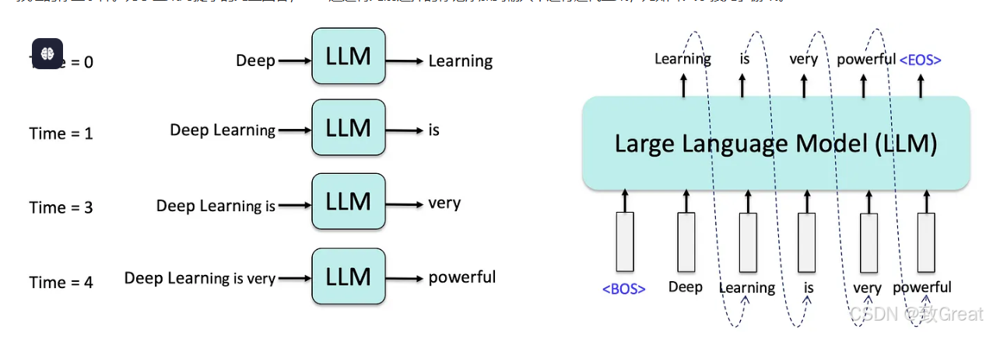

# Lesson 2: 从零手写 Qwen3 推理

Lesson 1 你学习了 Transformer 的基本原理和 HuggingFace 的用法。现在，我们**从零手写**一个完整的 Qwen3 模型，仅依赖 PyTorch，实现端到端的文本生成。

## 学习目标

1. **从零实现** Qwen3 的每一层：RMSNorm、RoPE、GQA、SwiGLU MLP
2. **理解架构细节**：为什么用 RMSNorm 而不是 LayerNorm？为什么用 GQA？QK-Norm 是什么？
3. **加载预训练权重**：从 HuggingFace 模型中提取权重到我们手写的模型
4. **实现自回归生成**：不依赖 HF 的 `generate()`，自己写生成循环

## 为什么要从零实现？

```
HuggingFace 方式:                    从零实现:
┌─────────────────────┐              ┌─────────────────────┐
│ from_pretrained()   │──── 黑盒 ───→│ 手写每一层 nn.Module │
│ model.generate()    │              │ 手动加载权重         │
│ "it just works"     │              │ 手写生成循环         │
└─────────────────────┘              └─────────────────────┘
  ~10 行代码, 不理解内部               ~300 行代码, 完全掌控
```

推理引擎 (vLLM, SGLang, TGI) 都选择从零实现模型，因为需要：
- 控制内存布局（预分配 KV cache，而非 `torch.cat` 动态增长）
- 控制批处理（连续批处理 continuous batching）
- 接入自定义算子（FlashAttention, Triton kernels）

---

## Qwen3 架构

```
Qwen3ForCausalLM
├── model (Qwen3Model)
│   ├── embed_tokens: Embedding(151936, hidden_size)
│   ├── layers: N × Qwen3DecoderLayer
│   │   ├── input_layernorm: RMSNorm              ← Pre-Norm
│   │   ├── self_attn: Qwen3Attention
│   │   │   ├── q_proj: Linear(hidden → heads × head_dim)
│   │   │   ├── k_proj: Linear(hidden → kv_heads × head_dim)    ← GQA
│   │   │   ├── v_proj: Linear(hidden → kv_heads × head_dim)    ← GQA
│   │   │   ├── o_proj: Linear(heads × head_dim → hidden)
│   │   │   ├── q_norm: RMSNorm(head_dim)          ← QK-Norm (Qwen3 特有)
│   │   │   └── k_norm: RMSNorm(head_dim)          ← QK-Norm
│   │   ├── post_attention_layernorm: RMSNorm
│   │   └── mlp: Qwen3MLP                         ← SwiGLU
│   │       ├── gate_proj: Linear(hidden → intermediate)
│   │       ├── up_proj:   Linear(hidden → intermediate)
│   │       └── down_proj: Linear(intermediate → hidden)
│   └── norm: RMSNorm
└── lm_head: Linear(hidden_size → vocab_size)
```

### 与原始 Transformer 的 5 大区别

| 特性 | 原始 Transformer | Qwen3 | 优势 |
|------|------------------|-------|------|
| 归一化 | LayerNorm (Post-Norm) | RMSNorm (Pre-Norm) | 更快，训练更稳定 |
| 注意力 | Multi-Head (MHA) | Grouped Query (GQA) | KV cache 显存减少 4× |
| QK 归一化 | 无 | QK-Norm | 训练稳定性 |
| MLP | ReLU + 2 层 | SwiGLU + 3 层 | 更强表达能力 |
| 位置编码 | Sinusoidal (绝对) | RoPE (相对) | 更好的长序列泛化 |

### 模型尺寸

| 模型 | 层数 | Hidden | Q Heads | KV Heads | MLP中间层 | 参数量 |
|------|------|--------|---------|----------|-----------|--------|
| Qwen3-0.6B | 28 | 1024 | 16 | 8 | 3072 | 0.6B |
| Qwen3-1.7B | 28 | 2048 | 16 | 8 | 8960 | 1.7B |
| Qwen3-4B | 36 | 2560 | 32 | 8 | 9216 | 4B |
| Qwen3-8B | 36 | 4096 | 32 | 8 | 12288 | 8B |

推荐使用 **0.6B** 快速迭代，确认无误后再跑大模型。

---

## 代码逐模块讲解

完整实现在 `run_qwen3.py`（~350 行），以下逐模块解析。

### 1. 模型配置 (Qwen3Config)

```python
@dataclass
class Qwen3Config:
    vocab_size: int = 151936
    hidden_size: int = 4096
    intermediate_size: int = 12288
    num_hidden_layers: int = 36
    num_attention_heads: int = 32       # Q 头数
    num_key_value_heads: int = 8        # KV 头数 (GQA)
    head_dim: int = 128
    rms_norm_eps: float = 1e-6
    rope_theta: float = 1000000.0
    ...
```

用一个简单 `dataclass` 替代 HF 的复杂配置类。所有值直接从 `config.json` 读取。

### 2. RMSNorm

```python
class RMSNorm(nn.Module):
    def forward(self, x):
        x_float = x.float()
        rms = torch.rsqrt(x_float.pow(2).mean(-1, keepdim=True) + self.eps)
        return (x_float * rms).to(x.dtype) * self.weight
```

**关键点**：
- 先转 `float32` 计算避免 `bfloat16` 精度问题，再转回原 dtype
- 比 LayerNorm 少一个 `mean` 和一个 `bias`，速度更快

### 3. Rotary Position Embedding (RoPE)

```python
class RotaryEmbedding(nn.Module):
    def __init__(self, head_dim, base=1000000.0):
        inv_freq = 1.0 / (base ** (torch.arange(0, head_dim, 2) / head_dim))
        self.register_buffer("inv_freq", inv_freq)

    def forward(self, position_ids):
        freqs = torch.outer(position_ids[0].float(), self.inv_freq)
        emb = torch.cat((freqs, freqs), dim=-1)
        return emb.cos().unsqueeze(0), emb.sin().unsqueeze(0)
```

**核心公式**：`angle = position × freq`，对 Q/K 的每对相邻维度施加 2D 旋转

$$q' = q \cdot \cos(m\theta) + \text{rotate\_half}(q) \cdot \sin(m\theta)$$

这使得 $q \cdot k^T$ 自然包含 $(m-n)$ 的相对位置信息。

### 4. Grouped Query Attention (GQA) + QK-Norm

```python
class Qwen3Attention(nn.Module):
    def forward(self, hidden_states, position_embeddings, attention_mask):
        # 投影 Q, K, V
        q = self.q_proj(hidden_states).view(B, S, self.num_heads, self.head_dim).transpose(1, 2)
        k = self.k_proj(hidden_states).view(B, S, self.num_kv_heads, self.head_dim).transpose(1, 2)
        v = self.v_proj(hidden_states).view(B, S, self.num_kv_heads, self.head_dim).transpose(1, 2)

        # QK-Norm (在 RoPE 之前)
        q = self.q_norm(q)
        k = self.k_norm(k)

        # RoPE
        q, k = apply_rotary_pos_emb(q, k, cos, sin)

        # GQA: 复制 KV 头
        k = repeat_kv(k, self.num_kv_groups)  # 8 heads → 32 heads
        v = repeat_kv(v, self.num_kv_groups)

        # 标准注意力计算
        attn = softmax(Q @ K^T / sqrt(d)) @ V
```

**GQA 数据流**（以 Qwen3-8B 为例）：
```
hidden_states (4096)
    ├── q_proj → (32 heads × 128) = 4096   ← 全量 Q heads
    ├── k_proj → (8 heads × 128) = 1024    ← 少量 KV heads
    └── v_proj → (8 heads × 128) = 1024

repeat_kv: 8 KV heads → 32 (每组 KV 复制 4 次, 匹配 32 个 Q heads)
```

### 5. SwiGLU MLP

```python
class Qwen3MLP(nn.Module):
    def forward(self, x):
        return self.down_proj(F.silu(self.gate_proj(x)) * self.up_proj(x))
```

`silu(gate(x)) * up(x)` — gate 通过激活函数作为 "门控" 调节信息流

### 6. 权重加载

```python
def load_weights_from_hf(model, model_name, device, dtype):
    hf_model = AutoModelForCausalLM.from_pretrained(model_name, torch_dtype=dtype, device_map=device)
    hf_state_dict = hf_model.state_dict()
    # 逐个 tensor 复制到我们的模型
    for key in our_state_dict:
        our_state_dict[key].copy_(hf_state_dict[key])
```

**思路**：借用 HF 成熟的权重管理（下载、分片、dtype），只替换模型本身。后续课程会直接从 safetensors 加载。

### 7. 自回归生成（无 KV Cache）

```python
for step in range(max_new_tokens):
    logits = model(generated)           # 每步送入完整序列
    next_token = sample(logits[:, -1])  # 取最后位置的 logits
    generated = cat(generated, next_token)
```

**没有 KV cache 的代价**：
```
Step 0: forward(N tokens)       ← prefill
Step 1: forward(N+1 tokens)     ← 重新计算 prompt!
Step 2: forward(N+2 tokens)
...
Step T: forward(N+T tokens)     ← 越来越慢

总计算量: O(N×T + T²)  → KV cache (Lesson 4) 可降为 O(N + T)
```

---

## 快速开始

```bash
# 安装依赖
pip install torch transformers

# 运行 (自动下载模型或指定本地路径)
python resources/lesson-2-run-qwen3/run_qwen3.py --model Qwen/Qwen3-0.6B

# 贪心解码
python resources/lesson-2-run-qwen3/run_qwen3.py \
    --model Qwen/Qwen3-0.6B \
    --temperature 0 \
    --prompt "What is the capital of France?"

# 指定 GPU
python resources/lesson-2-run-qwen3/run_qwen3.py \
    --model Qwen/Qwen3-8B \
    --device cuda:1
```

---

## 文件结构

```
resources/lesson-2-run-qwen3/
├── run_qwen3.py        # 从零手写 Qwen3 完整实现 (~350 行)
├── README.md           # 本文档
└── requirements.txt    # 依赖: torch, transformers
```

---

## 练习

1. **理解参数量**：修改代码打印每个模块的参数量。embedding 占多少？lm_head 占多少？attention 和 MLP 各占多少？

2. **对比验证**：用 `temperature=0` 分别运行 HF 模型和我们手写的模型，验证输出 token 完全一致。

3. **性能分析**：增加 `--max-tokens`（32, 64, 128, 256），绘制总耗时 vs token 数的曲线。无 KV cache 应该看到接近二次增长。

4. **阅读 HF 源码**：打开 `resources/lesson-1-llm-basics/qwen3_model/modeling_qwen3.py`（553 行），对比我们的 ~300 行。那 250 行差异是什么？（提示：大部分是 HF 基础设施代码）

5. **尝试不同模型**：跑 0.6B、1.7B、4B，比较推理速度和生成质量。

---

## 下一课预告

**Lesson 4: KV Cache** — 给模型加上 KV cache，将 decode 步骤从 O(seq_len) 降为 O(1)，获得 5×+ 加速。

---

## 参考资料

- [Qwen3 Technical Report](https://qwenlm.github.io/blog/qwen3/)
- [RoPE 论文](https://arxiv.org/abs/2104.09864) — Rotary Position Embedding
- [GQA 论文](https://arxiv.org/abs/2305.13245) — Grouped Query Attention
- [SwiGLU 论文](https://arxiv.org/abs/2002.05202) — GLU Variants Improve Transformer
