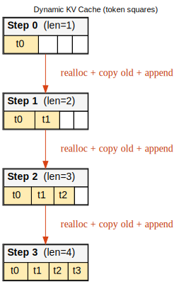
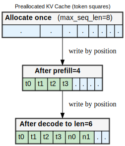
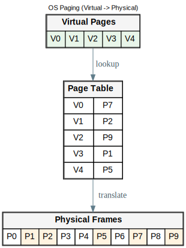
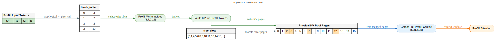
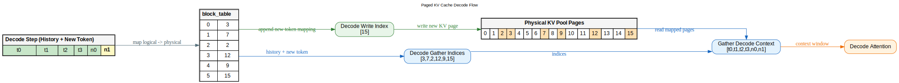
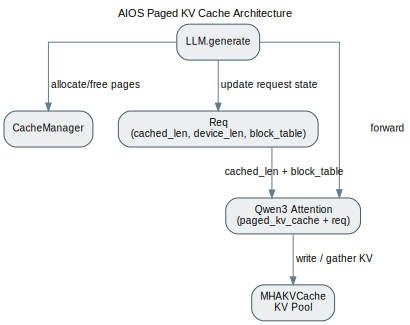

# Lesson 5: Paged KV Cache

## 1. Dynamic Cache 示意图，说明优缺点


图里每个小方块代表一个 token 的 KV 占用。Dynamic 的增长路径是：每步生成新 token 时，用 `torch.cat` 拼接历史与新 token。

当前实现位置：

- `python/aios/kvcache/dynamic.py`
- 类：`DynamicKVCache`

优点：

- 实现最简单，代码短，便于教学和调试。
- 和“连续内存 + 直接 attention”思路一致，容易验证 correctness。

缺点：

- 每次增长都要分配更大张量并复制旧内容，增长成本高。
- 序列越长，累计复制越重（典型 `1 + 2 + ... + n` 模式）。
- 并发请求多时，容易引入额外内存抖动。

## 2. Preallocated Cache



图里每个小方块也是一个 token 槽位。Preallocated 是“先按 `max_seq_len` 整块预留，再按位置写入”。

优点：

- 生成过程无需反复扩容，单请求写入路径直。
- 对固定长度任务，延迟稳定。

缺点：

- 预留但未使用的槽位会长期占用显存。
- 多短请求并发时，显存利用率差（空洞占用明显）。

## 3. 简要介绍操作系统的分页内存管理机制



操作系统分页的核心是三点：

1. 进程看到的是逻辑连续的虚拟页（Virtual Pages）。
2. 实际物理内存是离散页框（Physical Frames）。
3. 通过页表（Page Table）把“虚拟页号 -> 物理页号”映射起来。

Paged KV cache 本质上就是把这个思想搬到 KV 存储：

- 逻辑 token 顺序连续。
- 物理 KV 存储可以离散。
- `block_table` 充当页表。

## 4. Paged KV Cache 示意图，说明优点





在当前 AIOS 实现里（`page_size=1`），每个 token 对应一个 page 槽位。

核心组件：

- `block_table`：逻辑 token 下标到物理 page 下标的映射。
- `free_slots`：空闲 page 列表。
- `MHAKVCache`：底层 KV 物理池（只做物理存储）。
- 请求态由 `Req`（`cached_len` / `device_len` / `block_table`）维护。

优点：

- 按需分配：仅为真实 token 申请 page。
- 可复用：请求结束后，把 page 归还 `free_slots`，后续请求可复用。
- 职责分离清晰：请求态和共享物理池分离。

## 5. Paged KV Cache 整体架构图（按照 AIOS 当前代码实现）



当前代码的关键事实：

- 没有 `PagedKVCache` 类。
- 没有 `PagedRequestCache` 类。
- 请求态在 `Req` 对象中维护（参考 mini-sglang 的组织方式）。
- 共享物理池在 `MHAKVCache`。

对应代码：

- 请求态数据结构：`python/aios/core.py` (`Req`)
- 入口与调度：`python/aios/llm/llm.py`
- 分配释放：`python/aios/scheduler/cache.py` (`allocate`, `_free`)
- 底层存储：`python/aios/kvcache/mha_pool.py` (`store_kv`)
- 注意力调用：`python/aios/models/qwen3.py`（`req` + paged 路径）
- 动态路径：`python/aios/kvcache/dynamic.py`

补充：`CacheManager` 中 `lock/unlock` 等前缀缓存接口当前处于注释状态，lesson5 路径实际使用的是最小子集（`allocate/_free`）。

## 6. 一个例子走完整条代码路径

下面用一个固定例子，完整过一遍当前代码执行流。

例子参数：

- `use_paged_kv_cache=True`
- `page_size=1`
- Prompt 长度 `4`（`t0 t1 t2 t3`）
- 生成 `2` 个 token（`n0 n1`）

### Step A：初始化阶段（`LLM.__init__`）

代码：`python/aios/llm/llm.py`

- 创建共享物理池 `MHAKVCache`，形状为：
  `[2, num_layers, num_pages, num_kv_heads, page_size, head_dim]`
- 当前 `num_pages=2048`（硬编码默认值）。
- 创建 `CacheManager`，初始化 `_free_slots=[0..2047]`。

### Step B：请求进入 `generate()`，分配 prompt 对应 page

代码：`python/aios/llm/llm.py`

- 构建 `Req(...)`，并初始化：
- `block_table = self.cache_manager.allocate(input_ids.shape[1])`
- prompt=4 时，`block_table=[0,1,2,3]`
- `cached_len=0`, `device_len=4`

此时：

- 请求态：`Req(block_table=[0,1,2,3], cached_len=0, device_len=4)`
- 全局空闲：`_free_slots=[4,5,...]`

### Step C：prefill forward（一次输入 4 个 token）

代码链路：

- `Qwen3Model.forward()` -> `Qwen3Attention.forward()`
- paged 参数：`paged_kv_cache + req`

`python/aios/models/qwen3.py` 里：

1. `out_loc = req.block_table[req.cached_len:req.cached_len+seq_len]`
2. prefill 时 `req.cached_len=0`, `seq_len=4`，所以 `out_loc=[0,1,2,3]`
3. 写入物理池：`paged_kv_cache.store_kv(...)`
4. 读取历史：`all_locs=block_table[:4]`
5. gather 出 `full_k/full_v`，返回给 attention

注意：请求态由 `Req` 管理；`MHAKVCache` 只管物理数据。

### Step D：采样第一个新 token 后，追加 1 个 page

代码：`python/aios/llm/llm.py`

- `generated` 长度从 4 变 5
- 若未结束（非 EOS），执行：
- `req.complete_one()`，把 `cached_len` 从 0 更新到 4
- `new_block = self.cache_manager.allocate(1)`（例如 `[4]`）
- `req.block_table = cat([0,1,2,3], [4]) -> [0,1,2,3,4]`

### Step E：decode forward（输入单 token `n0`）

`Qwen3Attention.forward` 的 paged 路径中：

- `seq_len=1`
- `out_loc = req.block_table[req.cached_len:req.cached_len+1] = [4]`
- `all_locs = req.block_table[:5] = [0,1,2,3,4]`
- 返回长度为 5 的历史 KV 给 attention

然后同理处理 `n1`，再追加一个 page（例如 5）。

### Step F：请求结束释放

代码：`python/aios/llm/llm.py`

- `self.cache_manager._free(req.block_table)`
- 把该请求分配过的所有 page 归还 `free_slots`。

### 这个例子的状态快照

```text
初始:
  free_slots = [0,1,2,3,4,5,...]

allocate prompt=4:
  req.block_table = [0,1,2,3]
  req.cached_len = 0
  req.device_len = 4
  free_slots  = [4,5,6,...]

prefill(seq=4):
  out_loc  = [0,1,2,3]
  all_locs = [0,1,2,3]

decode n0 前追加 1 page:
  req.complete_one() -> cached_len = 4
  req.block_table = [0,1,2,3,4]
  free_slots  = [5,6,...]

decode(seq=1):
  out_loc  = [4]
  all_locs = [0,1,2,3,4]

结束释放:
  _free(block_table)
```

以上就是当前 AIOS 代码里 paged KV 的完整闭环：

- 分配：`CacheManager.allocate`
- 请求态维护：`Req(cached_len, device_len, block_table)`
- 写入：`MHAKVCache.store_kv`
- 读取：`Qwen3Attention.forward` 的 paged 路径内 gather
- 释放：`CacheManager._free`

## 7. 打印跟踪开关（trace_paged_kv）

已在代码中加入可选调试开关，默认关闭：

- `LLM.generate(..., use_paged_kv_cache=True, trace_paged_kv=True)`
- `benchmark/bench.py` 支持 `--trace-paged-kv`（需配合 `--paged-kv-cache`）

示例：

```bash
python benchmark/bench.py \
  --model Qwen/Qwen3-0.6B \
  --num-seqs 1 \
  --max-input-len 4 \
  --max-output-len 2 \
  --paged-kv-cache \
  --trace-paged-kv
```

会看到按 A-F 节点打印的关键信息（pool 初始化、block 分配、prefill/decode 的 `out_loc/all_locs`、释放）。
