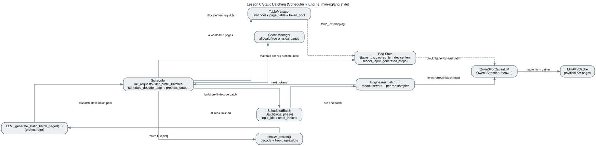
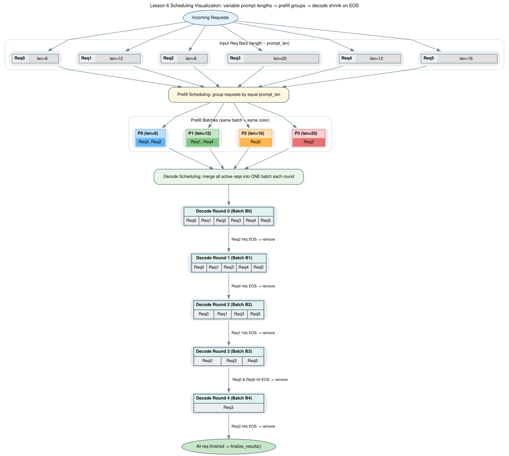
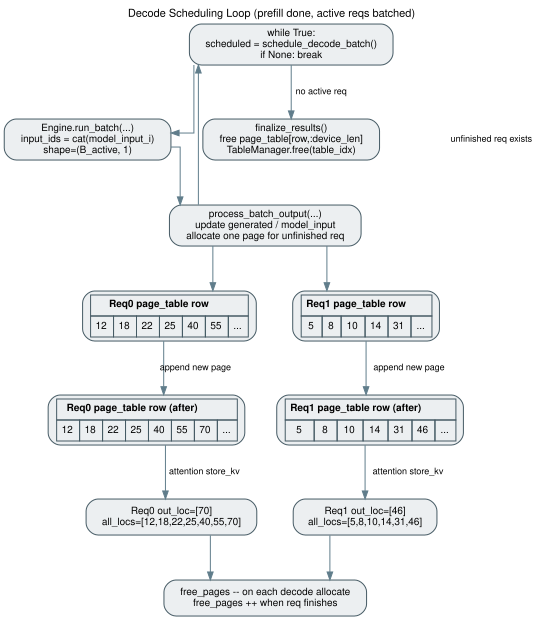
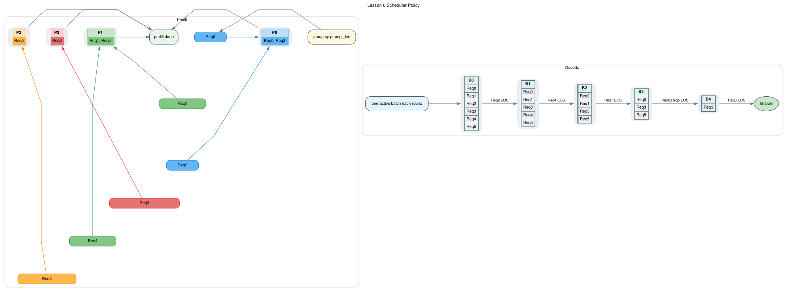

# Lesson 6：Static Batching + Scheduler/Engine 分层（按 mini-sglang 重新对齐）

> 本课目标是把 Lesson 6 的静态批实现尽可能对齐 mini-sglang 的数据面与执行链路：`Scheduler(调度)` + `Engine(执行)`。

## 1. 承接关系

- 输入基线：Lesson 5 的单请求 paged KV cache。
- 关键问题：多请求仍在 `generate` 内串行 `forward`，吞吐上不去。
- 本课目标：在保持“静态批”前提下，实现 mini-sglang 风格的请求态/表管理/批执行两阶段。

## 2. 本课改造点（已落地）

1. `Req` 对齐 mini-sglang 关键字段
- 新增 `table_idx`（用于 `page_table/token_pool` 行索引）。
- `input_ids` 改为 host tensor 语义（与 mini-sglang 一致）。
- 保留课程阶段需要的 `block_table` 兼容字段（见不一致说明）。

2. `Batch` 对齐 mini-sglang 批容器
- 增加 `input_ids/positions/out_loc/padded_reqs/attn_metadata` 字段。
- 保留 `phase = prefill/decode` 的两阶段执行语义。

3. `TableManager` 对齐 mini-sglang 的槽位策略
- 内置 `_free_slots`（LIFO 分配：`pop/append`）。
- `page_table/token_pool` 使用 `int32` 连续二维表。
- `free(slot)` 仅归还槽位，不强制清空整行（与 mini-sglang 一致）。

4. 新增 `Scheduler`（调度层）
- 路径：`python/aios/scheduler/scheduler.py`
- 负责请求初始化、按 prompt 长度分组 prefill、decode 活跃请求选择、结果回写与资源回收。
- `TableManager` 在这里被实际驱动（槽位分配、`page_table/token_pool` 写入、释放）。

5. 新增 `Engine`（执行层）
- 路径：`python/aios/engine/engine.py`
- 负责运行 `model.forward(..., reqs=batch.reqs)` 与 sampling，输出每个请求的 next token。

6. `LLM._generate_static_batch_paged` 重构为编排层
- 按 `table_idx` 写入 `page_table/token_pool`。
- prefill/decode 由 `Scheduler` 产出 `ScheduledBatch`，`Engine` 执行，再回到 `Scheduler` 推进状态。
- 释放时按 `page_table[table_idx, :req.device_len]` 回收页。

## 3. 整体架构图



数据流要点：

- `LLM.generate(...use_static_batch=True...)` 作为 orchestrator。
- `Scheduler` 维护请求状态和批次调度。
- `TableManager` 维护 `page_table/token_pool + slot pool`。
- `Req(table_idx, cached_len, device_len)` 维护请求运行态。
- `Engine` 执行 batched forward + sample。
- `Qwen3Attention(reqs=...)` 按请求 `out_loc/all_locs` 执行 paged KV store/gather。

## 4. Prefill / Decode 可视化

### 4.1 Prefill



- 每个请求一次写入 prompt 对应页。
- `out_loc` 为本步写入位置，`all_locs` 为当前可读上下文位置。

### 4.2 Decode



- 每个活跃请求每步追加 1 页（当前课程配置 `page_size=1`）。
- attention 用 `all_locs` gather 全历史 K/V。
- 请求结束后立即回收其占用页。

### 4.3 调度策略（Scheduler Policy）



当前 lesson6 的策略是：

- 图示约定：每个 `Req` 用长条表示，长条长度对应 `prompt_len`；prefill 中同一 batch 采用同色；decode 中每轮把命中 EOS 的请求从 batch 移除。
- `prefill-first`：先消费完所有 prefill 分组，再进入 decode 循环。
- prefill 分组规则：按 prompt 长度分组，组内做 batched forward。
- decode 批规则：每步收集所有 `unfinished && model_input!=None` 的请求，组成 `(B_active, 1)` 批。
- 当前不做 prefill/decode 同步混部。
- 当前不做 chunked prefill 和 token budget 裁剪（与 mini-sglang full scheduler 有差异）。

## 5. 关键代码落点

- `python/aios/core.py`
  - `Req` / `Batch`：对齐 mini-sglang 的请求态与批态容器。
- `python/aios/scheduler/table.py`
  - `TableManager`：`page_table/token_pool` + LIFO 槽位管理。
- `python/aios/scheduler/scheduler.py`
  - `Scheduler`：批次准备（prefill/decode）+ 请求状态推进 + 回收。
- `python/aios/engine/engine.py`
  - `Engine`：batch forward + per-request sampler。
- `python/aios/llm/llm.py`
  - `_generate_static_batch_paged(...)`：调度与执行编排。
- `python/aios/models/qwen3.py`
  - paged attention 的 batched `reqs` 路径。

## 5.1 新增数据结构：作用与字段说明

### A. `Req`（`python/aios/core.py`）

作用：描述单个请求在调度和执行中的运行态。

| 字段 | 类型 | 说明 |
|---|---|---|
| `input_ids` | `torch.Tensor` (CPU) | host 侧 token 序列（prompt + 已生成 token） |
| `table_idx` | `int` | 对应 `TableManager.page_table/token_pool` 的行索引 |
| `cached_len` | `int` | 已写入 KV 的 token 数（历史上下文长度） |
| `output_len` | `int` | 最多可生成 token 数（来自采样参数） |
| `uid` | `int` | 请求唯一标识 |
| `sampling_params` | `SamplingParams` | 该请求的采样配置 |
| `block_table` | `torch.Tensor \| None` | 当前课程兼容字段，指向该请求的页映射 |
| `trace_paged_kv` | `bool` | 是否打印 paged KV 调试日志 |

运行时派生字段：

| 字段/属性 | 说明 |
|---|---|
| `device_len` | 当前 device 侧有效长度（prompt + 已生成） |
| `max_device_len` | `len(prompt) + output_len` |
| `remain_len` | 剩余可生成长度 |
| `extend_len` | 本轮需要扩展的长度 |
| `can_decode` | 是否还能继续 decode |

### B. `Batch`（`python/aios/core.py`）

作用：一次 forward 的批描述（prefill 或 decode）。

| 字段 | 类型 | 说明 |
|---|---|---|
| `reqs` | `list[Req]` | 本批请求集合 |
| `phase` | `"prefill" \| "decode"` | 当前批阶段 |
| `input_ids` | `torch.Tensor` | 预留字段（对齐 mini-sglang） |
| `positions` | `torch.Tensor` | 预留字段（对齐 mini-sglang） |
| `out_loc` | `torch.Tensor` | 预留字段（对齐 mini-sglang） |
| `padded_reqs` | `list[Req]` | 预留字段（对齐 mini-sglang） |
| `attn_metadata` | `Any` | 预留字段（对齐 mini-sglang） |

### C. `ScheduledBatch`（`python/aios/scheduler/scheduler.py`）

作用：`Scheduler` 交给 `Engine` 的执行单元。

| 字段 | 类型 | 说明 |
|---|---|---|
| `batch` | `Batch` | 批元信息（reqs + phase） |
| `input_ids` | `torch.Tensor` | 本次 forward 的真实输入 token 张量 |
| `samplers` | `list[Sampler]` | 与 `reqs` 对齐的采样器列表 |
| `state_indices` | `list[int]` | 对应 `Scheduler.states` 的索引映射，用于回写输出 |

### D. `_ReqState`（`python/aios/scheduler/scheduler.py`，内部结构）

作用：调度器私有请求状态，承载推进逻辑。

| 字段 | 说明 |
|---|---|
| `req_id` | 请求 ID |
| `input_ids` | 初始 prompt 的 device 张量 |
| `generated` | 当前完整输出（prompt + generated） |
| `sampler` | 请求级采样器 |
| `sampling_params` | 请求采样参数 |
| `req` | 对应 `Req` 对象 |
| `generated_steps` | 已生成 token 数 |
| `finished` | 请求是否完成 |
| `model_input` | 下一轮 decode 的输入 token（通常 shape 为 `(1,1)`） |

### E. `TableManager`（`python/aios/scheduler/table.py`）

作用：集中管理“请求槽位 + 页映射表 + token 表”。

| 字段 | 说明 |
|---|---|
| `_free_slots` | 可用请求槽位池（LIFO） |
| `page_table` | `[req_idx, pos] -> physical_page` 映射 |
| `token_pool` | `[req_idx, pos] -> token_id` 存储（当前主要为状态镜像） |
| `max_seq_len` | 每请求最大序列长度上限 |

关键方法：

- `allocate()/free()`：申请/归还请求槽位。
- `write_pages()`：写入页映射。
- `write_tokens()`：写入 token。

### F. `Engine`（`python/aios/engine/engine.py`）

作用：纯执行层，接收已调度好的 batch，执行 forward+sample。

| 字段/方法 | 说明 |
|---|---|
| `model` | 推理模型实例 |
| `paged_kv_cache` | paged KV pool |
| `run_batch(batch, input_ids, samplers)` | 执行一次批推理并返回 next tokens |

## 6. 执行路径（2 请求示例）

设 Req0/Req1 的 prompt 长度相同，开启 `--paged-kv-cache --static-batch`：

1. 入场：分配 `table_idx`，写入 prompt token 与页映射。
2. 调度：`Scheduler.iter_prefill_batches()` 按长度分组产出 prefill batch。
3. 执行：`Engine.run_batch(...)` 跑 batched forward 并采样。
4. 推进：`Scheduler.process_batch_output(...)` 写回 token、分配 decode 页、更新状态。
5. Decode 循环：`Scheduler.schedule_decode_batch()` 选择活跃请求并重复 3-4。
6. 回收：`Scheduler.finalize_results()` 释放 `page_table[table_idx, :device_len]` 并归还槽位。

## 6.1 TableManager 在当前实现中的作用

- 已体现的作用：
  - 统一请求槽位管理（`allocate/free`）。
  - 统一维护 `page_table`（逻辑位置到物理页映射）。
  - 统一维护 `token_pool`（当前课程里主要用于状态镜像，不是主输入通道）。
- 还未完全体现 mini-sglang 的部分：
  - 还没有像 mini-sglang 一样把 `token_pool` 作为调度到执行的主输入/回写通道。
  - 当前模型侧仍保留 `Req.block_table` 兼容路径。

## 7. 运行与验收

### 7.0 更新 dot 图（重新生成 svg）

```bash
dot -Tsvg resources/lesson-6-static-batching/static_batch_architecture.dot \
  -o resources/lesson-6-static-batching/static_batch_architecture.svg
dot -Tsvg resources/lesson-6-static-batching/static_batch_prefill.dot \
  -o resources/lesson-6-static-batching/static_batch_prefill.svg
dot -Tsvg resources/lesson-6-static-batching/static_batch_decode.dot \
  -o resources/lesson-6-static-batching/static_batch_decode.svg
dot -Tsvg resources/lesson-6-static-batching/static_batch_scheduler_policy.dot \
  -o resources/lesson-6-static-batching/static_batch_scheduler_policy.svg
```

### 7.1 一键对比脚本

```bash
python resources/lesson-6-static-batching/run_lesson6.py \
  --model /data4/home/yan.wang/huggingface/Qwen3-0.6B \
  --suite historical \
  --collect-gpu-metrics
```

单独跑一个自定义用例：

```bash
python resources/lesson-6-static-batching/run_lesson6.py \
  --model /data4/home/yan.wang/huggingface/Qwen3-0.6B \
  --suite single \
  --num-seqs 32 \
  --max-input-len 128 \
  --max-output-len 256 \
  --collect-gpu-metrics
```

`historical` 默认 4 组用例：
- A: `num_seqs=8, max_input_len=64, max_output_len=256`
- B: `num_seqs=16, max_input_len=128, max_output_len=256`
- C: `num_seqs=24, max_input_len=128, max_output_len=256`
- D: `num_seqs=32, max_input_len=128, max_output_len=256`

### 7.2 直接跑 benchmark

```bash
python benchmark/bench.py \
  --model /data4/home/yan.wang/huggingface/Qwen3-0.6B \
  --num-seqs 16 \
  --max-input-len 64 \
  --max-output-len 256 \
  --paged-kv-cache \
  --static-batch
```

建议验收：

- 正确性：EOS / `max_tokens` 终止正确。
- 资源：请求结束后 `free_pages` 回升。
- 性能：static-batch 吞吐高于串行 paged 路径。

### 7.3 实测记录（2026-04-14，示例）

说明：以下是课程阶段的实测样例。当前代码可直接用 `run_lesson6.py` 重新生成最新数据。

测试模型：`/data4/home/yan.wang/huggingface/Qwen3-0.6B`  
测试设备：`CUDA_VISIBLE_DEVICES=0`

#### A. 小规模对比（num-seqs=2）

命令 1（dynamic KV，不启用 batching）：

```bash
CUDA_VISIBLE_DEVICES=0 python benchmark/bench.py \
  --model /data4/home/yan.wang/huggingface/Qwen3-0.6B \
  --num-seqs 2 \
  --max-input-len 32 \
  --max-output-len 128
```

结果：
- `[KV_CACHE] Total: 196tok, Time: 5.30s, Throughput: 36.96tok/s`

命令 2（static batching）：

```bash
CUDA_VISIBLE_DEVICES=0 python benchmark/bench.py \
  --model /data4/home/yan.wang/huggingface/Qwen3-0.6B \
  --num-seqs 2 \
  --max-input-len 32 \
  --max-output-len 128 \
  --paged-kv-cache \
  --static-batch
```

结果：
- `[STATIC_BATCH] Total: 196tok, Time: 4.00s, Throughput: 49.05tok/s`

对比：
- 吞吐提升 `49.05 / 36.96 = 1.33x`（约 +32.7%）

#### B. 补充对比（num-seqs=8）

命令 1（dynamic KV，不启用 batching）：

```bash
CUDA_VISIBLE_DEVICES=0 python benchmark/bench.py \
  --model /data4/home/yan.wang/huggingface/Qwen3-0.6B \
  --num-seqs 8 \
  --max-input-len 64 \
  --max-output-len 128
```

结果：
- `[KV_CACHE] Total: 900tok, Time: 32.57s, Throughput: 27.63tok/s`

命令 2（static batching）：

```bash
CUDA_VISIBLE_DEVICES=0 python benchmark/bench.py \
  --model /data4/home/yan.wang/huggingface/Qwen3-0.6B \
  --num-seqs 8 \
  --max-input-len 64 \
  --max-output-len 128 \
  --paged-kv-cache \
  --static-batch
```

结果：
- `[STATIC_BATCH] Total: 900tok, Time: 8.35s, Throughput: 107.81tok/s`

对比：
- 吞吐提升 `107.81 / 27.63 = 3.90x`

#### C. 补充对比 + GPU 资源指标（num-seqs=12）

命令 1（dynamic KV，不启用 batching）：

```bash
CUDA_VISIBLE_DEVICES=0 python benchmark/bench.py \
  --model /data4/home/yan.wang/huggingface/Qwen3-0.6B \
  --num-seqs 12 \
  --max-input-len 64 \
  --max-output-len 128
```

结果：
- `[KV_CACHE] Total: 1096tok, Time: 28.74s, Throughput: 38.13tok/s`
- `AVG_GPU_UTIL=25.08%`
- `AVG_MEM_USED_MIB=10270.45`

命令 2（static batching）：

```bash
CUDA_VISIBLE_DEVICES=0 python benchmark/bench.py \
  --model /data4/home/yan.wang/huggingface/Qwen3-0.6B \
  --num-seqs 12 \
  --max-input-len 64 \
  --max-output-len 128 \
  --paged-kv-cache \
  --static-batch
```

结果：
- `[STATIC_BATCH] Total: 1096tok, Time: 9.10s, Throughput: 120.44tok/s`
- `AVG_GPU_UTIL=19.23%`
- `AVG_MEM_USED_MIB=10117.61`

对比：
- 吞吐提升 `120.44 / 38.13 = 3.16x`

#### D. 补充对比（num-seqs=16）

命令 1（dynamic KV，不启用 batching）：

```bash
CUDA_VISIBLE_DEVICES=0 python benchmark/bench.py \
  --model /data4/home/yan.wang/huggingface/Qwen3-0.6B \
  --num-seqs 16 \
  --max-input-len 64 \
  --max-output-len 128
```

结果：
- `[KV_CACHE] Total: 1495tok, Time: 38.62s, Throughput: 38.71tok/s`

命令 2（static batching）：

```bash
CUDA_VISIBLE_DEVICES=0 python benchmark/bench.py \
  --model /data4/home/yan.wang/huggingface/Qwen3-0.6B \
  --num-seqs 16 \
  --max-input-len 64 \
  --max-output-len 128 \
  --paged-kv-cache \
  --static-batch
```

结果：
- `[STATIC_BATCH] Total: 1495tok, Time: 11.39s, Throughput: 131.23tok/s`

对比：
- 吞吐提升 `131.23 / 38.71 = 3.39x`

## 8. 与 mini-sglang **不一致**的地方（明确列举）

以下差异是当前 Lesson 6 仍保留的教学化简：

1. 已有 Scheduler/Engine 分层，但仍是单进程内编排
- mini-sglang：`PrefillManager + DecodeManager + SchedulerIOMixin` 消息驱动，支持更完整 worker 架构。
- Lesson 6：`Scheduler + Engine` 已拆分，但仍在 `LLM.generate` 内同步调用。

2. 没有 chunked prefill / token budget 调度
- mini-sglang：`PrefillAdder(token_budget, reserved_size)` 做预算裁剪与分块 prefill。
- Lesson 6：仅按 prompt 长度分组，不做 chunked prefill。

3. 没有 prefix cache 的 lock/match/evict 生命周期
- mini-sglang：`CacheManager.match_req/lock/unlock/cache_req/evict`。
- Lesson 6：只做最小可用 allocate/free，不做前缀复用与淘汰。

4. 注意力批元数据路径不同
- mini-sglang：prepare metadata + backend（fa/fi/trtllm）+ CUDA graph replay。
- Lesson 6：使用课程版 `Qwen3Attention` + 普通 PyTorch 路径。

5. `Req` 仍保留课程兼容字段 `block_table`
- mini-sglang：核心映射基于 `table_idx -> page_table`。
- Lesson 6：已引入 `table_idx`，但保留 `block_table` 兼容单请求路径与现有模型接口。

6. 单进程、单 worker
- mini-sglang：支持 tokenizer/detokenizer/scheduler/engine 多进程和 TP。
- Lesson 6：仅单进程教学实现。
