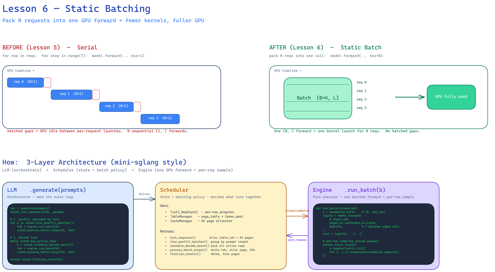
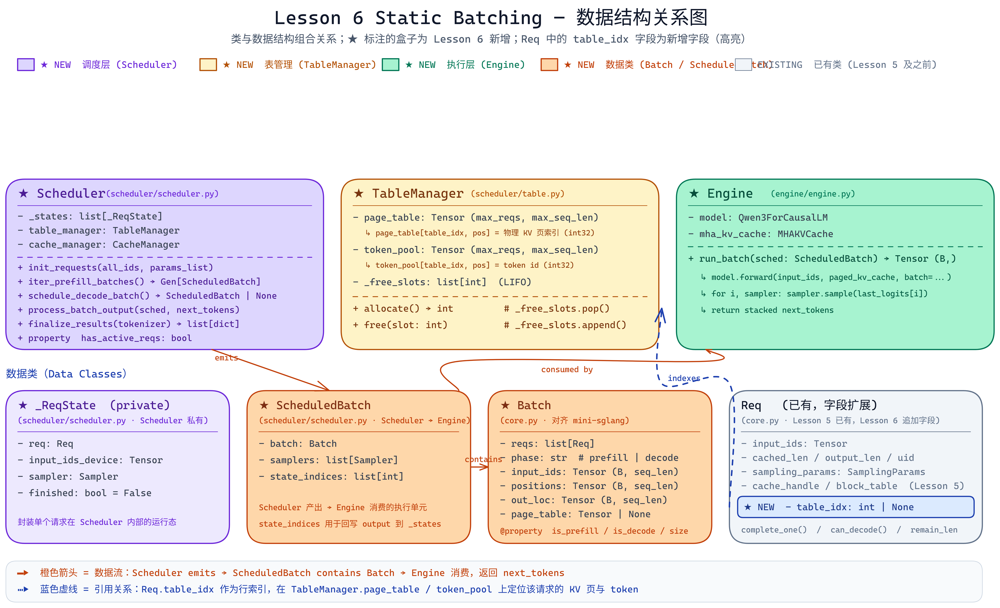
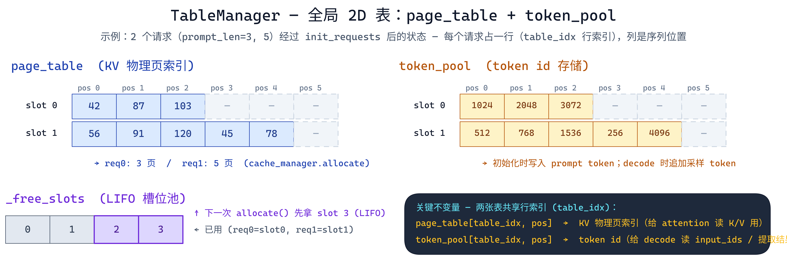
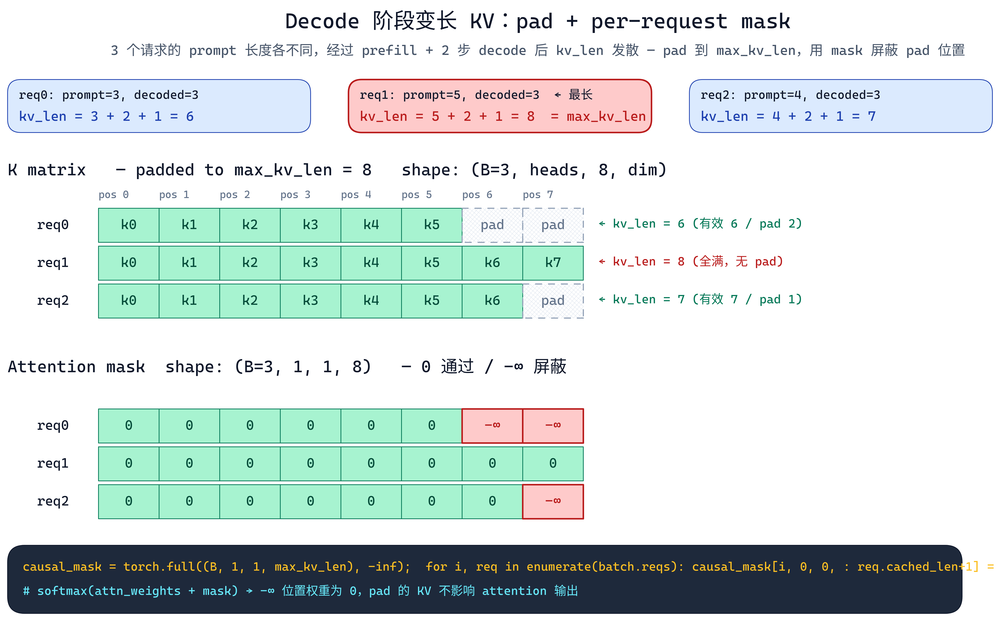

# Lesson 6：Static Batching 详解

> 本文档逐文件、逐函数地解释 Lesson 6 的全部代码改动，帮助读者理解从"单请求串行推理"到"多请求静态批推理"的完整实现过程。

---

## 目录

1. [问题背景：为什么需要 Batching](#1-问题背景为什么需要-batching)
2. [整体架构：Scheduler / Engine 分层](#2-整体架构schedulerenginellm-三层)
3. [数据结构改动：core.py](#3-数据结构改动corepy)
4. [表管理器：scheduler/table.py（新建）](#4-表管理器schedulertablepy新建)
5. [调度器：scheduler/scheduler.py（新建）](#5-调度器schedulerschedulerpy新建)
6. [执行引擎：engine/engine.py（新建）](#6-执行引擎engineenginepy新建)
7. [模型层改动：models/qwen3.py](#7-模型层改动modelsqwen3py)
8. [编排层改动：llm/llm.py](#8-编排层改动llmllmpy)
9. [KV 页数动态计算：_determine_num_pages](#9-kv-页数动态计算_determine_num_pages)
10. [Benchmark 改动：bench.py](#10-benchmark-改动benchpy)
11. [端到端执行流程图解](#11-端到端执行流程图解)
12. [与 mini-sglang 的对齐与差异](#12-与-mini-sglang-的对齐与差异)

---

## 1. 问题背景：为什么需要 Batching

Lesson 5 实现了 paged KV cache，但多请求仍然在 `LLM.generate()` 的 for 循环中**串行**执行 `model.forward()`：

```
for req in requests:          # 逐个请求
    for step in range(max_tokens):  # 逐个 token
        logits = model.forward(input, req=req)  # bsz=1
```

问题：每次 `forward` 只有 1 个请求（`bsz=1`），GPU 的大量并行计算单元处于空闲状态。矩阵乘法 `(1, hidden) × (hidden, vocab)` 无法充分利用 GPU 吞吐。

**Static Batching 的核心思想**：将多个请求打包成一个 batch，一次 `forward` 处理 `B` 个请求。

- **Prefill 阶段**：相同 prompt 长度的请求组成 `(B, prompt_len)` 的 batch。
- **Decode 阶段**：所有活跃请求每步各生成 1 个 token，组成 `(B_active, 1)` 的 batch。

吞吐提升来源：decode 阶段原本需要 `N` 次 `(1, 1)` forward，现在只需 `1` 次 `(N, 1)` forward，GPU 利用率大幅提升。

---

## 2. 整体架构：Scheduler/Engine/LLM 三层



> 上图左侧对比 **Lesson 5 串行执行**（4 次独立 `(1, ·)` forward，GPU 大量时间空闲）与 **Lesson 6 静态批**（1 次 `(B, ·)` forward 完成 4 个请求）；右侧展示 **LLM → Scheduler → Engine** 三层分工：`LLM` 驱动 prefill/decode 循环，`Scheduler` 管理状态并决定批组成，`Engine` 纯执行 `model.forward(batch=batch)` + per-request 采样。

```
LLM.generate(use_static_batch=True)
  │
  ├── Scheduler          ← 调度层：管理请求状态、组批、资源分配
  │     ├── TableManager  ← page_table / token_pool / slot 管理
  │     └── CacheManager  ← KV cache 页分配/释放（Lesson 5 已有）
  │
  └── Engine             ← 执行层：batched forward + per-request sampling
        └── model.forward(batch=batch)
              └── Qwen3Attention._batched_paged_attention()
```

**分层职责**：

| 层 | 职责 | 
|---|---|
| **LLM** | 编排：创建 Scheduler/Engine，驱动 prefill→decode 循环 |
| **Scheduler** | 调度：请求初始化、prefill 分组、decode 批构建、状态推进、资源回收 | 
| **Engine** | 执行：`model.forward()` + `Sampler.sample()` | 
| **TableManager** | 表管理：page_table + token_pool + slot 池 | 

---

## 3. 数据结构改动：core.py



> 上图给出 Lesson 6 **所有相关类与数据结构**的一览：三层协调者（★ Scheduler 紫 / ★ TableManager 琥珀 / ★ Engine 绿）在中间一行，新增的数据类（★ _ReqState / ★ ScheduledBatch / ★ Batch）与已有的 `Req` 在下方一行。`Req` 盒子内蓝色高亮的 `★ NEW - table_idx: int | None` 是本节 §3.1 要讲的唯一字段扩展；**蓝色虚线**展示它如何作为行索引把每个请求与 `TableManager.page_table / token_pool` 的 KV 物理页和 token id 关联起来；**橙色实线**展示 `Scheduler → ScheduledBatch → Engine` 的数据流与 `ScheduledBatch → Batch` 的组合关系。

### 3.1 `Req` 新增 `table_idx` 字段

```python
# python/aios/core.py

@dataclass(eq=False)
class Req:
    input_ids: torch.Tensor
    cached_len: int
    output_len: int
    uid: int
    sampling_params: SamplingParams
    cache_handle: Any | None = None
    block_table: torch.Tensor | None = None      # Lesson 5 兼容字段
    trace_paged_kv: bool = False
    table_idx: int | None = None                  # ★ 新增：TableManager 中的行索引
```

**为什么新增 `table_idx`**：

Lesson 5 中每个请求自带一个 `block_table`（1D tensor），记录该请求的 KV cache 页映射。这个方案有两个问题：

1. **无法集中管理**：每个请求各自持有 `block_table`，调度器无法一次性查看/操作所有请求的页映射。
2. **与 mini-sglang 不一致**：mini-sglang 使用全局 `page_table`（2D 表），用 `table_idx` 索引某一行。

引入 `table_idx` 后，请求的页映射存储在全局 `page_table[table_idx, :]` 中，调度器可以直接读写。

### 3.2 新增 `Batch` 数据类

```python
@dataclass
class Batch:
    reqs: List[Req]                           # 本批所有请求
    phase: str                                # "prefill" | "decode"
    input_ids: torch.Tensor                   # (B, seq_len) — forward 输入
    positions: torch.Tensor                   # (B, seq_len) — RoPE 位置
    out_loc: torch.Tensor                     # (B, seq_len) — KV 写入位置
    page_table: torch.Tensor | None = None    # 全局 page_table 引用

    @property
    def is_prefill(self) -> bool: ...
    @property
    def is_decode(self) -> bool: ...
    @property
    def size(self) -> int: return len(self.reqs)
```

**设计要点**：

| 字段 | 说明 | 谁构建 | 谁消费 |
|------|------|--------|--------|
| `input_ids` | prefill: `(B, prompt_len)` 全 prompt；decode: `(B, 1)` 上一步生成 token | Scheduler | Engine → model |
| `positions` | prefill: `[0, 1, ..., prompt_len-1]` 每行相同；decode: `[cached_len]` 每行不同 | Scheduler | model → RoPE |
| `out_loc` | 本步要写入 KV cache 的物理页索引 | Scheduler | model → Attention |
| `page_table` | 全局 page_table 引用，decode 时 attention 需要读取完整历史 | Scheduler | Attention |

---

## 4. 表管理器：scheduler/table.py（新建）



> 上图以 **2 个请求（prompt_len=3 和 5）** 为例，展示 `init_requests` 之后 `page_table` 与 `token_pool` 的实际内容：两张表共享 `table_idx` 行索引，`page_table[i, j]` 存 KV 物理页、`token_pool[i, j]` 存 token id；右下 `_free_slots` 是 LIFO 槽位池，`allocate()` 用 `.pop()`、`free()` 用 `.append()`。

```python
# python/aios/scheduler/table.py

class TableManager:
    def __init__(self, max_running_reqs: int, page_table: torch.Tensor) -> None:
        self._free_slots = list(range(max_running_reqs))   # LIFO 空闲槽位池
        self.page_table = page_table     # (max_reqs, max_seq_len), int32, GPU
        self.token_pool = torch.zeros_like(page_table, dtype=torch.int32)  # token 存储

    def allocate(self) -> int:           # 分配一个请求槽位
        return self._free_slots.pop()

    def free(self, slot: int) -> None:   # 归还一个请求槽位
        self._free_slots.append(slot)
```

**`page_table` vs `token_pool`**：

```
               pos 0    pos 1    pos 2    pos 3    pos 4
page_table[0]  [  42,     87,    103,    256,     ...]   ← 物理页索引
token_pool[0]  [1024,   2048,   3072,    512,     ...]   ← token id

含义：请求 0 的位置 0 的 KV 存在物理页 42，对应 token id 为 1024
```

- `page_table`：KV cache 物理页映射，模型 attention 层读取它来 gather 历史 K/V。
- `token_pool`：token id 存储，Scheduler 用它来构建 decode 阶段的 `input_ids`，以及最终提取生成结果。

### 4.1 `TableManager` vs Lesson 5 的 `CacheManager`

两者都是 **paged KV 系统** 里的资源管理器，但管理的东西完全不同，非常容易混淆。简单记住一句：**`CacheManager` 管"物理 KV 页"，`TableManager` 管"请求的身份行"**。

| 对比项 | `CacheManager`（Lesson 5） | `TableManager`（Lesson 6 新增） |
|---|---|---|
| **管理的资源** | KV cache 物理页（实际存 K/V 向量的显存页） | `page_table` / `token_pool` 的行槽位 |
| **空闲池结构** | `_free_slots: torch.Tensor`（页索引数组） | `_free_slots: list[int]`（行索引列表） |
| **一次分配单位** | 多个页（`allocate(needed_len)` 返回 tensor） | 一个行（`allocate()` 返回 int） |
| **分配/释放粒度** | per-token（每新 token 分一页） | per-request（请求到达时分一行，完成时归还） |
| **生命周期** | 随 decode 推进，一个请求不断追加页 | 一个请求整个生命周期内只占一个 `table_idx` |
| **存储位置** | GPU（因为被 attention kernel 读取） | CPU `list[int]`（调度器操作，不需要 GPU） |
| **与 `Req` 的关联** | `Req.cache_handle`（Lesson 5）指向这批页 | `Req.table_idx` 指向 `page_table` 的某行 |

**二者如何协作**：

```
新请求到达（prompt_len = N）：
  ① table_idx = TableManager.allocate()           → 拿一个请求槽位（1 行）
  ② pages = CacheManager.allocate(N)              → 拿 N 个物理 KV 页
  ③ page_table[table_idx, 0:N] = pages            → 把"行 × 列"关联到"物理页"
     token_pool[table_idx, 0:N] = prompt_ids

请求产生新 token（decode 一步）：
  ④ new_page = CacheManager.allocate(1)           → 只分配 1 页给新 token
  ⑤ page_table[table_idx, cached_len] = new_page  → 写到该请求的下一列
     token_pool[table_idx, cached_len] = token_id

请求结束（EOS / max_tokens）：
  ⑥ CacheManager._free(page_table[table_idx, :len])   → 归还所有物理页
  ⑦ TableManager.free(table_idx)                      → 归还请求槽位
```

**一句话总结**：`CacheManager` 是 **KV 存储的分配器**（存 K/V 向量的显存），`TableManager` 是 **"请求 → KV 页映射"的索引表管理器**（存页号、token id）。前者是"仓库管理员"，后者是"货架编号表"。两者结合起来，才能支持 static batching 里多请求并存的 paged KV 访问。

**与 mini-sglang 完全对齐**：同样的字段名、同样的 LIFO 分配策略、同样的 `page_table` 语义。

---

## 5. 调度器：scheduler/scheduler.py（新建）


> 上图展示 Scheduler 的两种调度策略：**① `iter_prefill_batches()`** 按 prompt 长度分组，每个 L bucket 生成一个矩形 batch；**② `schedule_decode_batch()`** 打包所有未完成请求为 `(B, 1)`；**③ decode batch 单调收缩**——请求命中 EOS 后被移除，而静态批调度从不补充新请求（这正是 continuous batching 要解决的问题）。

### 5.1 内部数据结构

```python
@dataclass
class _ReqState:
    """Scheduler 私有的请求状态"""
    req: Req                    # 核心请求对象
    sampler: Sampler            # 该请求的采样器
    finished: bool = False      # 是否已完成

@dataclass
class ScheduledBatch:
    """Scheduler → Engine 的执行单元"""
    batch: Batch                # 批元信息
    samplers: List[Sampler]     # 与 batch.reqs 对齐
    state_indices: List[int]    # 指向 Scheduler._states 的索引
```

`ScheduledBatch` 将 `Batch`（给模型用）和 `samplers`（给 Engine 采样用）打包在一起，同时通过 `state_indices` 建立批内请求到 Scheduler 内部状态的映射，方便 `process_batch_output` 回写。

### 5.2 `init_requests`：请求初始化

```python
def init_requests(self, all_input_ids, params_list):
    for uid, (ids, sp) in enumerate(zip(all_input_ids, params_list)):
        # 1. 分配 table slot
        table_idx = self.table_manager.allocate()

        # 2. 分配 KV cache 页（prompt_len 个页）
        pages = self.cache_manager.allocate(prompt_len)

        # 3. 写入 page_table：page_table[table_idx, 0:prompt_len] = pages
        self.table_manager.page_table[table_idx, :prompt_len] = pages

        # 4. 写入 token_pool：token_pool[table_idx, 0:prompt_len] = ids
        self.table_manager.token_pool[table_idx, :prompt_len] = ids.to(torch.int32)

        # 5. 创建 Req（cached_len=0，表示尚未执行 prefill）
        req = Req(input_ids=ids, cached_len=0, output_len=sp.max_tokens,
                  uid=uid, sampling_params=sp, table_idx=table_idx)
```

图示（2 个请求，prompt 长度分别为 3 和 5）：

```
page_table:
  slot 0: [42, 87, 103,  0,  0, ...]    ← req0 (prompt_len=3)
  slot 1: [56, 91, 120, 45, 78, ...]    ← req1 (prompt_len=5)

token_pool:
  slot 0: [1024, 2048, 3072,   0,    0, ...]
  slot 1: [ 512,  768, 1536, 256, 4096, ...]
```

### 5.3 `iter_prefill_batches`：Prefill 分组

```python
def iter_prefill_batches(self):
    # 按 prompt 长度分组
    by_len: dict[int, list[int]] = defaultdict(list)
    for idx, state in enumerate(self._states):
        plen = len(state.req.input_ids)
        by_len[plen].append(idx)

    for prompt_len, indices in by_len.items():
        reqs = [self._states[i].req for i in indices]
        B = len(reqs)
        input_ids = torch.stack([r.input_ids for r in reqs])   # (B, prompt_len)
        positions = torch.arange(prompt_len).expand(B, -1)     # (B, prompt_len)
        out_loc = torch.stack([
            table_manager.page_table[r.table_idx, :prompt_len] for r in reqs
        ])                                                      # (B, prompt_len)
        batch = Batch(reqs=reqs, phase="prefill", input_ids=input_ids,
                      positions=positions, out_loc=out_loc,
                      page_table=self.table_manager.page_table)
        yield ScheduledBatch(batch=batch, samplers=samplers, state_indices=indices)
```

**为什么要按 prompt 长度分组**：

Static batching 要求 batch 内所有序列长度相同（组成矩形 tensor）。不同长度的 prompt 无法直接 stack 成 `(B, seq_len)` 张量。因此按长度分组，每组生成一个 prefill batch。

```
假设 8 个请求的 prompt 长度为: [32, 64, 32, 64, 64, 32, 64, 32]

分组结果：
  Group(len=32): [req0, req2, req5, req7]  → batch (4, 32)
  Group(len=64): [req1, req3, req4, req6]  → batch (4, 64)
```

> 注意：在实际 benchmark 中，prompt 长度是随机的，可能每个长度只有 1 个请求。这是 static batching 的固有限制——生产系统通过 padding 或 chunked prefill 来解决。

### 5.4 状态机约定与页分配时机

在展开 `process_batch_output` / `schedule_decode_batch` 的实现之前，先明确与 mini-sglang 对齐的**状态机契约**。两个字段：

- **`cached_len`**：该请求已经写入 paged KV cache 的 token 数量。
- **`device_len`**：`cached_len + 本次 extend 的 token 数`，即当前这一步 forward 输入的总 token 覆盖到的位置。

**`complete_one()` 的推进**：`cached_len = device_len; device_len += 1`。即"承认已写入的 KV"，并为下一步再预留一个 slot。采样出的 token 写到 `token_pool[table_idx, device_len - 1]`。

**关键契约：`[cached_len, device_len)` 的页在 forward 之前分配**（从不在 forward 之后分配）：

| 阶段 | `cached_len` | `device_len` | extend 范围 | 谁负责分配该范围的页 |
|------|--------------|--------------|-------------|----------------------|
| Prefill 前 | 0 | prompt_len | `[0, prompt_len)` | **`init_requests`** 一次性分配 `prompt_len` 页 |
| Prefill 后 | prompt_len | prompt_len+1 | — | — |
| Decode step | cached_len | cached_len+1 | `[cached_len, cached_len+1)` | **`schedule_decode_batch`** 每步分配 1 页 |

这个"**alloc-at-schedule-time**"模式让 forward 永远不会遇到"要写 KV 但页未分配"的情况，也让 `process_batch_output` 变得极简——它只做**写回 + 终止检查**，不再负责为下一步预分配。

> 📝 **早期版本的一个 bug**：旧实现把"为下一步 decode 分配页"放在 `process_batch_output` 里（`page_table[table_idx, device_len] = new_page`），写入位置比应有位置（`device_len - 1`）晚了一拍；同时 `schedule_decode_batch` 中 `token_pool[cached_len - 1]` 又比实际写入位置（`device_len - 1 == cached_len`）早了一拍。两个 off-by-one 恰好在 prefill 后的第一步相互掩盖，但后续 decode 步的 KV slot 与 input token 实际上是错乱的。重构为"**alloc-at-schedule-time**"后，两类错位在结构上被彻底消除。

### 5.5 `schedule_decode_batch`：构建 Decode 批（含页分配）

```python
def schedule_decode_batch(self) -> ScheduledBatch | None:
    active = [(i, s) for i, s in enumerate(self._states) if not s.finished]
    if not active:
        return None

    indices = [i for i, _ in active]
    reqs    = [s.req     for _, s in active]
    samplers= [s.sampler for _, s in active]
    B = len(reqs)

    # —— 向量化索引：避免逐请求 .item() / for 循环构建 tensor ——
    table_idxs   = torch.tensor([r.table_idx  for r in reqs], device=self.device, dtype=torch.long)
    positions_1d = torch.tensor([r.cached_len for r in reqs], device=self.device, dtype=torch.long)

    # —— 为本步的 KV 写入位置分配 1 页 / req ——
    # 位置 = cached_len（即 [cached_len, cached_len+1) 这个 extend 的唯一 slot）
    new_pages = self.cache_manager.allocate(B)
    self.table_manager.page_table[table_idxs, positions_1d] = new_pages

    # —— 输入 token：上一步采样后写到 token_pool[cached_len] 的位置 ——
    # （上一步 complete_one 后 device_len - 1 == cached_len，写在了这里）
    input_ids = self.table_manager.token_pool[table_idxs, positions_1d].long().unsqueeze(1)
    positions = positions_1d.unsqueeze(1)      # (B, 1)
    out_loc   = new_pages.unsqueeze(1)          # (B, 1)

    batch = Batch(reqs=reqs, phase="decode", input_ids=input_ids,
                  positions=positions, out_loc=out_loc,
                  page_table=self.table_manager.page_table)
    return ScheduledBatch(batch=batch, samplers=samplers, state_indices=indices)
```

**三个关键细节**：

1. **`page_table[table_idxs, positions_1d] = new_pages`** 是**二维 fancy indexing**：一次性把 `B` 个新页写到 `B` 行的不同列。等价于 mini-sglang 中的 `page_table[out_cache_idxs, positions] = new_pages`。
2. **输入 token 从 `token_pool[cached_len]` 读取**（不是 `cached_len - 1`）。因为上一步 `complete_one` 之后有 `device_len - 1 == cached_len`，新采样的 token 正好写在这里。
3. **Decode 批形状恒为 `(B_active, 1)`**：每个请求贡献 1 个 query token；各自的 KV 历史长度可能不同（prompt 长度差异、或其他请求先 EOS 后剩下的请求继续生成）。变长 KV 的对齐在 attention 层用 pad + mask 处理（见 §7.3）。

### 5.6 `process_batch_output`：处理 forward 输出

```python
def process_batch_output(self, scheduled, next_tokens):
    next_tokens = next_tokens.view(-1)  # (B,)

    for i, state_idx in enumerate(scheduled.state_indices):
        state = self._states[state_idx]
        req = state.req
        tok = next_tokens[i].item()

        # 1) 推进状态机：cached_len = device_len; device_len += 1
        req.complete_one()

        # 2) 把采样 token 写到 token_pool 对应位置
        #    （下一步 schedule_decode_batch 会从 token_pool[cached_len] 读它作为 input）
        self.table_manager.token_pool[req.table_idx, req.device_len - 1] = tok

        # 3) 终止检查：EOS 或达到 max_tokens
        hit_eos = (not req.sampling_params.ignore_eos) and (tok == self.eos_token_id)
        if hit_eos or not req.can_decode():
            state.finished = True
```

**为什么这段可以如此简短**：页已经在 `init_requests`（prefill）或 `schedule_decode_batch`（decode）里预分配好了——本函数不再需要区分 prefill/decode，也不再需要"为下一步 alloc 1 页"。它只做三件对称的事：**advance state / write token / check termination**。

> 这正是 mini-sglang 中 `forward_batch` 结尾同样简洁的原因——调度期做的事，执行期不重复做。

### 5.7 `finalize_results`：资源回收

```python
def finalize_results(self, tokenizer):
    results = []
    for state in self._states:
        req = state.req
        prompt_len = len(req.input_ids)

        # 从 token_pool 提取生成的 token id
        gen_ids = token_pool[req.table_idx, prompt_len : req.device_len].cpu().tolist()
        text = tokenizer.decode(gen_ids, skip_special_tokens=True)
        results.append({"text": text, "token_ids": gen_ids})

        # 释放 KV cache 页：只释放真正被分配过的 [0, cached_len)
        used_pages = page_table[req.table_idx, : req.cached_len]
        self.cache_manager._free(used_pages)

        # 释放 table slot
        self.table_manager.free(req.table_idx)

    return sorted_results_by_uid
```

**为什么是 `[:cached_len]` 而不是 `[:device_len]`**：

`device_len = cached_len + 1` 中这最后一个 slot 对应"下一步要 extend 的位置"。在正常循环里，`schedule_decode_batch` 会为它 alloc 一页；但**终止路径**（EOS 或 `max_tokens` 用尽）发生在 `process_batch_output` 末尾，此时 `device_len` 已经 +1，但下一步 `schedule_decode_batch` 不会再执行，因此 `page_table[table_idx, device_len - 1]` 其实**没有被分配**，仍是初始值 0。若按 `:device_len` 释放，就会把"页 0"错误地加入 free list，造成逻辑上的双重释放。按 `:cached_len` 释放才与"alloc-at-schedule-time"的契约一一对应。

**注意顺序**：必须先从 `token_pool` 提取结果，再释放 `table_idx` slot，因为释放后该 slot 可能被其他请求复用。

---

## 6. 执行引擎：engine/engine.py

```python
# python/aios/engine/engine.py

class Engine:
    def __init__(self, model, mha_kv_cache):
        self.model = model
        self.mha_kv_cache = mha_kv_cache

    def run_batch(self, scheduled: ScheduledBatch) -> torch.Tensor:
        batch = scheduled.batch

        # 1. Forward pass
        logits = self.model.forward(
            batch.input_ids,           # (B, seq_len)
            paged_kv_cache=self.mha_kv_cache,
            batch=batch,
        )
        # logits: (B, seq_len, vocab_size)

        # 2. 取最后一个位置的 logits
        last_logits = logits[:, -1, :]  # (B, vocab_size)

        # 3. Per-request 采样
        next_tokens = []
        for i, sampler in enumerate(scheduled.samplers):
            tok = sampler.sample(last_logits[i : i + 1])  # (1, 1)
            next_tokens.append(tok.view(-1)[0])
        return torch.stack(next_tokens)  # (B,)
```

**为什么 per-request 采样**：不同请求可能有不同的 `temperature`、`top_k`、`top_p`。mini-sglang 也是 per-request 采样（通过 `BatchSamplingArgs` 向量化），此处用循环实现，逻辑更清晰。

---

## 7. 模型层改动：models/qwen3.py

这是 Lesson 6 最核心、最复杂的改动。

### 7.1 参数透传

`batch` 参数需要从最外层一路传递到 attention 层：

```
Qwen3ForCausalLM.forward(input_ids, batch=batch)
  → Qwen3Model.forward(input_ids, batch=batch)
      → position_ids = batch.positions      ★ 使用 Batch 预计算的位置
      → causal_mask = None                  ★ 批量路径不在此构建 mask
      → Qwen3DecoderLayer.forward(hidden_states, batch=batch)
          → Qwen3Attention.forward(hidden_states, batch=batch)
              → _batched_paged_attention()  ★ 批量 paged attention
```

### 7.2 `Qwen3Model.forward` 的分支逻辑

```python
def forward(self, input_ids, kv_cache=None, paged_kv_cache=None, req=None, batch=None):
    if batch is not None:
        # 批量路径：使用 Batch 中预计算的 positions
        position_ids = batch.positions
        causal_mask = None  # attention 层自行构建
    elif paged_kv_cache is not None:
        # Lesson 5 单请求 paged 路径（保持兼容）
        position_ids = torch.arange(req.cached_len, req.cached_len + seq_len, ...)
        causal_mask = ...   # 标准 causal mask
    else:
        # Dynamic KV cache / no cache 路径
        position_ids = torch.arange(past_len, past_len + seq_len, ...)
        causal_mask = ...
```

### 7.3 `_batched_paged_attention`：批量 Paged Attention（核心）



> 上图以 3 个请求的 decode 步为例（kv_len = 6 / 8 / 7），展示变长 KV 如何通过 **pad 到 max_kv_len** 组成矩形张量，再用 **per-request mask**（`-∞` 屏蔽 pad 位置）保证 softmax 后 pad 的权重归零。K 矩阵中的斜纹 pad 格与 mask 矩阵中的红色 -∞ 格严格对齐。

```python
def _batched_paged_attention(self, q, k, v, paged_kv_cache, batch, bsz, seq_len):
    page_table = batch.page_table

    # ===== Step 1: KV Store =====
    # 将本步计算的 K/V 写入 paged KV cache
    for i, req in enumerate(batch.reqs):
        out_loc_i = batch.out_loc[i, :seq_len]       # 物理页索引
        k_i = k[i].transpose(0, 1)                    # (seq_len, heads, dim)
        v_i = v[i].transpose(0, 1)
        paged_kv_cache.store_kv(k_i, v_i, out_loc_i, self._layer_idx)

    # ===== Step 2: KV Retrieve =====
    if batch.is_prefill:
        # Prefill：所有请求 kv_len 相同（同长度分组）
        kv_len = batch.reqs[0].cached_len + seq_len  # cached_len=0 → kv_len=seq_len
        for i, req in enumerate(batch.reqs):
            all_locs = page_table[req.table_idx, :kv_len]
            k_i = paged_kv_cache.k_cache(layer_idx)[all_locs, :, 0, :]  # (kv_len, heads, dim)
            v_i = paged_kv_cache.v_cache(layer_idx)[all_locs, :, 0, :]
            ...
        # → k_full: (B, heads, kv_len, dim), v_full: (B, heads, kv_len, dim)
        # causal_mask: 标准下三角 (1, 1, seq_len, kv_len)
    else:
        # Decode：每个请求 kv_len 不同，需要 pad
        max_kv_len = max(r.cached_len + 1 for r in batch.reqs)
        for i, req in enumerate(batch.reqs):
            kv_len_i = req.cached_len + 1
            all_locs = page_table[req.table_idx, :kv_len_i]
            k_i = paged_kv_cache.k_cache(layer_idx)[all_locs, :, 0, :]
            v_i = paged_kv_cache.v_cache(layer_idx)[all_locs, :, 0, :]
            if kv_len_i < max_kv_len:
                k_i = F.pad(k_i, (0, 0, 0, 0, 0, pad_len))  # 零填充
                v_i = F.pad(v_i, (0, 0, 0, 0, 0, pad_len))
            ...
        # → k_full: (B, heads, max_kv_len, dim)

        # Per-request mask：只 unmask 有效位置
        causal_mask = torch.full((B, 1, 1, max_kv_len), -inf, ...)
        for i, req in enumerate(batch.reqs):
            causal_mask[i, 0, 0, : req.cached_len + 1] = 0.0

    # ===== Step 3: 标准 Attention 计算 =====
    k_full = repeat_kv(k_full, num_kv_groups)  # GQA: 扩展 kv_heads → qo_heads
    v_full = repeat_kv(v_full, num_kv_groups)
    attn_weights = (q @ k_full.T) * scale + causal_mask
    attn_probs = softmax(attn_weights)
    attn_output = attn_probs @ v_full
```

#### Decode 阶段变长 KV 的处理图解

```
设 3 个请求的 prompt 长度分别为 3, 5, 4。经过 prefill 和 2 步 decode 后：

req0: kv_len = 3 + 2 + 1 = 6
req1: kv_len = 5 + 2 + 1 = 8   ← max_kv_len
req2: kv_len = 4 + 2 + 1 = 7

K 矩阵（pad 到 max_kv_len=8）:
req0: [k0, k1, k2, k3, k4, k5,  0,  0]   ← 后 2 位 pad
req1: [k0, k1, k2, k3, k4, k5, k6, k7]   ← 无 pad
req2: [k0, k1, k2, k3, k4, k5, k6,  0]   ← 后 1 位 pad

Attention mask (shape: (3, 1, 1, 8)):
req0: [ 0,  0,  0,  0,  0,  0, -inf, -inf]
req1: [ 0,  0,  0,  0,  0,  0,    0,    0]
req2: [ 0,  0,  0,  0,  0,  0,    0, -inf]
```

softmax 会将 `-inf` 位置的权重归零，因此 pad 的 KV 不会影响 attention 输出。

---

## 8. 编排层改动：llm/llm.py

### 8.1 `generate()` 新增 `use_static_batch` 分派

```python
def generate(self, prompts, sampling_params, ..., use_static_batch=False):
    if use_static_batch:
        return self._generate_static_batch_paged(prompts, sampling_params)
    # ... 原有路径不变
```

### 8.2 `_generate_static_batch_paged`：完整编排流程

```python
def _generate_static_batch_paged(self, prompts, sampling_params):
    # 1. Tokenize
    all_input_ids = [tokenize(p) for p in prompts]  # list of 1D CPU tensors

    # 2. 创建 TableManager
    max_total_len = max(len(ids) + sp.max_tokens for ids, sp in ...)
    page_table = torch.zeros((num_reqs, max_total_len), int32, device)
    table_manager = TableManager(num_reqs, page_table)

    # 3. 创建 Scheduler + Engine
    scheduler = Scheduler(table_manager, cache_manager, eos_token_id, device)
    engine = Engine(model, mha_kv_cache)

    # 4. 初始化请求
    scheduler.init_requests(all_input_ids, params_list)

    # 5. Prefill 阶段
    for scheduled in scheduler.iter_prefill_batches():
        next_tokens = engine.run_batch(scheduled)
        scheduler.process_batch_output(scheduled, next_tokens)

    # 6. Decode 循环
    while scheduler.has_active_reqs:
        scheduled = scheduler.schedule_decode_batch()
        if scheduled is None:
            break
        next_tokens = engine.run_batch(scheduled)
        scheduler.process_batch_output(scheduled, next_tokens)

    # 7. 收尾
    return scheduler.finalize_results(tokenizer)
```

---

## 9. KV 页数动态计算：_determine_num_pages

Lesson 5 写死了 `num_pages = 2048`，在请求较多时会耗尽 KV cache 页。Lesson 6 改为根据 GPU 剩余显存动态计算，与 mini-sglang 的 `Engine._determine_num_pages` 逻辑对齐：

```python
def _determine_num_pages(self, config, memory_ratio=0.9):
    torch.cuda.synchronize(self.device)
    torch.cuda.empty_cache()
    free_memory = torch.cuda.mem_get_info(self.device)[0]

    # 每页的 KV cache 占用 = 2(K+V) × head_dim × num_kv_heads × page_size × dtype_bytes × num_layers
    cache_per_page = 2 * config.head_dim * config.num_kv_heads * 1 * dtype.itemsize * config.num_layers

    available_memory = int(memory_ratio * free_memory)
    num_pages = available_memory // cache_per_page
    return num_pages
```

**Qwen3-0.6B 示例**：
- `head_dim=128, num_kv_heads=8, num_layers=28, dtype=bf16(2B), page_size=1`
- `cache_per_page = 2 × 128 × 8 × 1 × 2 × 28 = 114,688 bytes ≈ 112 KB`
- 若剩余显存 20 GB → `num_pages ≈ 185,000`

---

## 10. Benchmark 改动：bench.py

新增 `--static-batch` 命令行参数：

```python
parser.add_argument("--static-batch", action="store_true", help="Enable lesson-6 static batching")
```

根据参数分派不同的 `generate` 调用，并输出 `[STATIC_BATCH]` 标签。

**使用示例**：

```bash
# 串行 baseline（动态 KV cache）
python benchmark/bench.py --model Qwen3-0.6B --num-seqs 8 --max-input-len 64 --max-output-len 128
# → [KV_CACHE] Total: 900tok, Time: 26.32s, Throughput: 34.19tok/s

# Static batching
python benchmark/bench.py --model Qwen3-0.6B --num-seqs 8 --max-input-len 64 --max-output-len 128 \
  --paged-kv-cache --static-batch
# → [STATIC_BATCH] Total: 900tok, Time: 9.87s, Throughput: 91.16tok/s

# Speedup: 2.51x
```

---

## 11. 端到端执行流程图解

以 **4 个请求** 为例，prompt 长度分别为 `[3, 5, 3, 5]`：

```
╔═══════════════════════════════════════════════════════════════════╗
║ Phase 1: init_requests                                           ║
║                                                                   ║
║  req0 (len=3): table_idx=0, pages=[42,87,103]                   ║
║  req1 (len=5): table_idx=1, pages=[56,91,120,45,78]             ║
║  req2 (len=3): table_idx=2, pages=[22,33,44]                    ║
║  req3 (len=5): table_idx=3, pages=[11,55,66,77,88]              ║
╚═══════════════════════════════════════════════════════════════════╝
                              ↓
╔═══════════════════════════════════════════════════════════════════╗
║ Phase 2: Prefill — iter_prefill_batches                          ║
║                                                                   ║
║  Group(len=3): [req0, req2] → batch (2, 3) → Engine.run_batch   ║
║    → next_tokens = [tok_a, tok_b]                                ║
║    → process_batch_output: complete_one, alloc 1 page, write tok ║
║                                                                   ║
║  Group(len=5): [req1, req3] → batch (2, 5) → Engine.run_batch   ║
║    → next_tokens = [tok_c, tok_d]                                ║
║    → process_batch_output: complete_one, alloc 1 page, write tok ║
╚═══════════════════════════════════════════════════════════════════╝
                              ↓
╔═══════════════════════════════════════════════════════════════════╗
║ Phase 3: Decode — schedule_decode_batch loop                     ║
║                                                                   ║
║  Step 1: active=[req0,req1,req2,req3] → batch (4, 1)            ║
║    → Engine.run_batch → next_tokens = [t0, t1, t2, t3]          ║
║    → process_batch_output: complete_one × 4, alloc pages         ║
║                                                                   ║
║  Step 2: active=[req0,req1,req2,req3] → batch (4, 1)            ║
║    （假设 req2 在 Step 2 触发 EOS → finished=True）               ║
║                                                                   ║
║  Step 3: active=[req0,req1,req3] → batch (3, 1)                 ║
║    ...                                                            ║
║                                                                   ║
║  直到所有请求 finished 或 reach max_tokens                        ║
╚═══════════════════════════════════════════════════════════════════╝
                              ↓
╔═══════════════════════════════════════════════════════════════════╗
║ Phase 4: finalize_results                                        ║
║                                                                   ║
║  for each req:                                                    ║
║    gen_ids = token_pool[table_idx, prompt_len : device_len]      ║
║    text = tokenizer.decode(gen_ids)                               ║
║    free pages, free table slot                                    ║
╚═══════════════════════════════════════════════════════════════════╝
```

---

## 12. 与 mini-sglang 的对齐与差异

### 对齐点

| 概念 | mini-sglang | Lesson 6 |
|------|-------------|----------|
| 请求数据结构 | `Req(table_idx, cached_len, device_len, ...)` | 完全相同 |
| 批数据结构 | `Batch(reqs, phase, input_ids, positions, out_loc)` | 相同核心字段 |
| 表管理 | `TableManager(_free_slots, page_table, token_pool)` | 完全相同 |
| 调度/执行分层 | `Scheduler` + `Engine` | 相同分层 |
| prefill-first 策略 | 先消费完所有 prefill，再进 decode 循环 | 相同 |
| 页数动态计算 | `_determine_num_pages`: 剩余显存 / cache_per_page | 相同逻辑 |

### 教学简化

| 特性 | mini-sglang | Lesson 6 | 说明 |
|------|-------------|----------|------|
| Chunked prefill | `PrefillAdder(token_budget)` | 无 | 长 prompt 不做分块 |
| Prefix cache | `RadixCache` + lock/match/evict | 无 | 无前缀复用 |
| CUDA Graph | `GraphRunner` capture/replay | 无 | 用普通 PyTorch 路径 |
| Overlap scheduling | `overlap_loop` | 无 | 无 CPU/GPU 重叠 |
| 多进程架构 | tokenizer/scheduler/engine 独立进程 + ZMQ | 单进程 | 教学简化 |
| Attention backend | FlashInfer / FlashAttention | PyTorch SDPA | 无自定义 kernel |
| 采样 | `BatchSamplingArgs` 向量化 | Per-request loop | 简单但正确 |

---

## 文件变更清单

| 文件 | 操作 | 行数 | 说明 |
|------|------|------|------|
| `python/aios/core.py` | 修改 | +24 | `Req` 增 `table_idx`；新增 `Batch` |
| `python/aios/scheduler/table.py` | **新建** | 23 | `TableManager` |
| `python/aios/scheduler/scheduler.py` | **新建** | 188 | `Scheduler` + `ScheduledBatch` + `_ReqState`（alloc-at-schedule-time，与 mini-sglang 对齐）|
| `python/aios/engine/engine.py` | **新建** | 39 | `Engine` |
| `python/aios/models/base.py` | 修改 | +1 | `forward` 签名加 `batch` |
| `python/aios/models/qwen3.py` | 修改 | +111 | 批量 paged attention + 参数透传 |
| `python/aios/llm/llm.py` | 修改 | +80 | `_generate_static_batch_paged` + `_determine_num_pages` |
| `python/aios/scheduler/__init__.py` | 修改 | +2 | 导出 `TableManager`, `Scheduler` |
| `python/aios/engine/__init__.py` | 修改 | +1 | 导出 `Engine` |
| `benchmark/bench.py` | 修改 | +17 | `--static-batch` 参数 |
