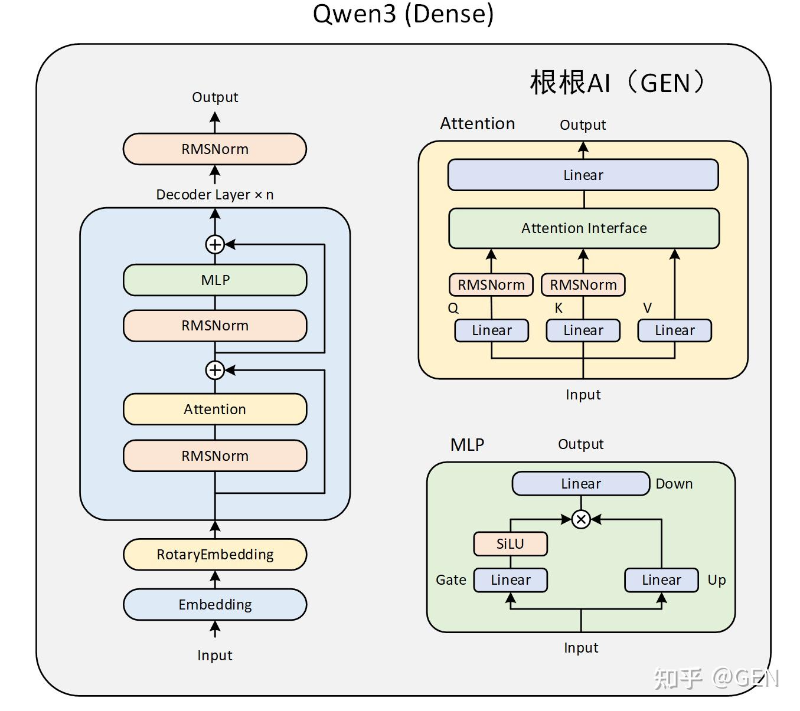
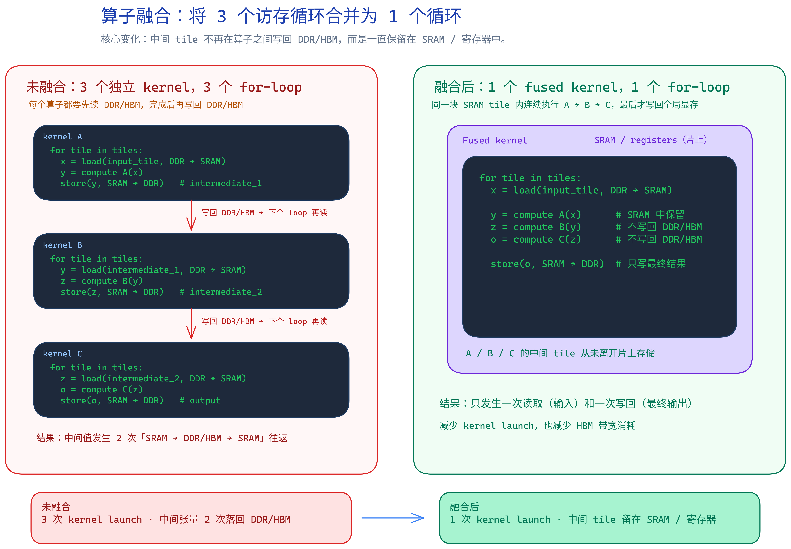
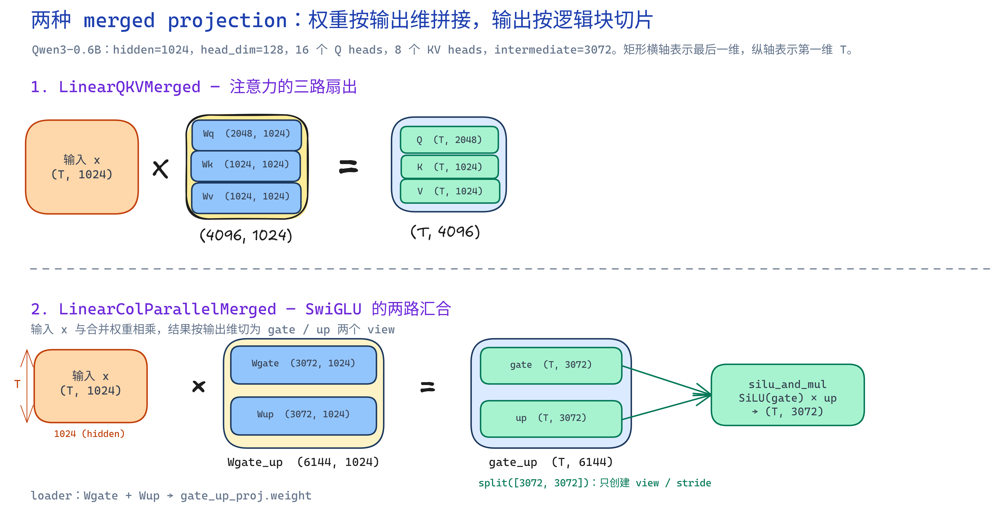
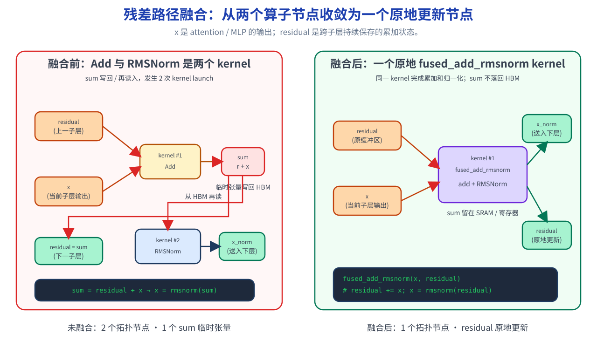

# Lesson 9：融合模型层（Fused Model Layers）

## 背景

Lesson 8 已经将变长 prefill 改为 flat token，并用 FlashInfer 完成 paged attention。attention 不再是 decode 的主要瓶颈后，Qwen3 每层仍然会发射大量小算子：三次 Q/K/V GEMM、两次 gate/up GEMM、SiLU、逐元素乘法、残差加法、RMSNorm，以及两次 KV cache 的高级索引写入。



这张架构图帮助我们把本课的优化位置放回完整模型里：融合发生在每个 `Qwen3DecoderLayer` 内部，主要覆盖 attention 的 Q/K/V 投影、MLP 的 gate/up 投影、SwiGLU 激活，以及残差加法后的 RMSNorm。

这些操作本身并不复杂，但 decode 每次只处理很少 token。kernel launch、读写中间张量和重复读取输入权重会占据显著时间。

本课不改变请求生命周期、page table、FlashInfer metadata 或调度策略；只替换模型层内部的计算方式。

## 原理

### 1. 算子融合优化的到底是什么？



先看这张图。左边的未融合版本把一段连续计算拆成 `kernel A -> kernel B -> kernel C` 三个独立 GPU kernel。每个 kernel 都有自己的 tile 循环：先把输入 tile 从 DDR/HBM 读到 SRAM，计算完以后把结果写回 DDR/HBM。下一个 kernel 不能直接使用上一阶段留在片上的数据，只能再从 DDR/HBM 把中间结果读回来。

所以未融合的真正代价不只是“多了几个函数调用”，而是：

1. **3 次 kernel launch**：A、B、C 分别调度，decode 小 batch 下 launch 开销会变得明显。
2. **3 个独立 for-loop**：每个 kernel 都重新遍历 tile，无法把局部数据流连续接起来。
3. **中间张量反复落盘**：`intermediate_1`、`intermediate_2` 会经历 `SRAM -> DDR/HBM -> SRAM` 的往返，浪费 HBM 带宽。

右边的融合版本把 A、B、C 放进同一个 fused kernel。对于同一块 tile，数据只从 DDR/HBM 读入一次，然后在 SRAM / registers 里连续完成 `A -> B -> C`，中间结果不写回全局显存，直到最终输出才 store 回 DDR/HBM。

这就是算子融合的核心：**把多个相邻算子的 tile loop 合并成一个 loop，让中间 tile 尽量留在片上存储中**。它不改变数学结果，也不一定减少主计算量；它减少的是 GPU 调度次数和 HBM 读写次数。

放到本课里，Qwen3 的 decode 阶段每步 token 很少，小 kernel 和中间张量读写会被反复放大。融合后，模型层内部的局部数据流更像右图：一次读取、片上连续计算、一次写回。这个变化会在每一层、每一个 decode step 重复累积，所以即使单个算子很小，总体收益仍然明显。

### 2. Merged Linear 原理

Merged Linear 的核心是一个简单的线性代数等价关系：如果多个线性层共享同一个输入 `x`，就不必分别执行多次 GEMM，而是把它们的权重沿**输出维**拼在一起，执行一次更宽的 GEMM。

```text
y1 = x @ W1.T
y2 = x @ W2.T
y3 = x @ W3.T

# 等价于：
y_merged = x @ concat(W1, W2, W3).T
y1, y2, y3 = split(y_merged)
```

PyTorch 的 `F.linear(x, weight)` 计算 `x @ weight.T`，权重布局是 `(output_size, input_size)`。因此 merged linear 只需要把权重沿 `dim=0` 拼接；GEMM 的输出是一段连续内存，再按原始输出大小切成多个 view。这里的 `split()` 不复制数据，只是在同一块输出 buffer 上建立逻辑切片。



本课实现了两个 merged linear：

- `LinearQKVMerged`：把 attention 中共享输入的 `q_proj/k_proj/v_proj` 合成一次投影，输出布局为 `[Q | K | V]`。
- `LinearColParallelMerged`：把 MLP 中共享输入的 `gate_proj/up_proj` 合成一次投影，输出布局为 `[gate | up]`。

它们对应的输出切片如下：

```text
qkv = qkv_proj(x)
q, k, v = qkv.split([q_size, kv_size, kv_size], dim=-1)

gate_up = gate_up_proj(x)
hidden = silu_and_mul(gate_up)
```

对 Qwen3-0.6B 来说：

- `q_size = 16 × 128 = 2048`，`kv_size = 8 × 128 = 1024`，故 `Wqkv` 的形状为 `(4096, 1024)`，输出为 `(T, 4096)`。
- `Wgate_up` 的形状为 `(2 × 3072, 1024) = (6144, 1024)`；`silu_and_mul` 读取其前半部分作为 gate、后半部分作为 up，输出恢复到 `(T, 3072)`。

`LinearColParallelMerged` 名称中的 *ColumnParallel* 为 Lesson 12 预留：在 tensor parallel 时，输出通道可按 rank 切分。本课暂时不引入 TP，只保留 merged linear 的单 GPU 语义：共享输入读一次，输出维变宽，随后用 view 切回原来的逻辑分支。

### 3. 残差路径也可以合并

残差路径也可以合并。`fused_add_rmsnorm(x, residual)` 的语义是：

```text
residual = residual + x
x = RMSNorm(residual)
```

因此 decoder 不再每层构造 `residual + hidden_states` 临时张量，而是持续传递 `(x, residual)`：



融合前，`Add` 的输出 `sum = residual + x` 同时有两条依赖边：一条把 `sum` 保存为下一子层的 `residual`，另一条把它作为 `RMSNorm` 的输入。两条算子节点之间需要将 `sum` 写回 HBM，再由下一次 kernel 读入。

融合后，`fused_add_rmsnorm(x, residual)` 保留完全相同的两条输出边：`residual` 在原缓冲区原地更新，归一化结果写入 `x` 并送给 attention / MLP。拓扑从两个 GPU 节点收敛为一个节点，`sum` 仅在 SRAM / 寄存器中短暂存在。

KV 写入保持在 `MHAKVCache.store_kv()`，但其实现委托给 `kernel.store_cache()`。输入是新 token 的 `(k, v, out_loc)`，内核按 `out_loc` 将整行 head vector 写入连续 cache。模型层不知道 page table 或物理 slot。

## 具体实现

### 1. 打包投影

`python/aios/layers/linear.py` 增加两个单 GPU 的 mini-sglang 同名抽象：

- `LinearQKVMerged`：布局 `[Q | K | V]`。
- `LinearColParallelMerged`：布局 `[gate | up]`。

它们当前是 replicated linear。Lesson 12 才在这些类上添加 shard 与 all-reduce，因此本课不提前引入 TP 概念。

`python/aios/models/qwen3.py` 相应将 `q_proj/k_proj/v_proj` 改为一个 `qkv_proj`，并将 `gate_proj/up_proj` 改为一个 `gate_up_proj`。Q/K norm、RoPE、attention backend 的输入形状保持不变。

### 2. Fused RMSNorm 和 SwiGLU

`RMSNormFused` 的返回值固定为 `(x, residual)`，与 mini-sglang 的生命周期一致。Q/K norm 使用 `forward_inplace()`，因为其输出只在 RoPE 前使用。

`silu_and_mul()` 接收最后一维为 `2 * intermediate_size` 的 packed tensor，并直接调用 FlashInfer。RMSNorm 与 fused add RMSNorm 同样直接调用 FlashInfer；AIOS 不提供 CPU 或 PyTorch fallback。

### 3. 权重加载边界

HF checkpoint 仍保存独立的 `q_proj/k_proj/v_proj` 和 `gate_proj/up_proj`。`python/aios/models/weight.py` 的 `packed_modules_mapping` 在加载边界拼接：

```text
HF q_proj, k_proj, v_proj  ->  qkv_proj.weight
HF gate_proj, up_proj      ->  gate_up_proj.weight
```

模型代码从不需要理解 HF key；其 state dict 只包含 fused module 名称。

### 4. KV 写入内核

`python/aios/kernel/store.py` 提供 `store_cache()`，接口与 mini-sglang 的同名边界一致。它只接受 CUDA tensor，并用 Triton 一次写入每个 token 的完整 KV vector。当前 FlashInfer backend 固定 `page_size=1`，KV pool 使用 mini-sglang 相同的 `(2, layers, pages, 1, kv_heads, head_dim)` 布局。

## 与 mini-sglang 的对齐

| 部分 | AIOS Lesson 9 | mini-sglang |
|---|---|---|
| QKV / gate-up 类名和布局 | `LinearQKVMerged`、`LinearColParallelMerged` | 相同 |
| 残差生命周期 | `(x, residual)` | 相同 |
| fused norm 接口 | `RMSNormFused.forward(x, residual)` | 相同 |
| KV 写入职责 | `MHAKVCache.store_kv -> kernel.store_cache` | 相同 |
| KV store 接口、布局与调用时机 | 相同 | 相同 |
| KV store 内核实现 | Triton | C++/CUDA JIT |
| 张量并行 | 未实现 | 已实现 |

后两项是实现层面的边界：本课只优化单 GPU，TP 留给 Lesson 12；Triton 让学生能直接阅读 KV 写入 kernel。除 KV 内核语言和尚未引入的 TP 外，当前 KV pool、FlashInfer metadata、fused layer 的字段、数据布局、调用顺序和职责边界与 mini-sglang 一致。

## 验证

先做语法与 CUDA-only API 检查：

```bash
PYTHONPATH=python python -m compileall -q python/aios
```

GPU kernel 与端到端验证需要正确的 CUDA JIT 环境：

```bash
CUDA_VISIBLE_DEVICES=2 \
CUDA_HOME=/usr/local/cuda-12.8 \
PATH=/usr/local/cuda-12.8/bin:$PATH \
FLASHINFER_CACHE_DIR=/tmp/flashinfer-aios-lesson9 \
PYTHONPATH=python \
python resources/lesson-9-fused-layers/run_lesson9.py \
  --model /data4/home/yan.wang/huggingface/Qwen3-0.6B --e2e
```

`run_lesson9.py` 分别比较三次 QKV GEMM 与一次 packed GEMM、两次 SwiGLU GEMM 与 packed+fused activation，以及高级索引 KV 写入与 Triton store。启用 `--e2e` 后还会验证 Qwen3-0.6B 在 fused path 上可以完整生成。

本机验证结果：

```text
QKV projection       baseline=0.050 ms  fused=0.016 ms  speedup=3.23x
SwiGLU projection    baseline=0.042 ms  fused=0.037 ms  speedup=1.14x
KV cache store       baseline=0.036 ms  fused=0.026 ms  speedup=1.36x
Mini-sglang KV layout and CUDA store checks passed
FlashInfer 0.5.3 fused norm and activation checks passed
Qwen3-0.6B strict CUDA fused path passed: [12555, 374]
```

> 本课固定 `flashinfer-python==0.5.3`。该版本提供相同的 paged attention、`rmsnorm`、`fused_add_rmsnorm` 与 `silu_and_mul` API，并兼容本机的 `torch 2.5.1+cu121`。FlashInfer 0.6.x 的 RMSNorm JIT 依赖 PyTorch 2.7 才提供的 `shared_memory_per_block_optin` 属性，不能与当前 PyTorch 组合使用。
